# Optometría holística — OCR consolidado

> Consolidación mecánica de los archivos OCR contenidos en esta carpeta.
> Se conserva el texto reconocido, incluidos posibles errores, repeticiones y fragmentos incompletos.
> Cada sección indica la fotografía de origen. Las figuras enlazan a los recursos extraídos por el OCR.

**Total de OCR consolidados:** 122  
**Rango documental:** IMG_3240–IMG_3362  
**Archivo ausente en la secuencia:** IMG_3250

## Índice de fuentes

- [IMG_3240.JPG](#ocr-img-3240-jpg)
- [IMG_3241.JPG](#ocr-img-3241-jpg)
- [IMG_3242.JPG](#ocr-img-3242-jpg)
- [IMG_3243.JPG](#ocr-img-3243-jpg)
- [IMG_3244.JPG](#ocr-img-3244-jpg)
- [IMG_3245.JPG](#ocr-img-3245-jpg)
- [IMG_3246.JPG](#ocr-img-3246-jpg)
- [IMG_3247.JPG](#ocr-img-3247-jpg)
- [IMG_3248.JPG](#ocr-img-3248-jpg)
- [IMG_3249.JPG](#ocr-img-3249-jpg)
- [IMG_3251.JPG](#ocr-img-3251-jpg)
- [IMG_3252.JPG](#ocr-img-3252-jpg)
- [IMG_3253.JPG](#ocr-img-3253-jpg)
- [IMG_3254.JPG](#ocr-img-3254-jpg)
- [IMG_3255.JPG](#ocr-img-3255-jpg)
- [IMG_3256.JPG](#ocr-img-3256-jpg)
- [IMG_3257.JPG](#ocr-img-3257-jpg)
- [IMG_3258.JPG](#ocr-img-3258-jpg)
- [IMG_3259.JPG](#ocr-img-3259-jpg)
- [IMG_3260.JPG](#ocr-img-3260-jpg)
- [IMG_3261.JPG](#ocr-img-3261-jpg)
- [IMG_3262.JPG](#ocr-img-3262-jpg)
- [IMG_3263.JPG](#ocr-img-3263-jpg)
- [IMG_3264.JPG](#ocr-img-3264-jpg)
- [IMG_3265.JPG](#ocr-img-3265-jpg)
- [IMG_3266.JPG](#ocr-img-3266-jpg)
- [IMG_3267.JPG](#ocr-img-3267-jpg)
- [IMG_3268.JPG](#ocr-img-3268-jpg)
- [IMG_3269.JPG](#ocr-img-3269-jpg)
- [IMG_3270.JPG](#ocr-img-3270-jpg)
- [IMG_3271.JPG](#ocr-img-3271-jpg)
- [IMG_3272.JPG](#ocr-img-3272-jpg)
- [IMG_3273.JPG](#ocr-img-3273-jpg)
- [IMG_3274.JPG](#ocr-img-3274-jpg)
- [IMG_3275.JPG](#ocr-img-3275-jpg)
- [IMG_3276.JPG](#ocr-img-3276-jpg)
- [IMG_3277.JPG](#ocr-img-3277-jpg)
- [IMG_3278.JPG](#ocr-img-3278-jpg)
- [IMG_3279.JPG](#ocr-img-3279-jpg)
- [IMG_3280.JPG](#ocr-img-3280-jpg)
- [IMG_3281.JPG](#ocr-img-3281-jpg)
- [IMG_3282.JPG](#ocr-img-3282-jpg)
- [IMG_3283.JPG](#ocr-img-3283-jpg)
- [IMG_3284.JPG](#ocr-img-3284-jpg)
- [IMG_3285.JPG](#ocr-img-3285-jpg)
- [IMG_3286.JPG](#ocr-img-3286-jpg)
- [IMG_3287.JPG](#ocr-img-3287-jpg)
- [IMG_3288.JPG](#ocr-img-3288-jpg)
- [IMG_3289.JPG](#ocr-img-3289-jpg)
- [IMG_3290.JPG](#ocr-img-3290-jpg)
- [IMG_3291.JPG](#ocr-img-3291-jpg)
- [IMG_3292.JPG](#ocr-img-3292-jpg)
- [IMG_3293.JPG](#ocr-img-3293-jpg)
- [IMG_3294.JPG](#ocr-img-3294-jpg)
- [IMG_3295.jpg](#ocr-img-3295-jpg)
- [IMG_3296.JPG](#ocr-img-3296-jpg)
- [IMG_3297.JPG](#ocr-img-3297-jpg)
- [IMG_3298.JPG](#ocr-img-3298-jpg)
- [IMG_3299.JPG](#ocr-img-3299-jpg)
- [IMG_3300.JPG](#ocr-img-3300-jpg)
- [IMG_3301.JPG](#ocr-img-3301-jpg)
- [IMG_3302.JPG](#ocr-img-3302-jpg)
- [IMG_3303.JPG](#ocr-img-3303-jpg)
- [IMG_3304.JPG](#ocr-img-3304-jpg)
- [IMG_3305.JPG](#ocr-img-3305-jpg)
- [IMG_3306.JPG](#ocr-img-3306-jpg)
- [IMG_3307.JPG](#ocr-img-3307-jpg)
- [IMG_3308.JPG](#ocr-img-3308-jpg)
- [IMG_3309.JPG](#ocr-img-3309-jpg)
- [IMG_3310.JPG](#ocr-img-3310-jpg)
- [IMG_3311.JPG](#ocr-img-3311-jpg)
- [IMG_3312.JPG](#ocr-img-3312-jpg)
- [IMG_3313.JPG](#ocr-img-3313-jpg)
- [IMG_3314.JPG](#ocr-img-3314-jpg)
- [IMG_3315.JPG](#ocr-img-3315-jpg)
- [IMG_3316.JPG](#ocr-img-3316-jpg)
- [IMG_3317.JPG](#ocr-img-3317-jpg)
- [IMG_3318.JPG](#ocr-img-3318-jpg)
- [IMG_3319.JPG](#ocr-img-3319-jpg)
- [IMG_3320.JPG](#ocr-img-3320-jpg)
- [IMG_3321.JPG](#ocr-img-3321-jpg)
- [IMG_3322.JPG](#ocr-img-3322-jpg)
- [IMG_3323.JPG](#ocr-img-3323-jpg)
- [IMG_3324.JPG](#ocr-img-3324-jpg)
- [IMG_3325.JPG](#ocr-img-3325-jpg)
- [IMG_3326.JPG](#ocr-img-3326-jpg)
- [IMG_3327.JPG](#ocr-img-3327-jpg)
- [IMG_3328.JPG](#ocr-img-3328-jpg)
- [IMG_3329.JPG](#ocr-img-3329-jpg)
- [IMG_3330.JPG](#ocr-img-3330-jpg)
- [IMG_3331.JPG](#ocr-img-3331-jpg)
- [IMG_3332.JPG](#ocr-img-3332-jpg)
- [IMG_3333.JPG](#ocr-img-3333-jpg)
- [IMG_3334.JPG](#ocr-img-3334-jpg)
- [IMG_3335.JPG](#ocr-img-3335-jpg)
- [IMG_3336.JPG](#ocr-img-3336-jpg)
- [IMG_3337.JPG](#ocr-img-3337-jpg)
- [IMG_3338.JPG](#ocr-img-3338-jpg)
- [IMG_3339.JPG](#ocr-img-3339-jpg)
- [IMG_3340.JPG](#ocr-img-3340-jpg)
- [IMG_3341.JPG](#ocr-img-3341-jpg)
- [IMG_3342.JPG](#ocr-img-3342-jpg)
- [IMG_3343.JPG](#ocr-img-3343-jpg)
- [IMG_3344.JPG](#ocr-img-3344-jpg)
- [IMG_3345.JPG](#ocr-img-3345-jpg)
- [IMG_3346.JPG](#ocr-img-3346-jpg)
- [IMG_3347.JPG](#ocr-img-3347-jpg)
- [IMG_3348.JPG](#ocr-img-3348-jpg)
- [IMG_3349.JPG](#ocr-img-3349-jpg)
- [IMG_3350.JPG](#ocr-img-3350-jpg)
- [IMG_3351.JPG](#ocr-img-3351-jpg)
- [IMG_3352.JPG](#ocr-img-3352-jpg)
- [IMG_3353.JPG](#ocr-img-3353-jpg)
- [IMG_3354.JPG](#ocr-img-3354-jpg)
- [IMG_3355.JPG](#ocr-img-3355-jpg)
- [IMG_3356.JPG](#ocr-img-3356-jpg)
- [IMG_3357.JPG](#ocr-img-3357-jpg)
- [IMG_3358.JPG](#ocr-img-3358-jpg)
- [IMG_3359.JPG](#ocr-img-3359-jpg)
- [IMG_3360.JPG](#ocr-img-3360-jpg)
- [IMG_3361.JPG](#ocr-img-3361-jpg)
- [IMG_3362.JPG](#ocr-img-3362-jpg)

---

## OCR IMG_3240.JPG

**Fuente:** `ocr-playground-download-20260621T163640Z/IMG_3240.JPG/markdown.md`

CAPÍTULO 1
INTRODUCCIÓN A LA VISIOLOGÍA

#### Planteamiento inicial

La moderna Optometría tiene sus bases asentadas en los programas educativos que se imparten en las Facultades de Óptica y Optometría en las que los Ópticos-Optometristas, formando parte activa del cuerpo docente, colaboran en la investigación científica y en la formación de los futuros profesionales de la visión.

Los Ópticos-Optometristas somos los únicos profesionales que nos ocupamos exclusivamente de la visión, y realizamos nuestro cometido mediante el ejercicio de la Optometría, cuya finalidad es la investigación y puesta en práctica de las técnicas y medios de estudio, evaluación y mejora de la conducta visual. La Optometría utiliza los conocimientos científicos conseguidos por disciplinas tan diversas como la propia Óptica, la Fisiología, la Oftalmología, la Embriología, la Anatomía, la Psicología, la Pedagogía...

#### La función visual, fenómeno global

La visión constituye un proceso dinámico que se modifica continuamente adaptándose a las necesidades impuestas por el espacio y el tiempo. La visión, considerada desde un punto de vista holístico, de acuerdo con Skeffington, nos proporciona información de nuestro entorno utilizando la luz como vehículo transmisor. A menudo consideramos la visión como una función de los ojos, así decimos: lo he visto con mis propios ojos, y esta aseveración constituye una síntesis demasiado simple de un fenómeno tan complejo. Realmente la información transportada por la luz no está destinada a los ojos sino al cerebro, previa su transformación en influjo nervioso en las células de la retina.

27
 

---

## OCR IMG_3241.JPG

**Fuente:** `ocr-playground-download-20260621T163640Z/IMG_3241.JPG/markdown.md`

CAPÍTULO 1
INTRODUCCIÓN A LA VISIOLOGÍA

#### Planteamiento inicial

La moderna Optometría tiene sus bases asentadas en los programas educativos que se imparten en las Facultades de Óptica y Optometría en las que los Ópticos-Optometristas, formando parte activa del cuerpo docente, colaboran en la investigación científica y en la formación de los futuros profesionales de la visión.

Los Ópticos-Optometristas somos los únicos profesionales que nos ocupamos exclusivamente de la visión, y realizamos nuestro cometido mediante el ejercicio de la Optometría, cuya finalidad es la investigación y puesta en práctica de las técnicas y medios de estudio, evaluación y mejora de la conducta visual. La Optometría utiliza los conocimientos científicos conseguidos por disciplinas tan diversas como la propia Óptica, la Fisiología, la Oftalmología, la Embriología, la Anatomía, la Psicología, la Pedagogía...

#### La función visual, fenómeno global

La visión constituye un proceso dinámico que se modifica continuamente adaptándose a las necesidades impuestas por el espacio y el tiempo. La visión, considerada desde un punto de vista holístico, de acuerdo con Skeffington, nos proporciona información de nuestro entorno utilizando la luz como vehículo transmisor. A menudo consideramos la visión como una función de los ojos, así decimos: lo he visto con mis propios ojos, y esta aseveración constituye una síntesis demasiado simple de un fenómeno tan complejo. Realmente la información transportada por la luz no está destinada a los ojos sino al cerebro, previa su transformación en influjo nervioso en las células de la retina.

C 27
 

---

## OCR IMG_3242.JPG

**Fuente:** `ocr-playground-download-20260621T163640Z/IMG_3242.JPG/markdown.md`

28
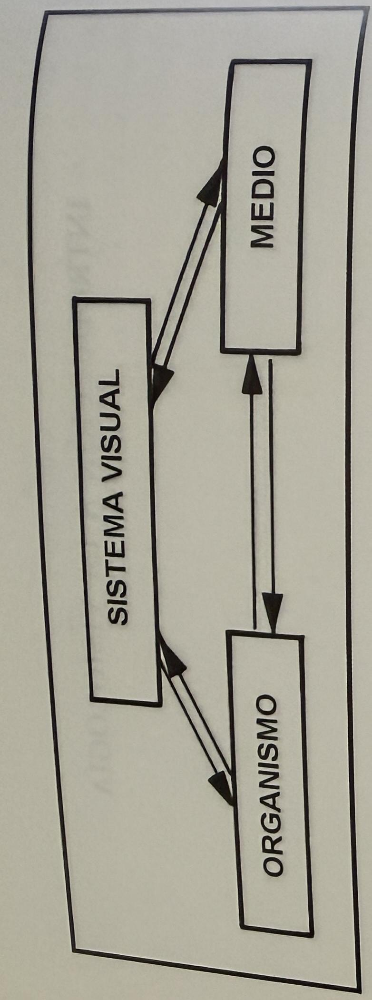
Relaciones: sistema visual – organismo – medio, según Skeffington.
IVF/SEO, Visión y Optometría, 1985.
Greg GILMAN, Optometría de la Conducta, CNOO, 1991.

#### Desarrollo visual infantil

Al nacer, el sistema visual no es aún operativo. El desarrollo óptimo de la función visual, de acuerdo a un programa genético bien definido, solo es posible si el sistema visual es convenientemente estimulado durante la niñez.

La carencia o insuficiencia de estímulos adecuados en los momentos precisos puede perturbar profundamente el desarrollo, o incluso bloquearlo. Por ejemplo, es el caso de los niños afectados por una ambliopía funcional unilateral, en los que el circuito visual de uno de los ojos proporciona un rendimiento reducido, aunque no presente lesión orgánica alguna. Otro ejemplo lo tenemos en los estrabismos, casi siempre resultantes de una fragilidad, falla o punto débil inscrito en el desarrollo de la coordinación de ambos ojos, ya entre ellos, ya en relación con todo el organismo.

La evolución y el progreso de la Optometría han proporcionado un sistema cibernético y analítico que sitúa los problemas visuales en el cuadro del desarrollo de la visión, cuadro a su vez inscrito en el del desarrollo del niño en relación con su entorno.

Algunos profesionales estructuralistas, o especialistas de los ojos, confunden a menudo los términos de vista y visión.

Con buena vista quizás veríamos un cuadro abstracto. La visión nos ayuda a ver Gala desnuda mirando el mar Mediterráneo, acercándonos al cuadro; mientras que en el grabado pequeño, como si nos
 

---

## OCR IMG_3243.JPG

**Fuente:** `ocr-playground-download-20260621T163640Z/IMG_3243.JPG/markdown.md`

29
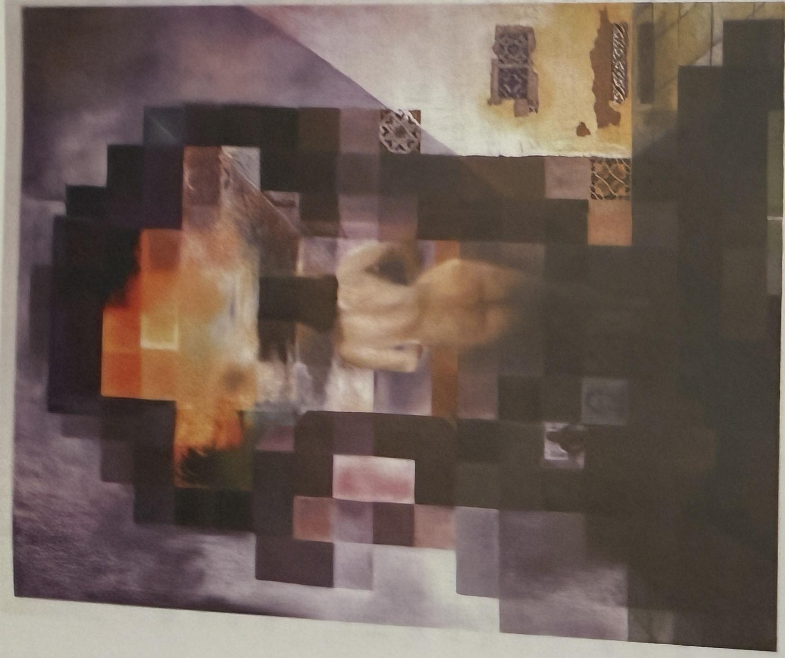
SALVADOR DALÍ
(1981-2001) Círculo de Agentes de la Unión
Gala de los 100 a 1000. (1981-1985)
Gala desnuda mirando el mar Mediterráneo, 1976.
© Salvador Dalí, Fundación Gala-Salvador Dalí, VEGAP, Barcelona, 2017.
Teatre-Museu Dalí de Figueres.

alejáramos unos veinte metros, podemos ver la figura del presidente Abraham Lincoln.

Para disfrutar de una buena visión, es preciso haber tenido una vivencia anterior rica en experiencias.

Corrientemente, en conversaciones sobre temas fortuitos, se oye decir: “Tengo muy buena vista” o “Hágase mirar la vista”. Realmente, la palabra vista es sinónimo de agudeza visual. Corresponde a la capacidad que tienen ambos ojos de transmitir una imagen de forma nítida, o borrosa en presencia de un defecto óptico. Este fenómeno es, desde luego, importante, pero limitado y, de hecho, solamente es uno de los elementos que componen la visión.
 

---

## OCR IMG_3244.JPG

**Fuente:** `ocr-playground-download-20260621T163640Z/IMG_3244.JPG/markdown.md`

- La vista, o agudeza visual, permite ver nítidamente.
- La visión permite percibir, comprender, interpretar, adaptarse.

Para disfrutar de una buena visión se necesita una vivencia rica en experiencias diversas, un universo sensorial variado. Nuestra imaginación, nuestra riqueza en imágenes visuales, nuestras posibilidades de recuerdo y de representación visual, dependen de ella. Disfrutar de una buena visión depende, en parte, de todo este conjunto.

Esta concepción limitada relativa a la vista no tendría consecuencias si sus posiciones no estuvieran acompañadas de una voluntad firme de imponer a todo el mundo unas ideas tan restrictivas. Este modelo solamente se apoya en las estructuras oculares, la agudeza visual y la fisiología, y no tiene en cuenta el fenómeno global por el cual el hombre adquiere las capacidades suficientes para la descodificación del símbolo escrito.

Parece que queramos enfatizar la lectura y la escritura pero es que, realmente, el lenguaje escrito es justamente aquello que determina la culminación de la conducta visual y, además, el nivel de civilización de la humanidad.

Un 20% de las personas que viven en cualquier país industrializado son funcionalmente analfabetas, no son capaces de comprender las instrucciones de la herramienta de trabajo que utilizan a diario, un 20% de nuestros compatriotas no han alcanzado la humanidad completa, dando a este término un sentido evolutivo. Nuestra parte de responsabilidad sobre este fenómeno inaceptable radica en la omisión: los componentes visuales de la lectura son competencia de los profesionales de la visión y no podemos ni debemos eludirlos.

El ser humano, con la lectura, ha dado un gran paso evolutivo. Es tiempo de que empecemos a compartir esta riqueza con el alto porcentaje de la humanidad que no la posee. La lectura es un proceso mecánico, no un proceso misterioso. Podemos enseñar a leer a los niños. El 20 por ciento de fracasos, en vuestro país y en el mío, es una desgracia. No existe ningún país industrializado con mejor porcentaje y esto ocurre simplemente porque no hemos pasado tiempo suficiente investigando y demostrando a las personas responsables donde radica la base del problema.

Carl H. DELACATO, Relaciones entre el Desarrollo Humano y la Visión, APALCE/SEO, 1986.

25
 

---

## OCR IMG_3245.JPG

**Fuente:** `ocr-playground-download-20260621T163640Z/IMG_3245.JPG/markdown.md`

&lt; 31&gt;

### Nociones de la visiología

La Optometría Holística, o Visiología, se apoya sobre algunas nociones:

#### 1.ª NOCIÓN. FILOGÉNESIS

La evolución no ha cesado, el hombre, al igual que todos los seres vivos continúa evolucionando, se mantiene dentro del vórtex evolutivo, y en cualquier caso constituye la culminación actual de una larga línea ancestral proveniente de una ameba. El estudio de esta evolución de las especies constituye la filogénesis.

Solamente conociendo el pasado filogenético nos será posible explicarnos, por ejemplo, la pervivencia de los denominados reflejos arcaicos, de los ritmos circadianos de vigilia y de sueño y de otras conductas de base o raíz innata como el sonreír.

#### 2.ª NOCIÓN. ONTOGÉNESIS

Igualmente necesitamos considerar la ontogénesis, o desarrollo del individuo que se realiza de acuerdo a las pautas marcadas por la filogénesis. A este respecto la ley de Haeckel nos dice:

La Ontogénesis constituye la recapitulación rápida de la Filogénesis.

Ernest HAECKEL, *La Morfología General de los Organismos*, 1866.

A pesar de que no puede defenderse estrictamente que la ontogénesis recapitula la filogénesis, sí que es cierto que los embriones de las especies superiores pasan por estadios en los que se parecen a adultos de especies inferiores. A grandes rasgos, la formación del encéfalo humano va recapitulando de manera abreviada y modificada los estadios filogenéticos anteriores. El paso, que de la ameba al neonato ha precisado 3.600 millones de años, se sintetiza en 9 meses de gestación.

Joaquim JUBERT y Josep NAVARRO, “De l’ameba al nadó”, *Avui*, 1987.

Antes de caminar normalmente, el niño marchará como un primate, habrá realizado los mismos movimientos locomotores que los mamíferos cuadrúpedos, antes se habrá arrastrado recordando los movimientos de los reptiles. Esta evolución motivó una frase, ya célebre, del biólogo J. Maynard Smith:
 

---

## OCR IMG_3246.JPG

**Fuente:** `ocr-playground-download-20260621T163640Z/IMG_3246.JPG/markdown.md`

Todo animal, en el curso de su desarrollo, debe trepar por su árbol genealógico...

Maynard SMITH, Theory of Evolution, 1958.

#### 3.ª NOCIÓN. ORGANISMO

El organismo humano es la resultante de las dos primeras nociones visiológicas y procede del desarrollo de tres sistemas: visceral, esquelético y cortical. Los biólogos han observado que, precozmente, a las tres semanas, el embrión presenta un disco trilaminar bien diferenciado: el endodermo, el mesodermo y el ectodermo van a dar lugar a las vísceras y glándulas que han de asegurar el mantenimiento de la vida, al sistema de soporte que el hombre ha utilizado para conquistar su medio y al sistema nervioso que conduce finalmente a la integración de las experiencias vividas.

#### 4.ª NOCIÓN. DESARROLLO

Esta noción del enfoque visiológico, admite que el futuro hombre franqueará las etapas ontogénicas mediante su desarrollo y lo hará pasando por lo que Maria Montessori denominó *periodos sensibles* en su conocido Método que ya intuyó en agosto de 1907, en la Casa dei Bambini de Roma, cuando realizó alfabetos rugosos para los niños escolarizados que le pedían más y más, y que tantos alumnos ha formado, o por lo que más posteriormente, Mucchielli y Boucier denominaron *periodos frágiles*, o aún, por lo que Frérebeau denomina *periodos críticos*.

Paula POLK LILLARD, *Un Enfoque Moderno al Método Montessori*, Diana, México, 1976.

Roger MUCCIELLI y Arlette BOUCIER, *La Dislexia*, Cincel-Kapelusz, Madrid, 1979.

Michel FRÉREBEAU, *El Desarrollo del Sistema Visual y de la Visión*, SEO, 1990.

Es plausible afirmar que algunos agentes tensionales, actuando sobre el organismo mientras se franquean estos periodos sensibles, frágiles o críticos, puedan inscribir fallas o bloqueos en las estructuras de uno o de diversos procesos en desarrollo. Los bloqueos detienen el desarrollo del proceso afectado, las fallas permiten este desarrollo, pero dejando frágiles o debilitadas algunas de las etapas del proceso.
 

---

## OCR IMG_3247.JPG

**Fuente:** `ocr-playground-download-20260621T163640Z/IMG_3247.JPG/markdown.md`

33

#### 5.ª NOCIÓN. PROCESOS VISUALES

Los tres sistemas considerados, en su relación con la visión van a conformar tres procesos visuales. Así del sistema visceral derivará el Proceso de Emetropización o de focalización y afinamiento de la dióptrica ocular; el sistema esquelético dará existencia al Proceso de Binocularización o de coordinación de ambos ojos, entre ellos y con la progresiva lateralización motriz del individuo y, finalmente, del sistema cortical surgirá el Proceso de Identificación o de afinamiento de la distinción y de la discriminación, en el que las sensaciones, las percepciones y las representaciones han de desembocar en el reconocimiento del espacio global, abstracto y simbólico.

#### 6.ª NOCIÓN. EVALUACIÓN

Esta última noción resulta la consecuencia de las anteriores: solamente una evaluación completa del desarrollo y de sus componentes visuales permitirá conocer un proceso de deterioración, invertirlo e intentar eliminar paulatinamente las consecuencias de las fallas, de los bloqueos y de las regresiones.

En virtud de la posibilidad que tiene el organismo de proseguir la elaboración de un proceso a pesar de la inscripción de fallas es necesario proceder de manera sistemática a la evaluación de cada uno de los parámetros esenciales al ortodesarrollo. Solo tal análisis permitirá determinar el grado cualitativo de las capacidades visuales presentes, incrementarlas si no son suficientes para la realización de una tarea determinada y ejercer una prevención que evite futuros problemas.

INSTITUT DE VISIOLOGIE DU QUÉBEC, Introduction à la Visiologie, tomo I, Le Processus de Binocularisation, IVQ, 1970.
 

---

## OCR IMG_3248.JPG

**Fuente:** `ocr-playground-download-20260621T163640Z/IMG_3248.JPG/markdown.md`

CAPÍTULO 2
EVOLUCIÓN DE LAS CIENCIAS DE LA VISIÓN

Desde siempre, la visión ha suscitado el interés de los medios científicos. Ya sea considerando el ojo como fuente de luz o bien construyendo los primeros trazos de la óptica geométrica, el misterio de la visión ha apasionado y lo sigue haciendo. Dejando aparte los primeros conceptos, demasiado imprecisos, el siglo XVII marca el principio de la evolución de la Óptica-Optometría.

Platón, 427 a. C.-347 a. C.

Nació y murió en Atenas, Grecia.

Discípulo de Sócrates. Fundador de la Academia. Filosofía global, de conjunto. Un tema central de su obra es el conflicto entre la naturaleza y las creencias de la época concernientes al rol de la herencia y del medio ambiente en el desarrollo de la personalidad y la inteligencia del hombre. Fue el primero en postular en el mundo occidental la idea de que había dos distintos aspectos en la mente humana. Se le considera el padre de la holística.

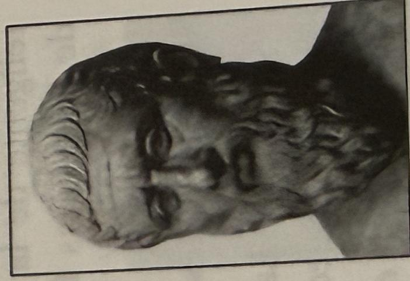

Aristóteles, 384 a. C.-22 a. C.

Nació en Estagira, Tracia. Murió en Calcis, Eubea.

Discípulo de Platón y maestro de Alejandro Magno. Fundador del Liceo. Intentó incrementar el conocimiento separando las cosas. Sistematizó y

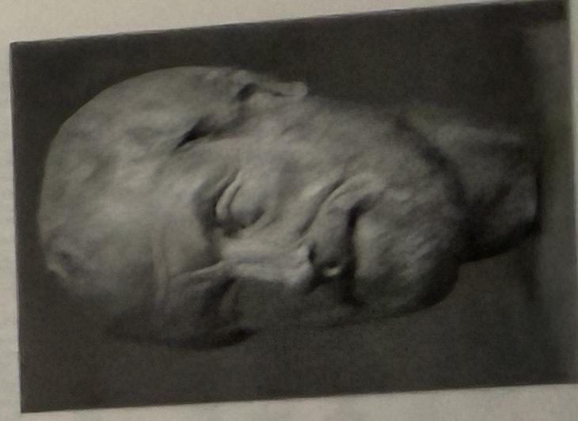
 

---

## OCR IMG_3249.JPG

**Fuente:** `ocr-playground-download-20260621T163640Z/IMG_3249.JPG/markdown.md`

organizó. Se le considera como uno de los grandes pensadores de la humanidad. Su pensamiento en lógica, naturalismo y ética dominaron en el pensamiento europeo hasta el siglo XVI.

No hay efecto sin causa, todo efecto debe ser proporcionado a su causa.

#### Galileo Galilei, 1564-1642

Nació en Pisa. Murió en Arcetri, Toscana.

Sus ideas, contrarias a la física aristotélica, y sus experimentos sobre mecánica, le ocasionaron tantos reproches de sus compatriotas, que decidió abandonar la Toscana y fijó su residencia en Venecia.

Galileo fue un innovador teórico y un científico práctico, a quien se debe el invento de la balanza hidrostática, un sistema para fijar las coordenadas geográficas de los barcos en alta mar, importantes perfeccionamientos en los telescopios primitivos y las ideas básicas sobre el movimiento de los cuerpos. Con Galileo nació la ciencia moderna, basada en la observación inteligente de la naturaleza, el método experimental y la formulación de las teorías físicas de acuerdo a los hechos reales.

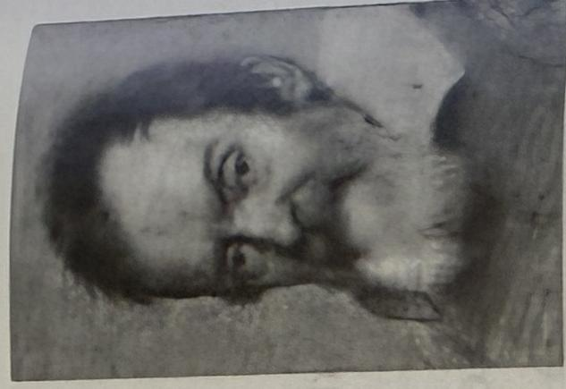

#### René Descartes, 1596-1650

Nació en La Haye, Touraine, Francia. Murió en Estocolmo, Suecia.

*Separación entre la mente y el cuerpo.* Establece un dualismo sustancial entre alma, pensamiento y cuerpo. Radicalizó su posición al rechazar considerar al animal, al que concibe como una máquina, como un cuerpo desprovisto de alma. Esta teoría será criticada durante la ilustración, especialmente por Diderot, Rousseau y Voltaire.

Del razonamiento matemático solamente debe de quedar el orden y la medida donde se trate de materia y solamente el orden donde no se trate de objetos materiales.

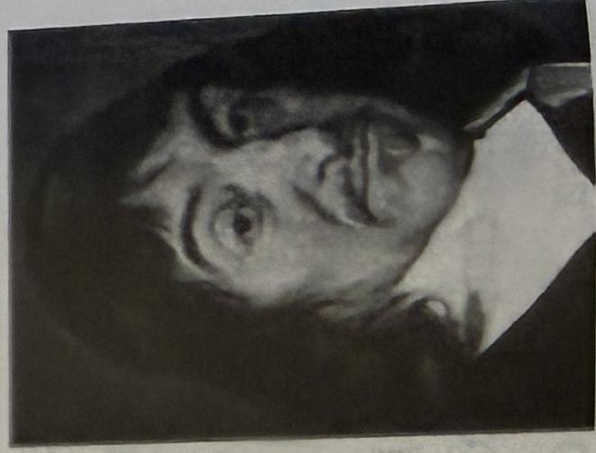

#### Isaac Newton, 1642

Nació en Wools, Londres, Inglaterra.

Visión mecánica, inminente los fenómenos, hasta nuestros días. Newton enunció lo que la cantidad de movimiento en el primer telescopio es el color basada en el descompone en la misma. Son también compuesta de parte.

Newton está por

Dejando a sus vicios, el siglo XIX. Optometría.

#### Albert Einstein

Nació en EE. UU.

Está con el siglo XX, neral de la R concepto de este trabajo evolucio

En la absolu dinámica universal que n
 

---

## OCR IMG_3251.JPG

**Fuente:** `ocr-playground-download-20260621T163946Z/IMG_3251.JPG/markdown.md`

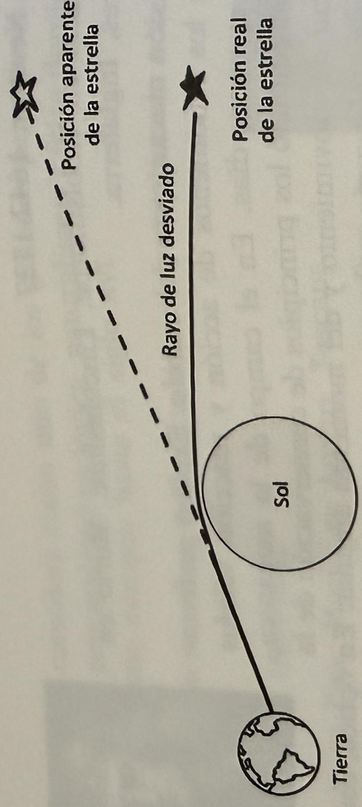

El 6 de noviembre de 1919 se celebró en Londres una reunión conjunta de la Royal Society y la Royal Astronomical Society, convocada para comunicar los resultados de las observaciones realizadas por dos expediciones británicas a la isla Príncipe, en el Golfo de Guinea, y a Sobral, al norte del Brasil, a raíz del eclipse de Sol del 29 de mayo. Se trataba de confirmar las predicciones de Einstein sobre la curvatura de la luz cuando sus rayos interaccionan con los campos gravitatorios, hecho que ocurrió observando la luz de estrellas muy próximas al disco solar, observación solo posible en ocasión de un eclipse. Como consecuencia de estos resultados, Einstein se convirtió en un ícono popular de la ciencia, mundialmente famoso, un privilegio al alcance de muy pocos científicos.

José Manuel Sánchez Ron, Albert Einstein, su vida, su obra, su mundo, Crítica, Barcelona 2015.

#### Arthur Marten Skeffington, 1890-1976

Nació en Kansas. Murió en Saint Louis, EE. UU.

Skeffington fue un optometrista americano conocido como el padre de la Optometría behavioral u holística.

El 1928, cofundó la Optometric Extension Program con E. B. Alexander. En 1950, diseñó sus cuatro círculos: Antigravedad, Centrado, Identificación, Habla-Audición, los cuales conducen a la Visión, un modelo holístico para describir el proceso visual.

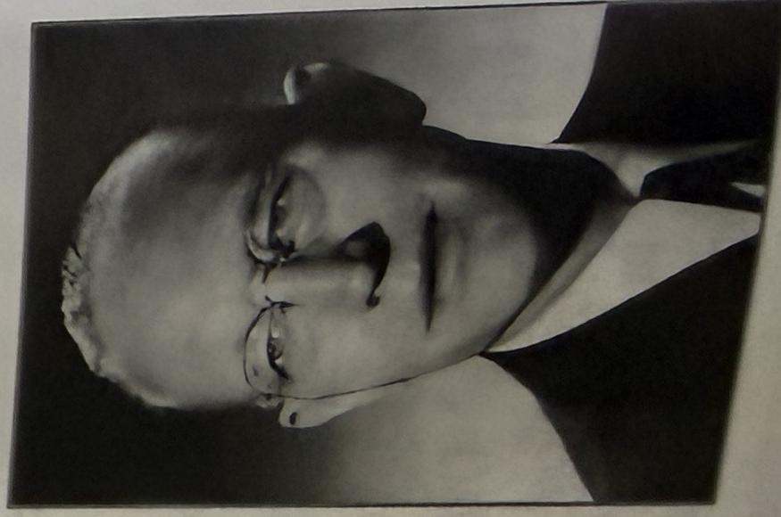

Uno de los importantes que skeffington fue el conexión de la astrofísica de la era de la astrofísica. Su nombre fue un conjunto, una red de nándolos con el nombre de S.
 

---

## OCR IMG_3252.JPG

**Fuente:** `ocr-playground-download-20260621T163946Z/IMG_3252.JPG/markdown.md`

Uno de los legados más importantes que nos dejó Skeffington fue el concepto de la conexión de la visión con el organismo y el entorno. La Optometría Holística consiste en no mirar el cuerpo humano, todo el organismo, de trozo en trozo sino mirarlo formando parte de un conjunto, y además relacionándolo con todo el entorno.

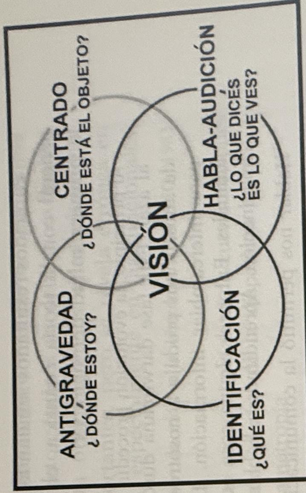

El Dr. Skeffington comenzó diciendo que la visión era más que una agudeza visual del 100% y el globo ocular. Mantuvo que la visión constituye la capacidad de entender los estímulos visuales. Este entendimiento sucedía debido a que el organismo humano entero reaccionaba al estímulo luminoso de la retina. Estaba introduciendo en la optometría el concepto de la percepción y sus atributos holísticos, estaba diciendo que la percepción no es solamente un fenómeno mental, sino un fenómeno completo de mente y cuerpo, habló de las cuatro interrelaciones de funcionamiento, que conforman el proceso total de la visión y el entendimiento.

Greg GILMAN, Optometría de la Conducta, CNOO, 1991.
Si hi veus bé, estudiar és més fàcil, COOOC, 2013.

La visión es única. Nadie sabe donde está funcionando ni qué tipo de funcionamiento es... Actualmente no hay una fisiología observable o una parte física, como un pulmón, una oreja o una lengua, solo sabemos que todo el organismo está implicado...

A. M. SKEFFINGTON, Citado por Pilar Vergara, La Era de la Neurociencia, IV Congreso Federópticos, 2011.

### Stephen Hawking

Nació en Oxford, Inglaterra, el 1942.

Hawking ha trabajado en las leyes básicas gobernantes del universo. Junto con Roger Penrose mostró que la Teoría General de la Relatividad de Einstein implica que el espacio y el tiempo han de tener un principio en el Big Bang y un final dentro de los agujeros negros.

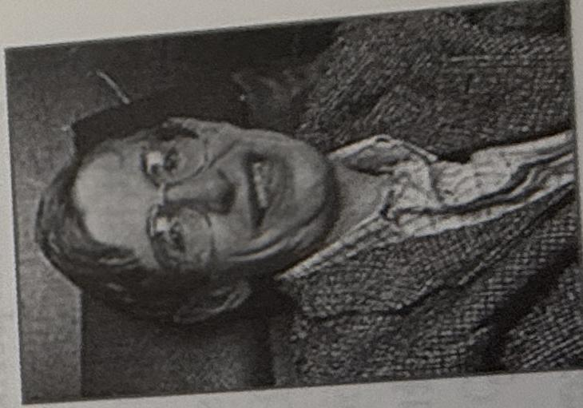
 

---

## OCR IMG_3253.JPG

**Fuente:** `ocr-playground-download-20260621T163946Z/IMG_3253.JPG/markdown.md`

40

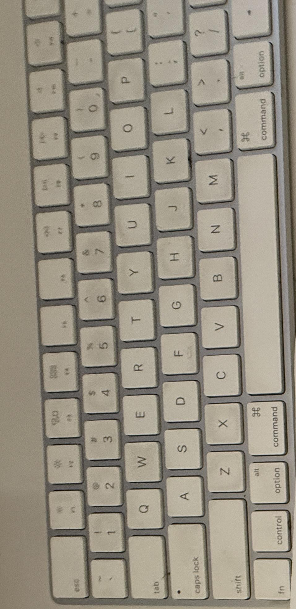

Parecidos resultados señalan la necesidad de unificar la relatividad general con la teoría cuántica, el otro gran desarrollo científico de la primera mitad del siglo XX.

Al principio, la evolución procedía por selección natural, con mutaciones al azar. Esta fase darwiniana duró aproximadamente tres mil millones de años, y nos produjo a nosotros, seres que desarrollaron el lenguaje para intercambiar información. La humanidad vivió justo como los animales. Entonces alguna cosa ocurrió que liberó el poder de nuestros imaginación. Aprendimos a hablar. Y aprendimos a escuchar.

Hablar nos permitió la comunicación de ideas, permitiendo a los seres humanos comenzar a trabajar juntos. Para construir lo imposible. Los logros más importantes del ser humano llegan por hablar. Y los mayores fracasos por no hacerlo. No debe de ser así. Pero aquello que nos distingue de nuestros antepasados cavernícolas es el conocimiento que hemos acumulado durante los últimos diez mil años, y muy especialmente, durante los últimos trescientos años.

Stephen Hawking

#### Óptica geométrica

##### SISTEMA ÓPTICO

Aún en la actualidad, la palabra visión es considerada sinónimo de ojo. Esta concepción mecánica estableció la relación: ojo-visión. Es la época de la construcción de las marchas de rayos, del desarrollo de la Óptica Geométrica. El ojo, esencialmente, es considerado como un sistema óptico encargado de formar una imagen, como si de una cámara fotográfica se tratara. Esta concepción permite responder a preguntas hasta aquí misteriosas: ¿Por qué un trozo de vidrio mejora la visión de personas que ven mal? En este punto nació la explicación de los defectos ópticos.

Mediante el estudio de las marchas de rayos se demuestra que este ojo, que se supone debería formar imágenes sobre su envoltura interna o retina, las forma a veces delante y a veces detrás, de manera virtual. En el primer caso se dice que el ojo es miope, en el segundo hipermétrope.

Partiendo de la esquematización de la marcha de rayos, vino enseguida la necesidad de encontrar, bien el punto de enfoque más próximo o más lejano, bien el ojo más largo o más conclusión hizo creer que los defectos ópticos se sienten en el caso de defectos importantes, pero se le ha de hacer parte de las ametropías, especialmente.

Introducción a la Vía

Esta ametropía, la más frecuente, no es ni axial, sino los elementos del ojo entran todos dentro de la visión, sólo su desarmonía produce la ametropía.

Yves Le GRAND, Óptica fisiológica

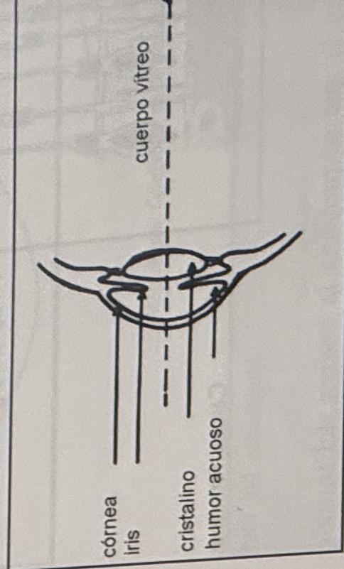

#### Óptica fisiológica

##### SISTEMA VISUAL

El progreso de la anatomía y de la técnica que el ojo solamente es uno de los elementos, oficialmente complejo, el sistema visual. La forma que el ojo está como funcionaba este conjunto sin lámina de actualmente, a todos sus misterios.

La retina, la capa sensible, es una parte de la papila del nervio óptico llegan las mismas mesodérmicas: duramadre, aracnoide, etc. El ojo es un ser con un conocimiento del Sistema Nervioso. El ojo es un ser cesario para comprender los mecanismos de comunicación.
 

---

## OCR IMG_3254.JPG

**Fuente:** `ocr-playground-download-20260621T163946Z/IMG_3254.JPG/markdown.md`

La necesidad de unificar la relatividad de un gran desarrollo científico de

La selección natural, con mutaciones extremadamente tres mil millones de veces que desarrollaron el lenguaje de humanidad vivió justo como los años 50 que liberó el poder de nuestra comprendimos a escuchar.

Tres ideas, permitiendo a los seres de Para construir lo imposible. Los que llegan por hablar. Y los mayores de ser así. Pero aquello que nos ha enícolas es el conocimiento que transfiere mil años, y muy especial. 50 años.

Stephen HAWKING.

En es considerada sinónimo de la relación: ojo-visión. Es la base de rayos, del desarrollo que se siente, es considerado como una imagen, como si de una relación permite responder a la de un trozo de vidrio mejora de un punto nació la explicación

Tres rayos se demuestra que imágenes sobre su envoltura son ya veces detrás, de manera el ojo es miope, en el

marcha de rayos, vino
al punto de enfoque más

próximo o más lejano, bien el ojo más largo o más corto. Esta última conclusión hizo creer que los defectos ópticos se debían, exclusivamente, a la longitud del ojo. Esta observación es estadísticamente cierta en el caso de defectos importantes, pero se revela errónea en la mayor parte de las ametropías, especialmente en las funcionales.

*Introducción a la Visiología*, IVF/SEO, 1983.

Esta ametropía, la más frecuente, no es ni axial ni de curvatura, pues los elementos del ojo entran todos dentro de la dispersión normal, y sólo su desarmonía produce la ametropía.

Tres LE GRAND, *Óptica fisiológica*, tomo I, SEO, 1991.

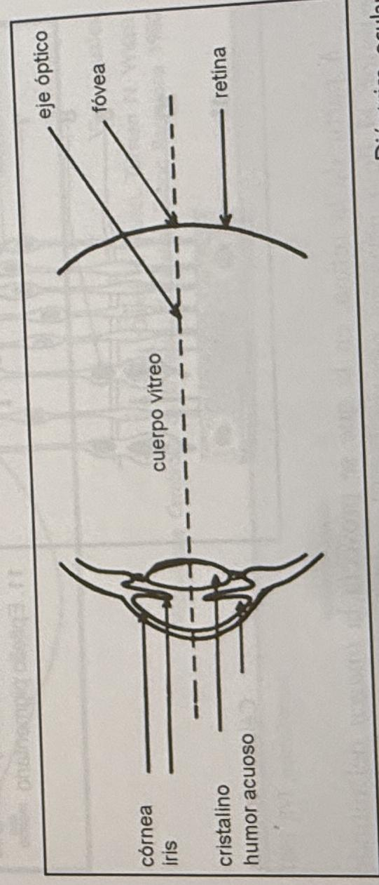

Diógerica ocular.
*Identification*, IVF, 1987.

#### Óptica fisiológica

##### SISTEMA VISUAL

El progreso de la anatomía y de la fisiología permitió constatar que el ojo solamente es uno de los elementos de un sistema especialmente complejo, el sistema visual. Poco a poco se comprendió como funcionaba este conjunto sin llegar, no obstante, ni incluso actualmente, a todos sus misterios.

La retina, la capa sensible, es una prolongación del cerebro. Hasta la papila del nervio óptico llegan las meninges o envolturas cerebrales mesodérmicas: duramadre, aracnoides y piamadre. En consecuencia, el conocimiento del Sistema Nervioso Central (SNC) llega a ser necesario para comprender los mecanismos visuales.
 

---

## OCR IMG_3255.JPG

**Fuente:** `ocr-playground-download-20260621T163946Z/IMG_3255.JPG/markdown.md`

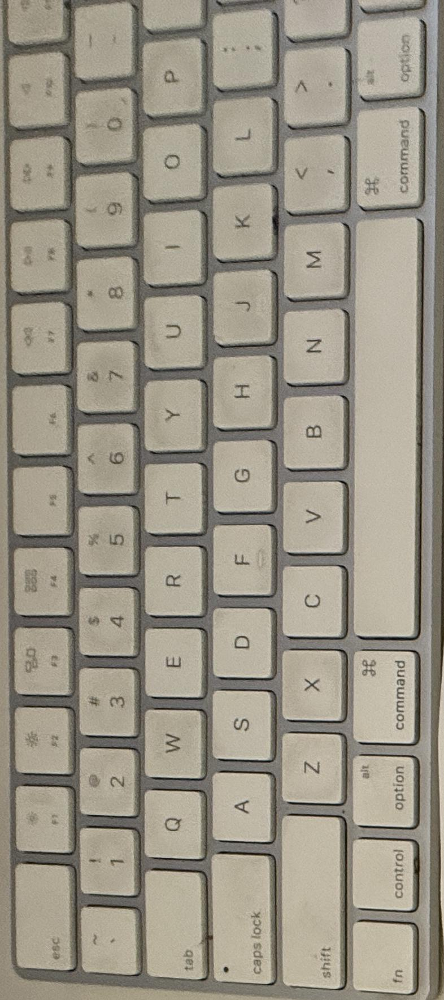

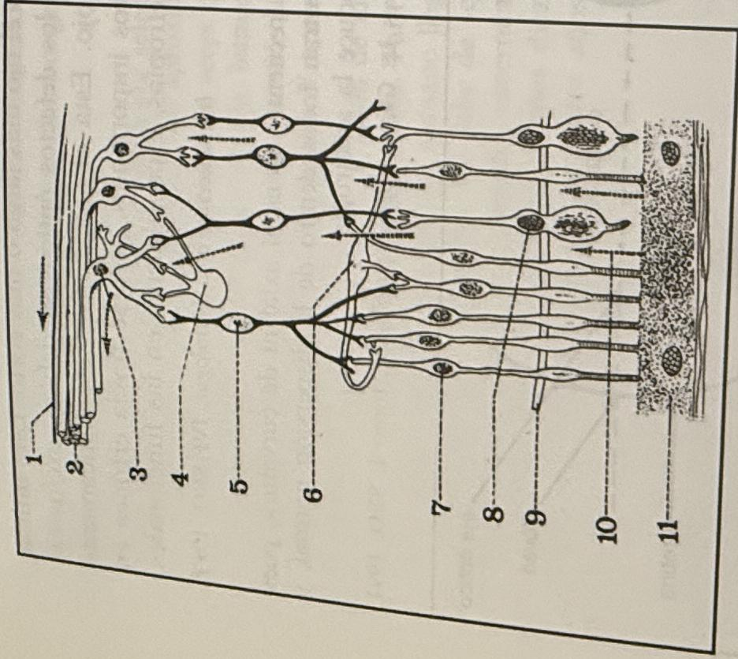

1. Membrana limitante interna.
2. Capa de fibras ópticas.
3. Células ganglionares.
4. Células amacrinas.
5. Células bipolares.
6. Células horizontales.
7. Células de bastón.
8. Células de cono.
9. Membrana limitante externa.
10. Sentido del influjo nervioso.
11. Epitelio pigmentario.

Células retínicas, Identificativo, IVF, 1987.

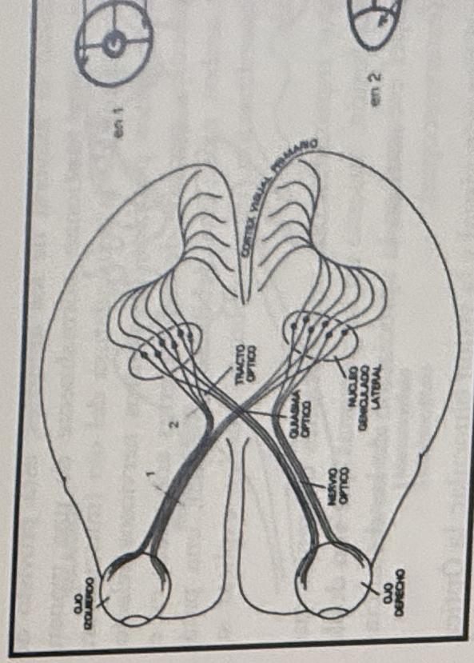

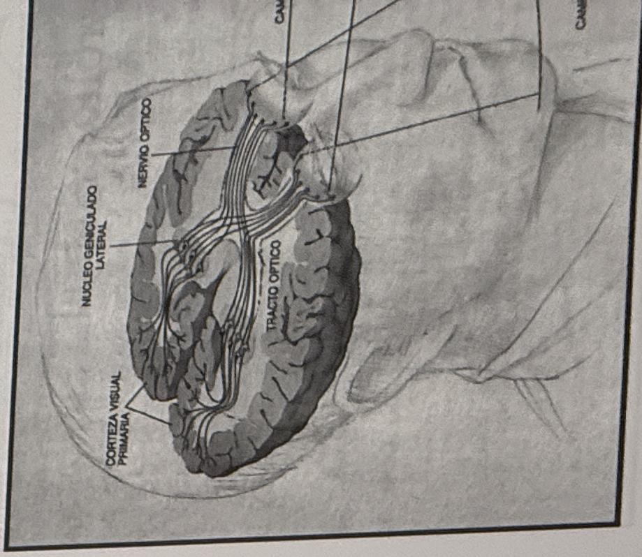
Ducto
Mecanomas Cerebrales de la Visión, El

A partir de la retina, en la que se proyecta la imagen del mundo exterior, el flujo nervioso recorre las fibras del nervio óptico, se ordena adecuadamente en los núcleos o cuerpos geniculados externos (CGE), ya que es el punto donde se ordenan, principalmente, los dos sistemas magno y parvo, para dirigirse a la parte más posterior de los hemisferios cerebrales, las áreas visuales. Trazando así el trayecto de las informaciones de origen luminoso, nos queda por comprender el mecanismo de análisis de estas informaciones.

A pesar de las lagunas, es posible explicar un fenómeno hasta entonces incomprehensible; ciertas personas, a pesar de presentar un ojo sano y sin defecto refractivo, no tienen una agudeza visual satisfactoria, el problema se sitúa a nivel de los elementos de transmisión y de descodificación. En este caso, y cada vez que la agudeza visual es insuficiente a pesar de la mejor compensación óptica, se dice que hay ambliopía. Las vías nerviosas son poco conocidas, el estudio de sus relaciones funcionales permite un primer enfoque fisiológico de la visión binocular.
 

---

## OCR IMG_3256.JPG

**Fuente:** `ocr-playground-download-20260621T163946Z/IMG_3256.JPG/markdown.md`

El hombre, como la mayoría de los animales, está provisto de dos ojos. Estos dos ojos funcionan normalmente de una manera coordinada. La observación de la musculatura del ojo (musculatura corminada, corminada) es extrínseca), los movimientos posibles, los centros nerviosos relativos a los sentidos, por lo que los sentidos son estos músculos, permite describir ciertas anomalías en el funcionamiento de ambos ojos. Una debilidad muscular, una parálisis, una falta de coordinación, una ambliopía, pueden explicar un alineamiento anómalo.

Los nervios ópticos transmiten dos informaciones diferentes que el cerebro unifica. Esta fusión, ausente en las personas que ven dolas (diplopía), juega un papel esencial en la apreciación de las distancias y de la profundidad (exteroscopia).

Al estudiar la descodificación visual y la visión binocular, la Óptica Fisiológica se interesó igualmente por las variaciones dioptricas del ojo y por sus causas. Como todo sistema óptico, el ojo no permite una focalización sobre todos los puntos del espacio sin modificaciones de sus componentes.

Después de diversas tentativas de explicación erróneas (se trataba de aplicar al hombre los mecanismos observados en algunos animales, como los peces), se enunciaron algunas teorías que finalmente han aclarado el papel del cristalino en la acomodación. Sujeto por ligamentos suspensorios a músculos situados en el interior del ojo (musculatura intrínseca) el cristalino, bajo el efecto de estos músculos, cambia de curvatura gracias a su plasticidad.

Durante el envejecimiento, los tejidos pierden su elasticidad y la acomodación de cerca se hace cada vez más difícil.

Hoy en día, gracias a la mejoría de nuestros medios de investigación, el análisis neurofisiológico del sistema visual no cesa de progresar.

Introducción a la Visiología, IVF/SEO, 1983.

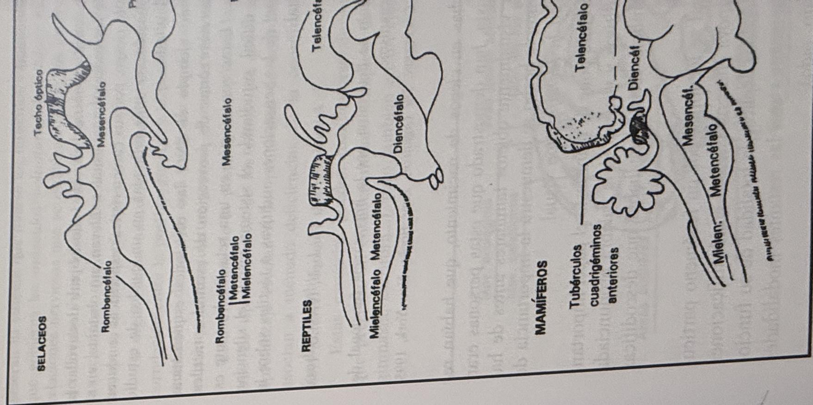
 

---

## OCR IMG_3257.JPG

**Fuente:** `ocr-playground-download-20260621T163946Z/IMG_3257.JPG/markdown.md`

46

### Optometría funcional

#### VISIÓN

Las concepciones expuestas han sido valiosas para desarrollar la comprensión de los mecanismos visuales. Llevan, no obstante, en sí mismas, su propio riesgo; por sus características específicas conducen a investigaciones cada vez más refinadas en un cuadro de estudio necesariamente limitado.

Tomando como ejemplo el SNC, las divisiones esquemáticas han permitido entrever zonas de proyección de estímulos táctiles, auditivos, visuales... Estas zonas están en una relación bastante estrecha, por eso es difícil, estudiando el sistema visual, el silenciar, por ejemplo, el papel de las sensaciones auditivas o táctiles sobre la descodificación visual.

*Introducción a la Visiología, IVF/SEO, 1983.*

El efecto de estímulo se determina por la importancia funcional del estímulo para el organismo.

Kurt GOLDSTEIN, *The Organism*, Zone Books, New York, 1995.

Observaciones hechas en ciegos de nacimiento, que habían recobrado el uso de la vista, han demostrado que estas personas eran incapaces de reconocer visualmente objetos familiares antes de haberlos tocado. Por este simple hecho se demuestra la importancia de las experiencias táctiles en la *Identificación visual*.

El aprendizaje de la lectura pone de manifiesto el papel importante de las asociaciones auditivas y visuales. A la palabra pronunciada y oída corresponde un símbolo escrito que habrá que descodificar visualmente.

El reconocimiento visual se identifica por un fenómeno particularmente complejo, que se apoya entre otras cosas en identificaciones táctiles y auditivas, no pudiéndose explicar la totalidad de su funcionamiento más que por sus relaciones con las restantes modalidades sensoriales (tacto, gusto, olfato, oído).

Con el mismo espíritu, se hace difícil considerar la visión binocular únicamente en el plano ocular para comprender su funcionamiento general. El sistema que gobierna los relaciones nerviosas ojo derecho y las relaciones bruscos o de ancha.

La organización correlación entre musculatura y constituye la misma.

Esta evidencia, en su trabajo, es el que se aplica a la precisión de la gimnasia, en el que precisen la gimnasia, en el que se aplica.

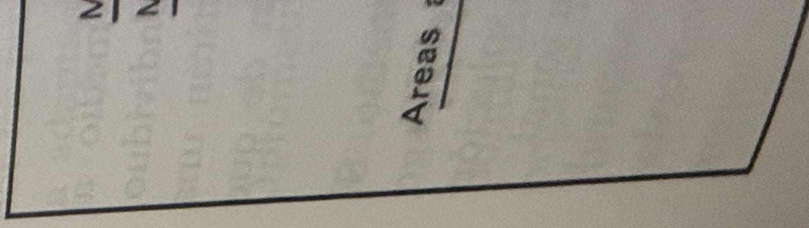
 

---

## OCR IMG_3258.JPG

**Fuente:** `ocr-playground-download-20260621T163946Z/IMG_3258.JPG/markdown.md`

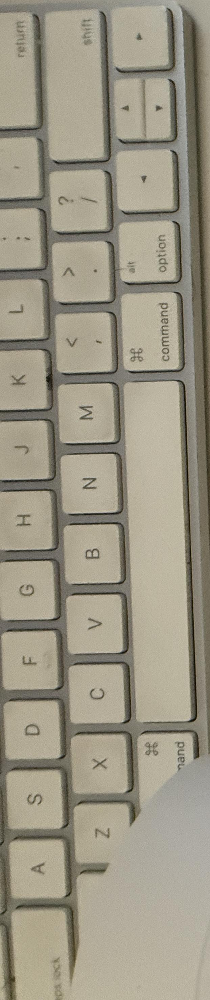

general. El sistema que mueve los músculos extrínsecos es el mismo que gobierna los músculos voluntarios (estriados) del cuerpo. Las relaciones nerviosas que se establecen entre los centros motores del ojo derecho y los del ojo izquierdo son de la misma naturaleza que las relaciones que permiten coordinar los movimientos de los dos brazos o de ambas piernas.

La organización neurológica permite establecer la existencia de correlación entre la postura general y la postura ocular. En efecto, la musculatura de los ojos está integrada en el conjunto funcional que constituye la musculatura general. ¿Por qué razón va a estar separada?

Esta evidencia de la postura, se repite en la coordinación motriz. Es típico el caso de los niños que presentan dificultades de aprendizaje escolar. A los problemas de coordinación binocular se asocian a menudo deficiencias de la coordinación motriz general (andar, escribir...).

Estas carencias pueden manifestarse durante otras actividades que precisen un encadenamiento complejo de movimientos (danza, gimnasia, escritura...), pero también en un ejercicio como el gateo.

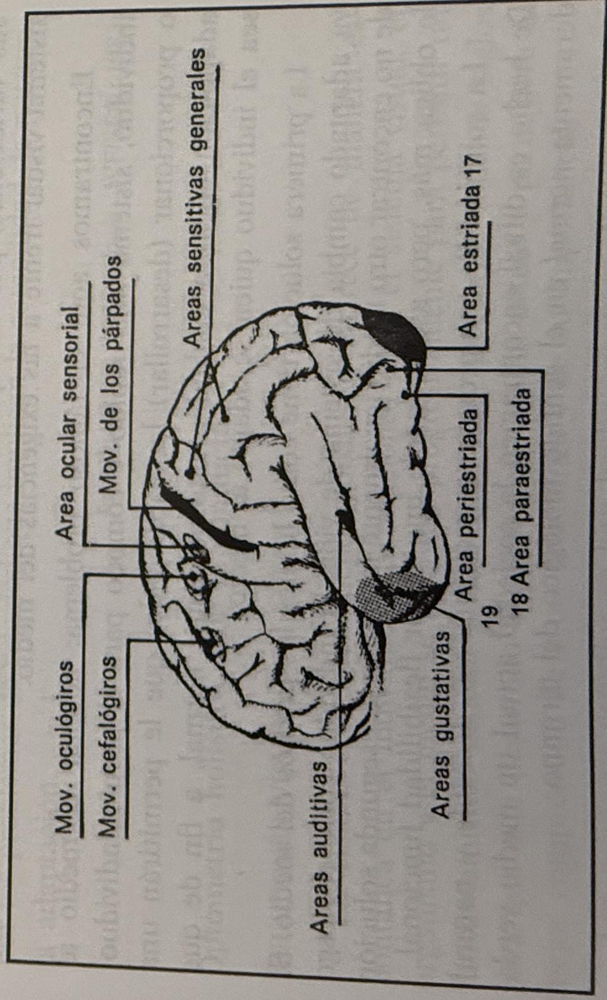

Áreas visuales.
Introducción a la Visiólogía, IVF/SEO, 1983.
 

---

## OCR IMG_3259.JPG

**Fuente:** `ocr-playground-download-20260621T163946Z/IMG_3259.JPG/markdown.md`

48
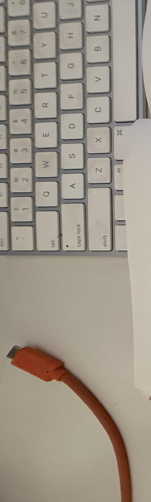

En este contexto, la motricidad ocular no está limitada a los músculos oculares extrínsecos o a los nódulos motores que los go-biernan. Está en relación con la motricidad general y tanto depende de ella como puede influirla.

Las variaciones de focalización mencionadas anteriormente dependen de las modificaciones que se producen en el resto del cuerpo. Estos componentes, lejos de limitar su acción al nivel ocular, de hecho influyen toda la actividad del organismo, actividad inconsciente, interna, vegetativa.

Modifican el sistema circulatorio, regulan las emisiones de las glándulas, rigen de una manera general todos los músculos involuntarios (lisos), que escapan generalmente al control voluntario.

Si la visión aparece como indisociable del conjunto del organismo, ¿por qué no consideramos de la misma manera sus relaciones con el medio exterior?

Dos consecuencias se desprenden de esta relación: es necesario tener en cuenta, por una parte, la influencia del entorno visual y de sus variaciones; por otra parte, las capacidades de adaptación del sistema visual frente a las exigencias del medio.

Encontramos aquí el famoso problema: adaptar el medio al individuo, sistema más rápido y cómodo para el propio individuo, o proporcionar (desarrollar) las capacidades que le permitirán una adaptación eficaz a cualquier entorno visual normal, a fin de que sea el individuo quien se adapte al medio.

La primera solución tiene como límites los propios del medio. Si ya adaptado cambia de sistema de vida, el individuo corre el riesgo de no encontrar otro medio igualmente favorable. La segunda solución le obliga más, pero asegurándole una mejor flexibilidad funcional.

La solución de compromiso parece a la vez deseable y natural. De hecho es difícil encontrar en la sociedad actual un medio verdaderamente normal en el sentido biológico del término.

CAPACIDADES VISUAL

Esquema de la

Es preciso pues, a más nocivos e importante trabajo, intensidad u funcionamiento visual, miento de las aptitudes, consecuencia, se trata de sus posibilidades.

El concepto único del estudio de las allá de los problemas, por los problemas de la adaptación.

Optometría holística

RELACIONES VISUAL

La visión, como pontánea en el organismo y el funcionamiento para que este como mejor comprensión.

Los primeros desarrollo estriado
 

---

## OCR IMG_3260.JPG

**Fuente:** `ocr-playground-download-20260621T163946Z/IMG_3260.JPG/markdown.md`

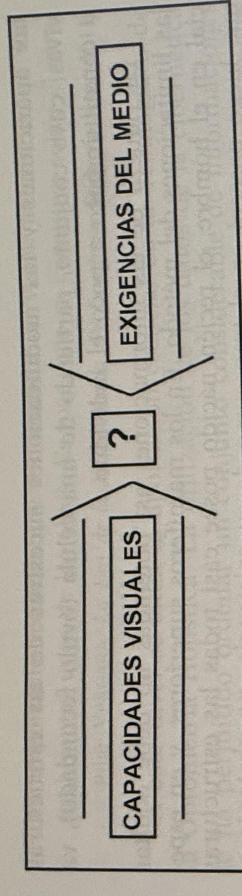

Esquema de las relaciones: capacidades visuales – exigencias del medio.
*Introducción a la Visiología*, IVF/SEO, 1983.

Es preciso pues, actuar sobre el medio para eliminar sus efectos más nocivos e imponer las modificaciones posibles (condiciones de trabajo, intensidad luminosa...) e intentar mejorar al individuo en su funcionamiento visual. Esto es posible a partir de un buen conocimiento de las aptitudes necesarias y de su modo de adquirirlas. En consecuencia, se trata de desarrollar el potencial visual al máximo de sus posibilidades.

El concepto unitario *visión-organismo-medio* se descubre a partir del estudio de las relaciones organismo-visión y visión-medio. Más allá de los problemas específicamente visuales, se interesa asimismo por los problemas de relación que implican la comodidad, la postura, la adaptación.

*Introducción a la Visiología*, IVF/SEO, 1983.

#### Optometría holística o de la conducta

##### RELACIONES VISUALES

La visión, como fenómeno global, no aparece de manera espontánea en el individuo. Las relaciones entre el sistema visual, el organismo y el medio se elaboran progresivamente para permitir un funcionamiento general eficaz. Han sido necesarios muchos siglos para que este desarrollo alcanzara su estadio actual y permitiera la mejor comprensión de estas relaciones y de su importancia.

Los primeros estudios se han hecho substancialmente sobre el desarrollo estructural, es decir sobre la embriogénesis. Ella analiza

&lt; 49
 

---

## OCR IMG_3261.JPG

**Fuente:** `ocr-playground-download-20260621T164110Z/IMG_3261.JPG/markdown.md`

las apariciones y las modificaciones sucesivas de las estructuras vivas, cuyo conjunto, partiendo de una célula (óvulo fecundado), va a constituir poco a poco el individuo.

La riqueza de las informaciones así obtenidas no debe ocultar las limitaciones del método. En los mamíferos superiores, y en especial en el hombre, el recién nacido posee casi todas las estructuras que luego poseerá en el transcurso de su existencia, no obstante el conjunto de sus comportamientos se aleja mucho de los del adulto.

¿De dónde proviene esta diferencia? ¿Por qué se produce? ¿Se trata de faltas a nivel del sistema nervioso? No parece así; lo más esencial de las estructuras nerviosas está presente desde el nacimiento.

¿Se trata de carencias del sistema vegetativo? En efecto, es preciso, una vez más, considerar el conjunto del problema. Las estructuras en su gran mayoría están en su sitio y funcionan.

La diferencia de resultados entre el recién nacido y el adulto se debe esencialmente a la naturaleza de este funcionamiento. El adulto utiliza las coordinaciones motrices aprendidas durante la infancia, así como la experiencia que ha podido adquirir en su movimiento en el espacio y en su capacidad de predicción y anticipación de lo que pasará al ejecutar una acción. El desarrollo del bebé, como el del niño, se basa en una sucesión de modificaciones funcionales.

Los órganos colocados en su sitio desde la embriogénesis van entrando poco a poco en juego, las funciones que realizan en su comienzo son a menudo diferentes de las que desempeñarán en el adulto. Al principio se puede hablar de un funcionamiento *por funcionar, por aprender*. Poco a poco se establecerán los esquemas nerviosos que transformarán un conjunto poco organizado de actividades distintas en un Todo en continua interacción.

Una dificultad inherente a este género de investigación viene del hecho de que los comportamientos que atestiguan esta organización funcional son más variables que las transformaciones estructurales de la embriogénesis. Su orden de aparición es igualmente mucho menos preciso.

Es necesario, pues, generalizar los comportamientos, presentando las diferencias apreciables de un individuo a otro, tanto en su cronología como en sus manifestaciones.

Es importante recordar que los dos los que son los que se encuentran en el Continente. El esculpamiento es la evaluación de las actividades educativas y las actividades de la vida social, y el desarrollo visual sobre el sentido más amplio de la información y el desarrollo del ambiente. El desarrollo visual sobre el sentido más amplio de la información y el desarrollo del ambiente es el sentido más amplio de la información y el desarrollo del ambiente.

Es importante recordar que los comportamientos que se encuentran en el Continente están en el que el adulto es el más importante. El desarrollo visual es el que se encuentra en el Continente, y el desarrollo visual es el que se encuentra en el Continente.

Generalizar consiste en que los comportamientos que se encuentran en el Continente, y de acuerdo con la diccionario biológica, se describen las características estéticas y la forma de la vida.
 

---

## OCR IMG_3262.JPG

**Fuente:** `ocr-playground-download-20260621T164110Z/IMG_3262.JPG/markdown.md`

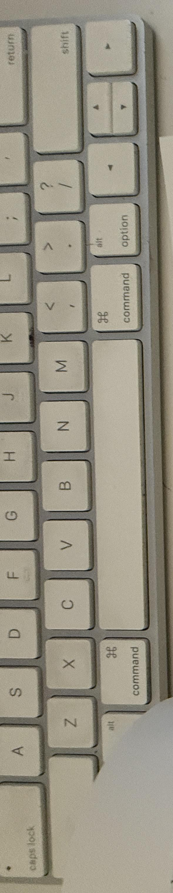

Es importante recordar que los modelos de visión anteriores, no son excluyentes unos de los otros. Es más, uno se construye sobre el otro.

Pilar VERGARA, *La Era de la Neurociencia*, IV Congreso Federópticos, 2011.

A este nivel se sitúa la aportación esencial de la Visiología o de la Optometría Holística. La utilización de los datos de la cibernética le ha permitido ordenar un conjunto considerable de informaciones y organizar, según un modelo funcional de estudio, los principales elementos del desarrollo general y visual.

Así es posible comprender, por ejemplo, como la motricidad general influye en el establecimiento de la coordinación binocular, como la sensibilidad táctil favorece la adquisición de la sensibilidad visual, como el sistema vegetativo actúa sobre la regulación de la focalización. De la misma manera se comprende la incidencia del desarrollo visual sobre el aprendizaje escolar. La visión, tomada en el sentido más amplio, puede aparecer como una guía, como un elemento de unificación general.

Con este espíritu proponemos la organización de una secuencia de actividades educativas que tiendan a favorecer un buen desarrollo sensorial, motor y cognitivo.

Esta secuencia es el resultado de la generalización del estudio sistemático de la visión.

*Introducción a la Visiología*, IVE/SEO, 1983.

Generalizar consiste (...) en crear nuevos conjuntos de relaciones, es decir nuevas estructuras que engloben los conjuntos preexistentes, cuyas características esenciales son ya conocidas.

Henri LABORIT, *Biologie et Structure*, Gallimard, París, 1968.
 

---

## OCR IMG_3263.JPG

**Fuente:** `ocr-playground-download-20260621T164110Z/IMG_3263.JPG/markdown.md`

52

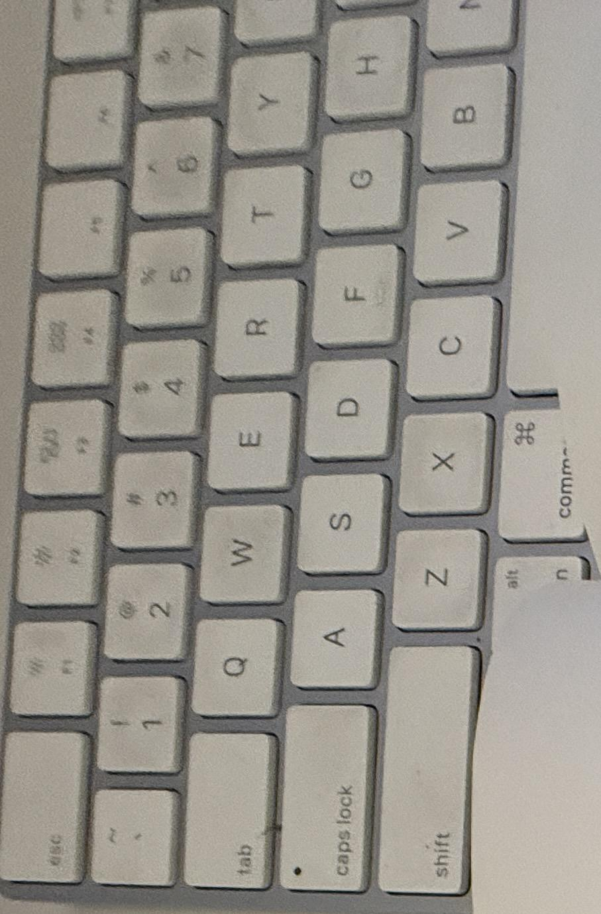

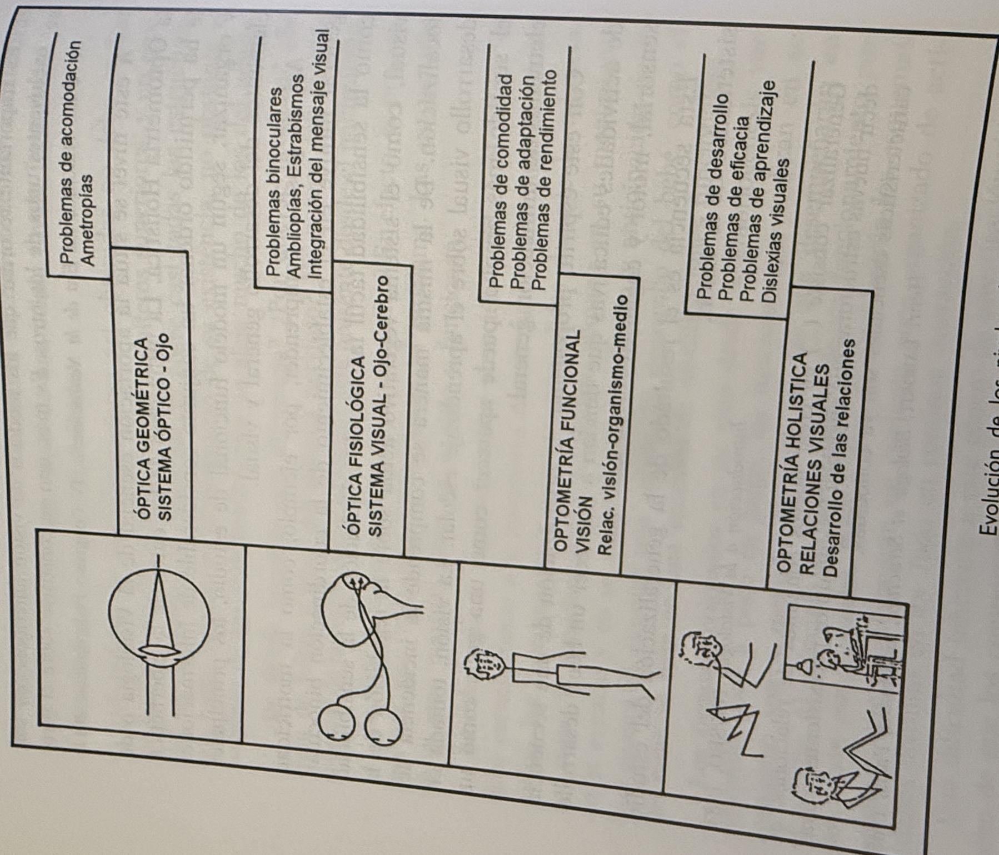

#### Definiciones

El desarrollo, fundamentalmente, de las ciencias de la visión, la cual es considerada como un medio de la diversidad, es considerado de una manera más eficiente y eficiente. En la difícil asimilación constante, en las modificaciones conciernes, los comportamientos, mudando a las ciencias.

¿Qué se entiende por:

- (El comportamiento)… sobre el medio, organizando a los más grandes?
- Jean Puech

- (El comportamiento)… entre otros, entre los más grandes y los más grandes, en una habilidad para la gestión de la estabilidad, el desarrollo de la gestión de la estabilidad, el desarrollo de las lecciones en una habilidad para la gestión de la estabilidad, y por sí misma, rediseño de la gestión de la estabilidad, etc.

#### Implica la noción de la estabilidad

Invertimos en el desarrollo de las ciencias, y en la estabilidad, y en la estabilidad, el desarrollo de las lecciones.
 

---

## OCR IMG_3264.JPG

**Fuente:** `ocr-playground-download-20260621T164110Z/IMG_3264.JPG/markdown.md`

CAPÍTULO 3

NOCIÓN DE DESARROLLO

Definiciones

El desarrollo, fundamento de la cuarta fase de la evolución de las ciencias de la visión, la de la Optometría Holística, a menudo es considerado de una manera demasiado limitada. En efecto, es difícil asimilar todas las implicaciones del estudio de un campo en modificación constante. En el marco del desarrollo funcional, estas modificaciones conciernen menos a las estructuras tangibles que a los comportamientos, muchas veces difíciles de apreciar.

¿Qué se entiende por comportamiento?

(El comportamiento)... consiste en el conjunto de elección y de acción sobre el medio, organizando los intercambios de manera óptima.

Jean Piaget, *Biologie et Connaissance*, Gallimard, París, 1967.

(El comportamiento)... es, en efecto, la expresión más completa y coherente de un estadio de desarrollo determinado.

Arnold Gesell y Catherin S. Amatruda, *Embriología de la Conducta*, Paidós, Buenos Aires, 1972.

Implica la noción de extensión, extensión cuantitativa ciertamente, pero también cualitativa. La extensión cualitativa marca los cambios más o menos profundos de la naturaleza de aquello que se está desarrollando. El desarrollo de la visión binocular permite la aparición de la estereocularidad. Extensión significa ir todavía más lejos en una habilidad, en un campo de actividad o en la eficacia por sí misma, reduciendo, por ejemplo, la energía gastada para un acto determinado.

53
 

---

## OCR IMG_3265.JPG

**Fuente:** `ocr-playground-download-20260621T164110Z/IMG_3265.JPG/markdown.md`

El desarrollo se caracteriza por la duración (no es instantáneo), extensión, sucesión cronológica, encadenamiento o concatenación en extensión, sucesión cronológica, que aparecen encadenados según una cierta cronología. Este encadenamiento relativamente dico que se ha reducido, pero, por lo tanto, se ha reducido. Este encadenamiento se ha reducido en el curso de la contración muscular, en el curso de la contración de la interacción muscular, en el curso de la contración de la contración de la contración de la interacción muscular, en el curso de la contración de la contración de la contración de la contración de la contración de la contración de la contración de la contración de la contración de la contración de la contración de la contración de la contración de la contración de la contración

La fase representa mucho más la misma manera que el todo. En efecto en el interior de ellas siempre según el mismo, cibernético, encadenándose correspondientes.

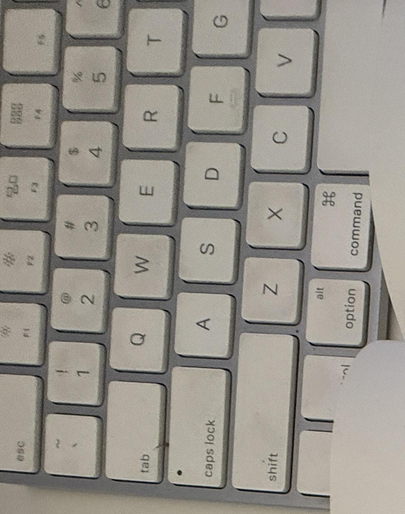

El desarrollo se caracteriza por la duración (no es instantáneo), extensión, sucesión cronológica, encadenamiento o concatenación en extensión, sucesión cronológica, que aparecen encadenados según una cierta cronología. Este encadenamiento relativamente dico que se ha reducido, pero, por lo tanto, se ha reducido. Este encadenamiento se ha reducido en el curso de la contración muscular, en el curso de la contración de la contración de la contración de la contración de la contración de la contración de la contración de la contración de la contración de la contración de la contración de la contración de la contración de la contración

La fase representa mucho más la misma manera que el todo. En efecto en el interior de ellas siempre según el mismo, cibernético, encadenándose correspondientes.

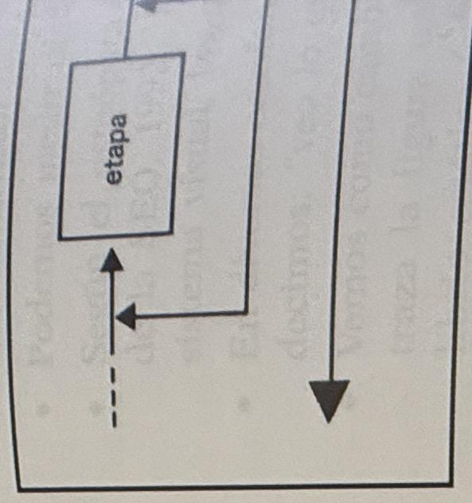

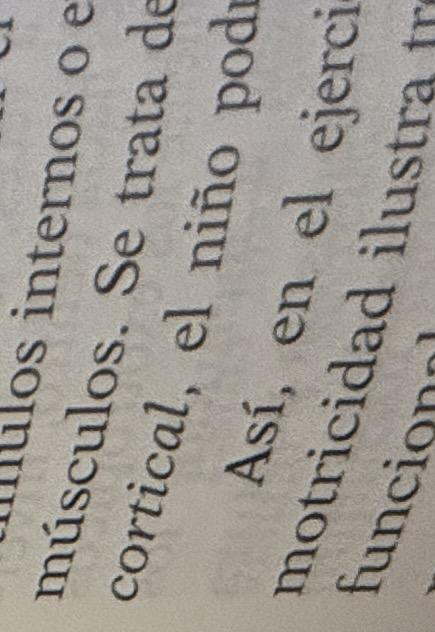

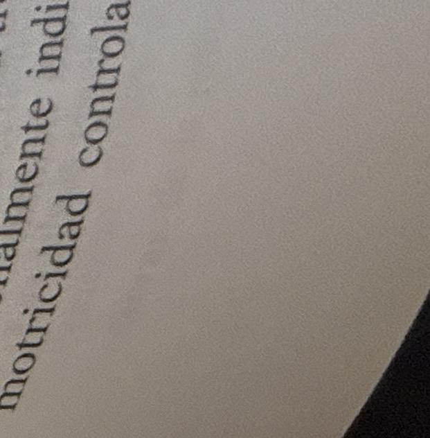
 

---

## OCR IMG_3266.JPG

**Fuente:** `ocr-playground-download-20260621T164110Z/IMG_3266.JPG/markdown.md`

capa lock
A S D F G H J K L
z x c v b n m &lt; &gt; ?
an option
command
an option

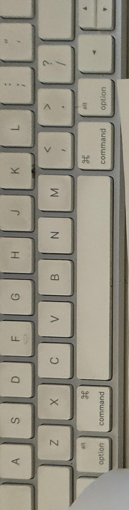

(no es instantáneo), no es una concatenación en que se quede en la etapa, está sujeto al presente también en una etapa que aparecen encadenando relativamente los apartamientos son dos apartamientos, en el que se quede, en la etapa, en la que se suceden en la etapa, en la que se suceden en la etapa, en la que se suceden en la etapa, en la que se suceden en la etapa, para que se suceden en la etapa, para que se suceden en la etapa, para que se suceden en la etapa, para que se suceden en la etapa, para que se

La fase representa mucho más que la suma de las etapas, de la misma manera que el todo es superior a la suma de las partes.

En efecto en el interior de cada fase, las etapas se articulan entre ellas siempre según el mismo esquema de la caja negra del modelo cibernético, encadenándose la una a la otra mediante los feed-back correspondientes.

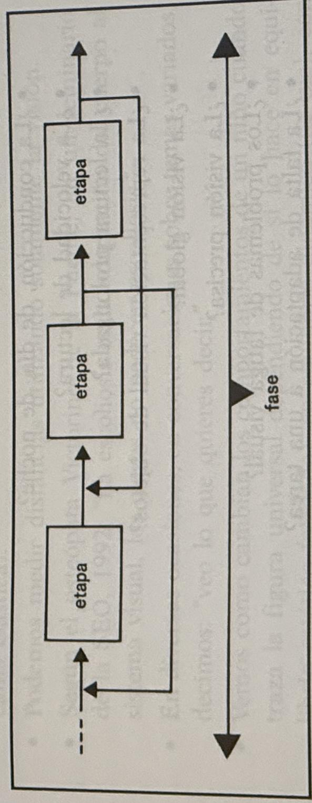
Esquema de la concatenación fase-etapas.
Introducción a la Visiología, IVF/SEO, 1983.

Cada nivel de complejidad proporciona los elementos de construcción a partir de los cuales se forma el nivel siguiente, de complejidad superior, Jóel de ROSNAY, *Les Origines de la Vie, de l'Atome à la Cellule*, Seuil, París, 1966.

Estos cambios se reflejan por ejemplo en el desarrollo del control de la contracción muscular.

En el curso de la embriogénesis se producen contracciones antes de que exista la inervación. Esta primera fase es *aneural*. Durante el periodo fetal o en el recién nacido, los reflejos desencadenados por estímulos internos o externos provocan la contracción de estos mismos músculos. Se trata de la fase *refleja*. Más adelante, en la fase llamada *cortical*, el niño podrá provocar voluntariamente la contracción.

Así, en el ejercicio del mismo movimiento, el desarrollo de la motricidad ilustra tres niveles de operación (fases) bien distintos pero funcionalmente indisociables: motricidad aneural, motricidad refleja, motricidad controlada.

Introducción a la Visiología, IVF/SEO, 1983.

&lt; 55
 

---

## OCR IMG_3267.JPG

**Fuente:** `ocr-playground-download-20260621T164110Z/IMG_3267.JPG/markdown.md`

56

Relaciones entre la visión, el organismo y el medio

¿Qué es la visión?
- ¿Los ojos?
- ¿Ver claro?
- ¿Ver simple?
- ¿La agudeza visual?
- ¿La conducción, de día, de noche?
- ¿La velocidad de lectura?
- ¿La lectura prolongada?
- ¿La representación visual de objetos?
- ¿La visión global?
- ¿La visión precisa?
- ¿Los problemas de fatiga visual?
- ¿La falta de adaptación a una tarea?
- ¿Tener las necesidades visuales cubiertas?...

Cada cual puede enfocar la pregunta según sus necesidades o costumbres particulares, dependiendo de la importancia que dé a cada uno de los atributos visuales. La visión es todo esto y mucho más.

La visión tiene sus raíces en el organismo: numerosos estrábicos endotrópicos tienen los hombros hacia adelante y, a veces, también los pies hacia dentro, inversamente los exotrópicos tienen, a menudo, los pies abiertos; la postura general es análoga a la postura ocular.

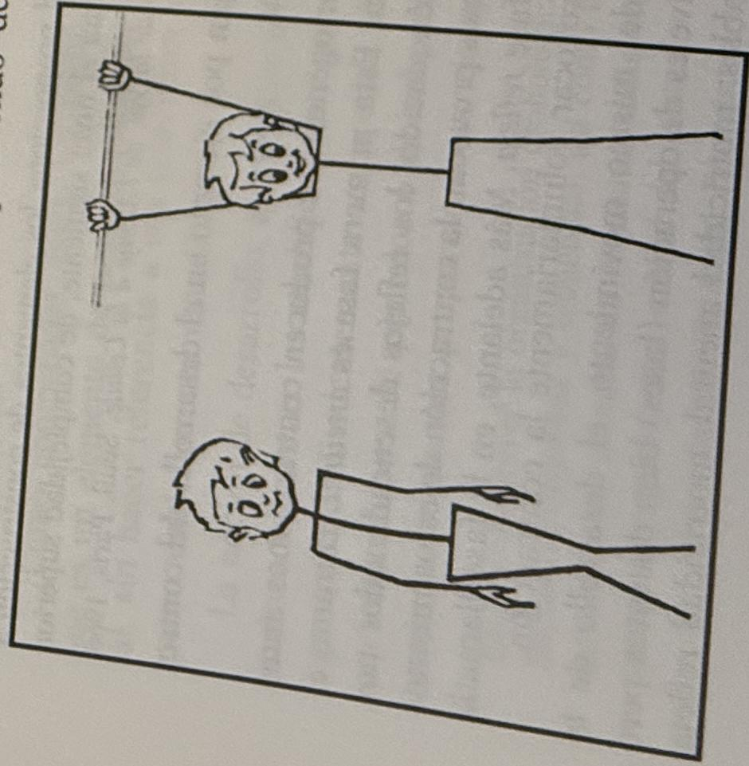
Relaciones entre la postura y el estrabismo.
La visión y el niño, IVF/SEO, 1983.

- Perdemos el equilibrio si, a la persona
- Podemos experimentar una repercusión en un objeto (manzana).
- Se nos hace la boca agua vivida.
- Modificamos las líneas de miras (cambiar los patrones de soporte a la cama elástica).
- Podemos medir distancias.
- Según el osteópata Victorino de la SEO, 1992: "La escolar, la sistema visual, los ciegos no son.
- En diversas ocasiones, en otros decimos: "veo lo que quieras.
- Vemos como cambian los riñones, traza la figura universal del libro estático (sentado), el brazo rígido (diversos).

Como comprobación de la Stewart Duke-Elder mostró que el efecto no llegan al córtex visual, sino a la percepción visual.

Cuando los terminales de los riñones, unos 200 nervios están vinculados a la red de las células bipolares y se encuentran como un primer análisis de la energía orgánica. A continuación, los calculados laterales donde, a menudo, se vean ya no viajan hacia el córtex, sino las áreas motoras del sistema.

Jean-Paul Belin

Estas fibras quedan visual y se relacionan con un implican directamente el cuerpo.

Las fibras visuales encendidas estén en el externo. El 80% de las fibras de la retina que
 

---

## OCR IMG_3268.JPG

**Fuente:** `ocr-playground-download-20260621T164110Z/IMG_3268.JPG/markdown.md`

&lt; 57&gt;

- Perdemos el equilibrio si, a la pata coja, cerramos los ojos.
- Podemos experimentar una representación (gusto) pensando en un objeto (manzana).
- Se nos hace la boca agua viendo a alguien lamer un limón.
- Modificamos las líneas de mirada (ruptura de estrabismos) al cambiar los patrones de soporte (colgamiento por los brazos, cama elástica).
- Podemos medir distancias utilizando solamente la visión.
- Según el osteópata Victorino de la Fuente, en un seminario de la SEO, 1992: "La escoliosis es la adaptación del cuerpo al sistema visual, los ciegos no padecen escoliosis."
- En diversas ocasiones, en conversaciones sobre temas variados, decimos: "veo lo que quieres decir."
- Vemos como cambian los comportamientos de un niño cuando traza la figura universal dependiendo de si lo hace en equilibrio estático (sentado), en equilibrio dinámico (de pie), con el brazo rígido (diversos grados de bloqueo).

Como comprobación de estas relaciones, el neurooftalmólogo Stewart Duke-Elder mostró que el 20% de las fibras del nervio óptico no llegan al córtex visual y no participan en la elaboración de la percepción visual.

Cuando los terminales de los nervios se encuentran en la periferia de la retina, unos 200 nervios están vinculados a una fibra del nervio óptico a través de la red de las células bipolares y ganglionares de la retina y, por su estructura física, actúan como un primer analizador de la energía radiante y primer organizador de la energía orgánica. A continuación, la señal se transmite a los cuerpos geniculados laterales donde, a nivel de los colículos superiores, el 20% de las fibras ya no viajan hacia el córtex visual del cerebro, sino que ahora se mueven hacia las áreas motoras del sistema nervioso central.

Jean-Paul BLOUIN, *The Black Book of the Year 2000*, OEP, 1991.

Estas fibras quedan asociadas a los mecanismos de orientación visual y se relacionan con los centros de la motricidad y la postura, implican directamente al tronco.

Las fibras visuales encuentran una estación de relevo en el cuerpo geniculado externo. El 80% de las fibras de la retina pasan por aquí hacia el córtex. Las fibras de la retina que pasan por los colículos superiores, el 20% restante,
 

---

## OCR IMG_3269.JPG

**Fuente:** `ocr-playground-download-20260621T164110Z/IMG_3269.JPG/markdown.md`

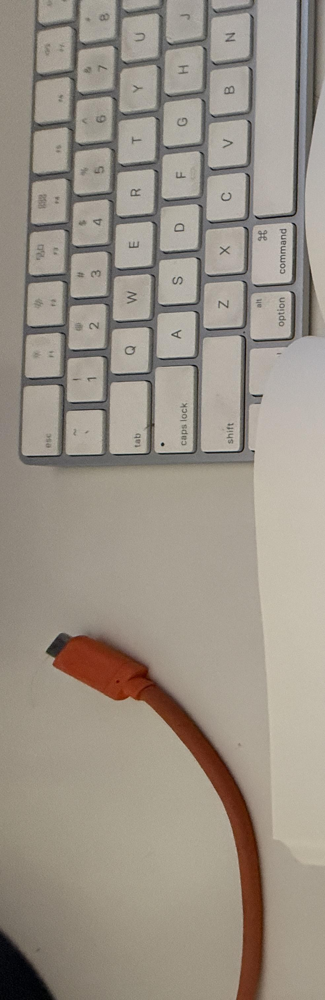

son, sin duda, las más primitivas filogenéticamente... y en el hombre están asociadas con la fotostática primitiva (luz y postura), más que no con las funciones superiores sensoriales de la visión.

Stewart DUKE-ELDER, System of Ophtalmology, Henry Kimpton, London, 1958-1963. Citado por Robert A. KRASKIN, Lens Power in Action, OEP, 2001.

Estas dos vías principales de procesamiento que llevan la información visual desde los ojos a los cuerpos geniculados externos (CGE), se denominan:

- La vía parvocelular (células parvo, pequeñas), también denominada focalizadora, que comprende el 80% de las fibras que finalmente se dirigen al cortex visual y son responsables de la visión nítida, de la agudeza visual, uno de los atributos de la visión.

- La vía magnocelular (células magno, grandes), también denominada ambiental, es una vía de procesamiento, paralela a la parvocelular, que lleva el restante 20% de las fibras. Estas, pasando por folículos superiores, van a los centros motores del organismo y afectan los restantes sentidos del hombre; relaciona la visión con el equilibrio, el movimiento, la audición, el habla, la propiocepción.

La vía parvocelular nos pregunta: "Qué es esto que miro", mientras la vía magnocelular nos concreta: "Donde estoy yo y donde está el objeto mirado".

Cada sistema celular tiene diferencias funcionales características y es responsable de la separación e interconexión de los canales de información. Las vías toman su nombre de las capas del cuerpo geniculado externo (CGE). Las propiedades de las dos vías se diferencian en cuatro funciones: color, agudeza, velocidad y sensibilidad al contraste. Las dos vías son importantes, una nos permite "ver" y la otra nos permite "movernos". Ninguna de las dos vías trabaja separadamente de la otra ni del resto del organismo. De manera óptima, ambas refuerzan la función de la otra de manera sinérgica.

Citado por Pilar VERGARA, Desarrollo visual, Jornadas sobre la prevención del fracaso escolar, Burgos 2008.

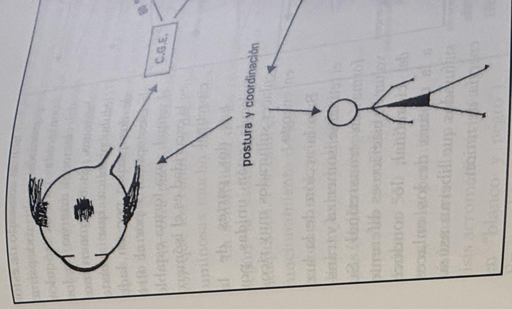

Stewart DUKE-ELDER, System of

Citado por Jean-Paul

Fisiología de la visión

CREACIÓN DE LA INFORMACIÓN

La transformación de la visión en información nerviosa, sensoriales, orales, y malos y primarios son los pigmentos
 

---

## OCR IMG_3270.JPG

**Fuente:** `ocr-playground-download-20260621T164110Z/IMG_3270.JPG/markdown.md`

&lt; 59&gt;

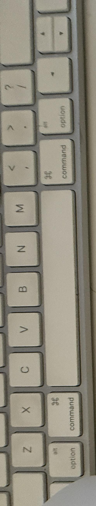

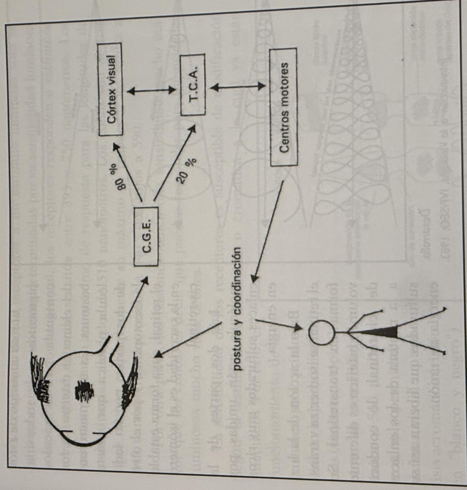

Vas visomotrices según Duke-Elder.
Stewart DUKE-ELDER, System of Ophthalmology, Henry Kimpton, Londres, 1958-1963.
Citado en Binocularisation, IVF, 1979.
Citado por Jean-Paul BLOUIN, The Black Book of the Year 2000, OEP, 1991.

#### Fisiología de la visión

##### CREACIÓN DE LA INFORMACIÓN NERVIOSA VISUAL

La transformación de la información luminosa (imagen retiniana) en información nerviosa, se produce a nivel de los receptores sensoriales retinianos, gracias a los mecanismos fotoquímicos cuyos agentes primarios son los pigmentos fotosensibles de los conos y los bastones.
 

---

## OCR IMG_3271.JPG

**Fuente:** `ocr-playground-download-20260621T164508Z/IMG_3271.JPG/markdown.md`

60
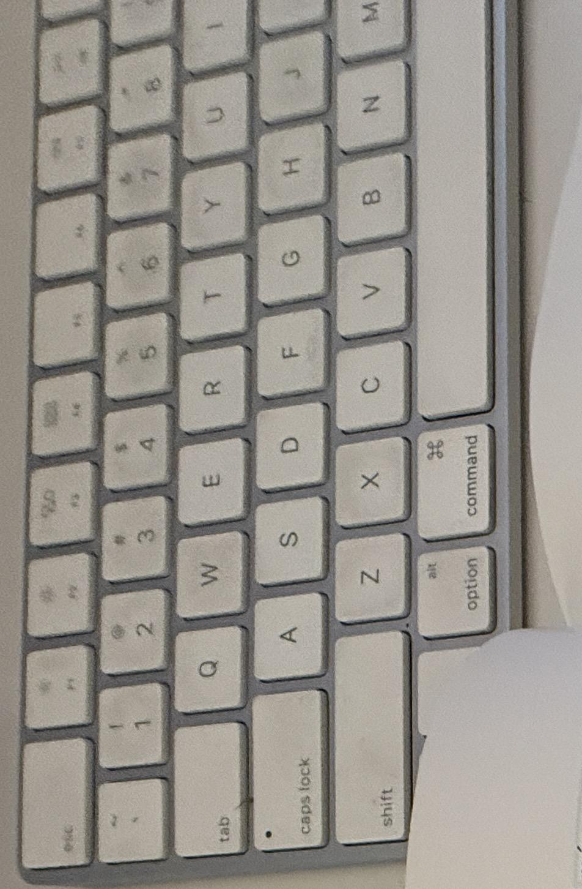

El más conocido de estos pigmentos es la rodepilla, contenida en los séculos del elemento externo de los bastones. Es una macrorrea lécula proteica que consta de dos partes: por un lado, la escotopsina, y por el otro, el retinal, cuya forma estable en la oscuridad es el isómero cis-retinal.

Las dos partes de la molécula están unidas por enlaces sulfurados muy ricos en energía.

Bajo la acción de la luz, el retinal se isomeriza y transforma en transretinal. Su volumen estérico es diferente del cis-retinal, lo conduce a la ruptura de los enlaces sulfurados que liberan así su energía de unión.

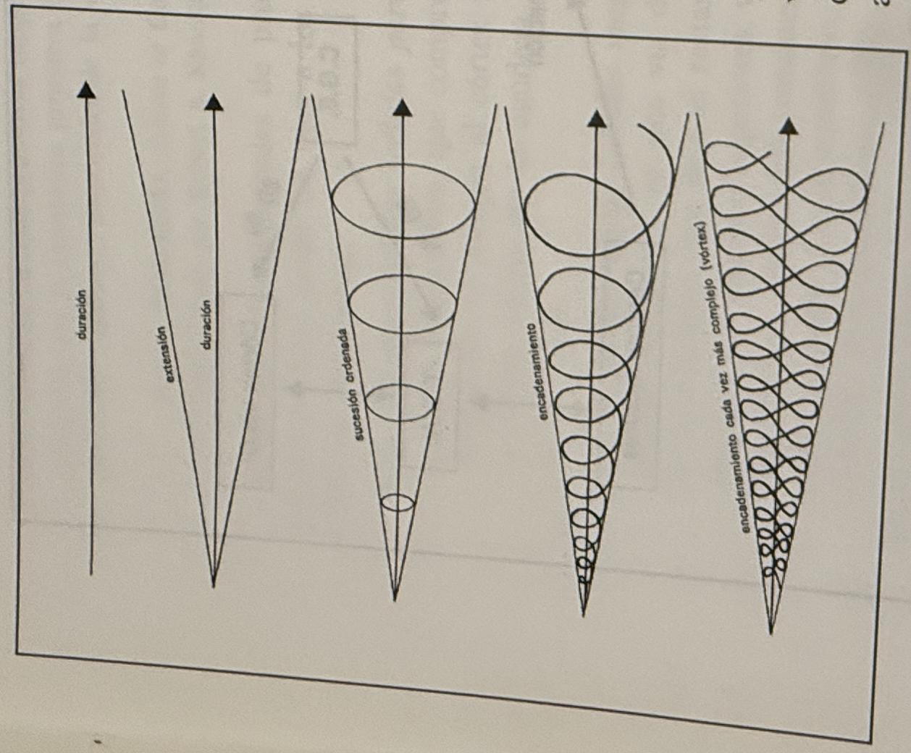
Desarrollo.
Introducción a la Virología, IVF/SEO, 1983.

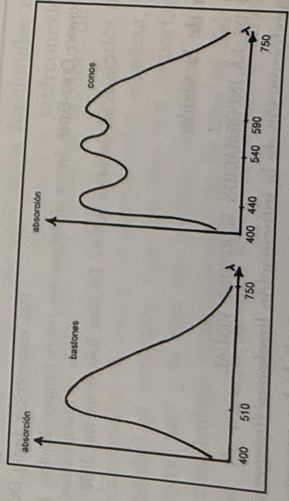
Absorción de la luz por los receptores, curvas de Wright.
(Estas curvas son análogas a las curvas de sensibilidad espectral).
Identification, IVF, 1987.

La respuesta de los receptores a un estímulo de luz hará en ciertas condiciones determinadas por su uso y espectral. De forma general, los receptores con cuya longitud de onda se vista esta. No es posible que las bastones presentan un máximo de respuesta para una onda situada alrededor de 510 kilómetros. Los receptores de tipos, tienen respectivamente su máximo de respuesta 440 nanómetros, los verdes a 960 y los viejos a 4400 nanómetros.

Por otra parte, los bastones tienen una visibilidad y por qué los conos, es decir, que pueden requerir luminosas mucho más débiles.

La sensibilidad de los receptores es su según la estimulación luminosa o cronológica adaptados. Por esto, el funcionamiento de los bastones será primordial en bajas luminancias (visión escotópica), pero su sensibilidad única a 510 nanómetros, solo permitirá al sistema visual un análisis acromático (visión en "blanco y negro"). En cambio, el funcionamiento de los conos será predominante en otras luminancias (visión fotópica). Su triple sensibilidad a 440, 540 y 590 nanómetros permitirá al sistema visual hacer una discriminación cromática (visión en color).
 

---

## OCR IMG_3272.JPG

**Fuente:** `ocr-playground-download-20260621T164508Z/IMG_3272.JPG/markdown.md`

La respuesta de los receptores a un estímulo luminoso solo se hará en ciertas condiciones determinadas por su sensibilidad luminosa y espectral. De forma general, los receptores responden a estímulos cuya longitud de onda se sitúa entre 393 y 750 nanómetros. Los bastones presentan un máximo de respuesta para las longitudes de onda situadas alrededor de 510 nanómetros. Los conos son de tres tipos, tienen respectivamente su máximo de respuesta, los azules a 440 nanómetros, los verdes a 540 y los rojos a 590.

Por otra parte, los bastones tienen una sensibilidad mucho mayor que los conos, es decir, que pueden responder para intensidades luminosas mucho más débiles.

La sensibilidad de los receptores es susceptible de modificación según la estimulación luminosa o cromática a la cual ya están adaptados. Por esto, el funcionamiento de los bastones será primordial en bajas luminancias (visión escotópica), pero su sensibilidad única a 510 nanómetros, solo permitirá al sistema visual un análisis acromático (visión en "blanco y negro"). En cambio, el funcionamiento de los conos será predominante en otras luminancias (visión fotópica). Su triple sensibilidad a 440, 540 y 590 nanómetros permitirá al sistema visual hacer una discriminación cromática (visión en color).

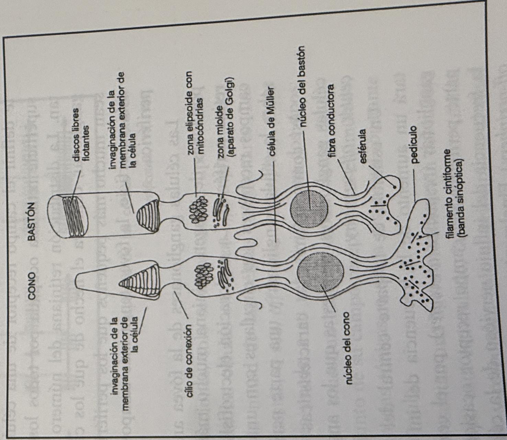

Esquema de los dos tipos de fotorreceptores.
César URTUBIA VICARIO, Neurobiología de la Visión,
Ediciones UPC, 1997.
 

---

## OCR IMG_3273.JPG

**Fuente:** `ocr-playground-download-20260621T164508Z/IMG_3273.JPG/markdown.md`

La información nerviosa creada por los receptores es, por lo tanto, una información bruta, la cual solo se codifica para intensidades, luminosas o las variaciones de intensidad. El origen de estas informaciones: bastones, conos azules, conos verdes, conos rojos, fóvea, retina periférica, que permitirá al sistema visual realizar el análisis de la estimulación.

Identification, IVF, 1987

#### TRANSFORMACIÓN EN INFORMACIONES DIFERENCIALES

El juego de las conexiones verticales y horizontales de la retina, hará de las células ganglionares el primer centro de tratamiento de la información visual.

El fenómeno de convergencia de las conexiones verticales permite definir el campo receptor de una célula ganglionar así como la superficie retiniana ocupada por todos los receptores que la conectan. La distribución retiniana del número de conexiones por célula ganglionar, conlleva el hecho de que los campos receptores foveales sean mucho más pequeños que los periféricos; y que en proporción a la superficie, la fóvea tenga más campos receptores que la retina periférica.

Las células ganglionares de la fóvea analizan, por lo tanto, unas porciones de imagen retiniana mucho más pequeñas que las de la retina periférica. La exploración electrofisiológica muestra que estos campos receptores son circulares con una parte central excitadora sobre la célula ganglionar y una parte periférica inhibidora.

Así comprendemos las características de las respuestas de las células ganglionares, respuestas que los anglosajones denominan on-center - off-periphery.

Un estímulo de la parte central del campo receptor comportará un aumento de la frecuencia del influjo nervioso de la célula ganglionar (respuesta on-center), por el contrario un estímulo de la parte periférica del campo receptor ocasionará una disminución de la frecuencia del influjo nervioso de la célula ganglionar (respuesta off-periphery). Finalmente un estímulo del conjunto del campo receptor casi no producirá ninguna modificación de la frecuencia del influjo nervioso de reposo de la célula ganglionar.

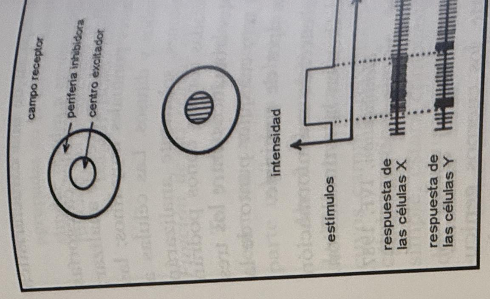

Para agilizar las células Ganglionar, el control de las células ganglionales es el resultado de las apenas representaciones de los receptores que se unen a otras tienen respuestas en el campo de la célula ganglionar. Los sondeos de la célula ganglionar, que se unen a otras tienen respuestas en el campo de la célula ganglionar, se unen a otras tienen respuestas en el campo de la célula ganglionar.

- Las células Ganglionar se unen a otras tienen respuestas en el campo de la célula ganglionar. Por lo tanto, la información sobre la estimulación de las células ganglionar es de un modo más general. La estimulación de las células ganglionar se puede ver en el apartado 1.

Una célula ganglionar (on u off) cuando se unen a otras tienen respuestas en el campo de la célula ganglionar puede ser de un modo más general.
 

---

## OCR IMG_3274.JPG

**Fuente:** `ocr-playground-download-20260621T164508Z/IMG_3274.JPG/markdown.md`

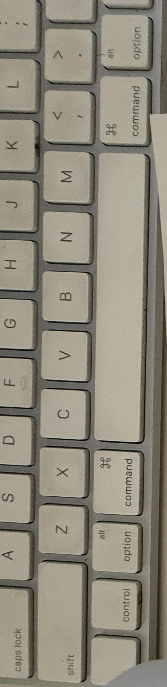

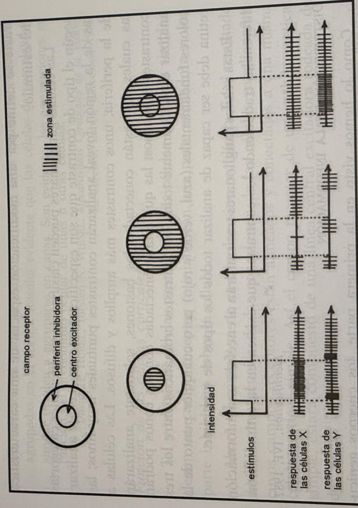
Respuesta de las células ganglionares.
Identificacion, IVF, 1987.

Para agilizar las explicaciones, solo se menciona un tipo funcional de células ganglionares: las células on-center, off-periphery, pero ellas apenas representan la mitad de las células ganglionares. Las otras tienen respuestas opuestas, o sea, off-center, on-periphery. Cada uno de estos tipos celulares puede, a su vez, dividirse en dos tipos:

- Las células X, que no muestran ninguna modificación del influjo cuando el conjunto de su campo receptor está estimulado, son células denominadas tónicas, o sea a respuesta constante durante todo el estímulo.
- Las células Y, que presentan una ligera modificación del influjo cuando todo el campo está estimulado, las cuales son células denominadas físicas, y responden solo al principio o al final del estímulo.

Una célula ganglionar solo responderá de manera significativa (on u off) cuando su receptor sea estimulado por contrastes. Un con
 

---

## OCR IMG_3275.JPG

**Fuente:** `ocr-playground-download-20260621T164508Z/IMG_3275.JPG/markdown.md`

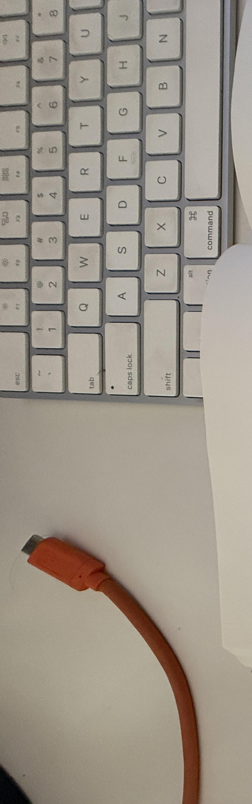

traste se define por una modificación espacial de una característica del estímulo.

Las células ganglionares pueden clasificarse en diferentes categorías, según el tipo de contraste que son específicamente capaces de analizar, las de la región foveal analizarán contrastes puntuales muy finos; las de la periferia, unos contrastes más amplios y difusos. Las células y las cuales solo están conectados los bastones, solamente analizarán contrastes luminosos; las que están conectadas con los conos podrán analizar específicamente todos los contrastes cromáticos entre los tres colores fundamentales (azul, verde y rojo) pero cualquier punto de la retina debe ser capaz de analizar todos los tipos de contraste.

Estas células ganglionares transmitirán al encéfalo una información diferencial traduciendo los contrastes que existen en la estimulación.

*Identification, IVF, 1987.*

#### DISTRIBUCIÓN DE LA INFORMACIÓN

Como lo hemos visto en la primera parte, los cuerpos geniculados solo serán un sistema distribuidor de la información visual a las diferentes partes del encéfalo. A este nivel, la información no está modificada; pero sí que sufre una reorganización espacial muy importante. Primero el campo visual derecho debe de proyectarse sobre el cuerpo geniculado izquierdo, y el campo visual izquierdo sobre el cuerpo geniculado derecho. Ello contribuye a la lateralización diestra y zurda del análisis visual. Después estas proyecciones se efectúan de manera retinotópica, o sea, que cada una de las capas del cuerpo geniculado cartografía de forma muy precisa la superficie retiniana, por tanto, el campo visual.

*Identification, IVF, 1987.*

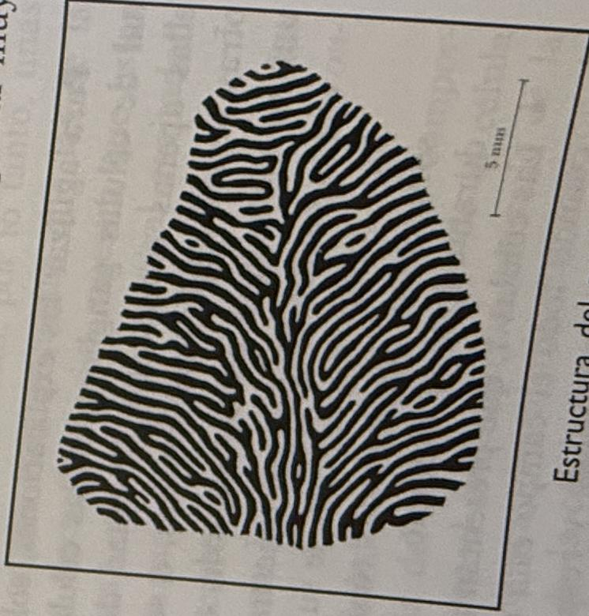
Estructura del predominio ocular. (Realizada por David H. Hubel y Torsten N. Wiesel con la colaboración de Simon, Lo Vay). M. Cinta PUELL MANN, *Codificación de la Señal Visual, Monografías de Gaceta*, n° 7, CNOO, 1994.

Consideraremos ahora la manera de que se agruparán las capas del cuerpo geniculado a la que se agrupan las agruparías de las celdas agrupares, agruparán las agruparías de las celdas agrupares, y agruparán las agruparías de las celdas agrupares, a agruparán las agruparías de las celdas agrupares agrupares agrupares.

#### Función de las células corticales

Tal y como las células precedentes tienen un campo receptor retinotópico, se puede identificar parte inhibitora sobre la célula.

Ahora, el campo ya no es citado en las células de las convergencias de las celdas, sino que los cuyos campos receptores están en la cresta de la célula cortical simple. Así el campo visual simple, estará compuesto de celdas, celdas, celdas, celdas, celdas, celdas, celdas, celdas, celdas, celdas, celdas, celdas, celdas, celdas, celdas, celdas, celdas, celdas, celdas, celdas.

Estas células solo responden a un campo receptor retinotópico, o sea, a un campo receptor de la orientación del campo visual, y a un campo visual de la sean detectoras de contraste.

#### Función de las células corticales

Estas células presentan un campo de rectilíneo pero son menos estímulos. Por el contrario, el campo de celdas es bastante si el estímulo se encuentra en la cresta de conexiones de las células de las convergencias de las celdas. Las células son paralelos y no se agrupan en las celdas, y a su orientación y con una orientación.

Estas células corticanas son más estímulos. En cualquier punto de la retina, los cuerpos superpuestos; cada uno de los cuales se especifica en la detección.
 

---

## OCR IMG_3276.JPG

**Fuente:** `ocr-playground-download-20260621T164508Z/IMG_3276.JPG/markdown.md`

65

Consideraremos ahora la manera de como estas células se encuentran agrupadas en el córtex. Resulta evidente que las células de complejidad similar tienden a agruparse en capas. Son evidentes las agrupaciones en función del predominio ocular de unas u otras células.

David H. HUBEL, Torsten N. WIESEL, *Mecanismos Cerebrales de la Visión*, El Cerebro, Labor, Barcelona 1980.

#### Función de las células corticales simples

Tal y como las células precedentes, las células corticales simples, tienen un campo receptor retiniano con una parte excitadora y una parte inhibidora sobre la célula.

Ahora, el campo ya no es circular, sino rectilíneo. Es el resultado de las convergencias de las conexiones: de las células ganglionares, cuyos campos receptores están alineados y conectados a una misma célula cortical simple. Así el campo receptor de una célula cortical simple, estará compuesto de una línea central excitadora rodeada de dos líneas inhibidoras.

Estas células solo responderán cuando su campo receptor sea estimulado por una línea de contraste orientada aproximadamente en $10^{\circ}$ en la orientación del campo receptor. Este hecho hace que estas células sean detectoras de contrastes lineales, o sea, de porciones de formas.

#### Función de las células corticales complejas

Estas células presentan también un campo receptor retiniano rectilíneo pero son menos sensibles en la localización precisa del estímulo. Por el contrario, su respuesta se convierte en muy importante si el estímulo se desplaza en una dirección perpendicular a su orientación. Ello es debido, una vez más, a una convergencia de conexiones de las células corticales simples los campos de las cuales son paralelos y alineados en una dirección y perpendicular a su orientación y conectados a la misma célula cortical compleja.

Estas células corticales complejas son detectoras de movimiento. En cualquier punto de la retina, diferentes campos receptores estarán superpuestos; cada uno correspondiente a una célula cortical compleja, específica en la detección de una dirección de movimiento.

*Identification*, IVF, 1987.
 

---

## OCR IMG_3277.JPG

**Fuente:** `ocr-playground-download-20260621T164508Z/IMG_3277.JPG/markdown.md`

Consideraremos ahora la manera de como estas células se encuentran agrupadas en el córtex. Resulta evidente que las células de complejidad similar tienden a agruparse en capas. Son evidentes las agrupaciones en función del predominio ocular de unas u otras células.

David H. HUBEL, Torsten N. WIESEL, *Mecanismos Cerebrales de la Visión*, El Cerebro, Labor, Barcelona 1980.

#### Función de las células corticales simples

Tal y como las células precedentes, las células corticales simples, tienen un campo receptor retiniano con una parte excitadora y una parte inhibidora sobre la célula.

Ahora, el campo ya no es circular, sino rectilíneo. Es el resultado de las convergencias de las conexiones: de las células ganglionares, cuyos campos receptores están alineados y conectados a una misma célula cortical simple. Así el campo receptor de una célula cortical simple, estará compuesto de una línea central excitadora rodeada de dos líneas inhibidoras.

Estas células solo responderán cuando su campo receptor sea estimulado por una línea de contraste orientada aproximadamente en 10° en la orientación del campo receptor. Este hecho hace que estas células sean detectoras de contrastes lineales, o sea, de porciones de formas.

#### Función de las células corticales complejas

Estas células presentan también un campo receptor retiniano rectilíneo pero son menos sensibles en la localización precisa del estímulo. Por el contrario, su respuesta se convierte en muy importante si el estímulo se desplaza en una dirección perpendicular a su orientación. Ello es debido, una vez más, a una convergencia de conexiones de las células corticales simples los campos de las cuales son paralelos y alineados en una dirección y perpendicular a su orientación y conectados a la misma célula cortical compleja.

Estas células corticales complejas son detectoras de movimiento. En cualquier punto de la retina, diferentes campos receptores estarán superpuestos; cada uno correspondiente a una célula cortical compleja, específica en la detección de una dirección de movimiento.

*Identification*, IVF, 1987.
 

---

## OCR IMG_3278.JPG

**Fuente:** `ocr-playground-download-20260621T164508Z/IMG_3278.JPG/markdown.md`

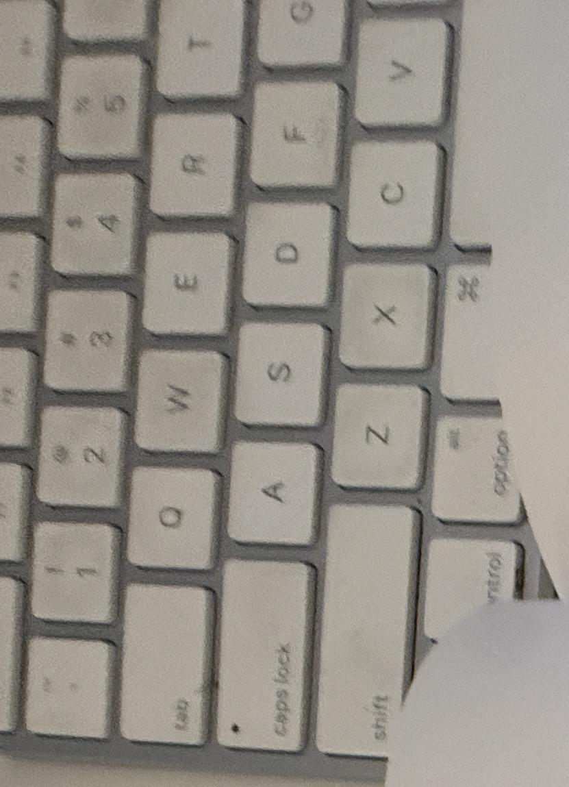

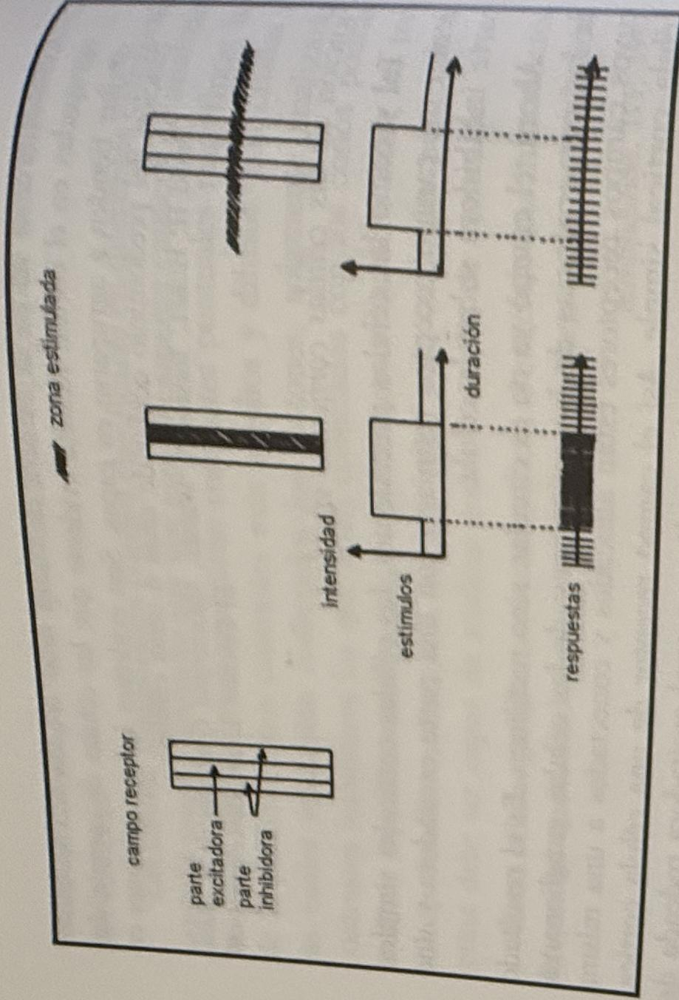
Respuestas de las células corticales simples.
Identification, IVF, 1987.

#### Función de las células binoculares

Una célula binocular recibe informaciones de dos puntos correspondientes de ambas retinas; o sea, de un mismo punto del campo visual. O dicho de otra forma, una célula binocular tiene su campo receptor repartido sobre las dos retinas.

Pero la binocularidad de estas células no es una constante; muestran todas, relativamente, un fenómeno de predominio ocular. Encontramos así todos los grados de predominio: desde el predominio estricto cuando la célula solo responde a los estímulos procedentes de un ojo, hacia la verdadera binocularidad cuando la célula responde de forma indiferente a los estímulos procedentes de ambos ojos.
Identification, IVF, 1987.

#### Arquitectura cortical

El primer punto: fundamental de la organización del área 17, estriada, es el fenómeno de la retinotopía, o sea, la proyección cartográfica del campo visual sobre el córtex visual primario.

El segundo punto: cada punto de todos que comprenden todas las células los parámetros de la estimulación, conectado a este modelo.

En estas tres dimensiones, se manera siguiente:

- Su anchura aproximada del estímulo ocular. En toda esta una de las 15 grados de predominio, el ojo izquierdo hacia el preto, pasando por la igualdad de las espasas.
- Su longitud aproximada de la estimulación detectada. En todas las especificidades de la célula.
- Su altura, o sea el centro, el lúmetro, representa los 170000000000000000000000000000000000000000000000000000000000000000000000000000000000000000000000000.

Así, si examinamos desde la escala de la que se encuentran en una línea de un óxido preDominio, la misma especificación. En todas las células a lo largo de la línea de la que se encuentra, la anchura, tendrán el mismo grado de complejidad, y la misma especificación de orientación, pero prestarán todos los grados de predominio ocular.

Por fin, si examinamos todas las células que se encuentran en una línea de un óxido postural paralela a la lámina, tendrán el mismo grado de complejidad, el mismo grado de complejidad.
 

---

## OCR IMG_3279.JPG

**Fuente:** `ocr-playground-download-20260621T164508Z/IMG_3279.JPG/markdown.md`

El segundo punto: cada punto del córtex está ocupado por módulos que comprenden todas las células capaces de analizar todos los parámetros de la estimulación que excita un punto de la retina conectado a este modelo.

En estas tres dimensiones, este modelo está constituido de la manera siguiente:

- Su anchura aproximada de un milímetro, representa el predominio ocular. En toda esta anchura encontraremos todos los grados de predominio; desde el predominio estricto para el ojo izquierdo hacia el predominio estricto para el ojo derecho, pasando por la igualdad binocular.
- Su longitud aproximada de un milímetro, representa la orientación detectada. En toda esta longitud encontraremos todas las especificidades de orientación desde 0° hasta 180°.
- Su altura, o sea el espesor del córtex, alrededor de 1,8 milímetros, representa todos los grados de complejidad celular repartidos en seis capas.

Así, si examinamos dentro de este modelo todas las células que se encuentran en una línea vertical, estas tendrán el mismo grado de predominio, la misma especificidad de orientación, pero presentarán todos los grados de complejidad. Si examinamos todas las células a lo largo de una área horizontal paralela a la anchura, tendrán el mismo grado de complejidad, la misma especificidad de orientación, pero presentarán todos los grados de predominio ocular.

Por fin, si examinamos todas las células que se encuentran en una línea horizontal paralela a la longitud, tendrán el mismo grado de complejidad, el mismo grado

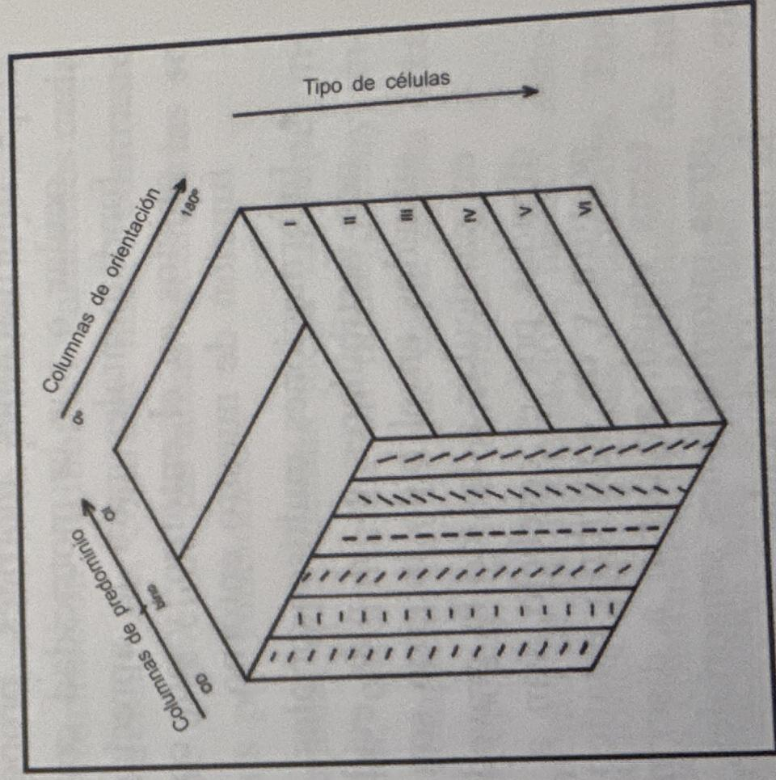
Módulo de córtex visual.
Identification, IVF, 1987.
 

---

## OCR IMG_3280.JPG

**Fuente:** `ocr-playground-download-20260621T164508Z/IMG_3280.JPG/markdown.md`

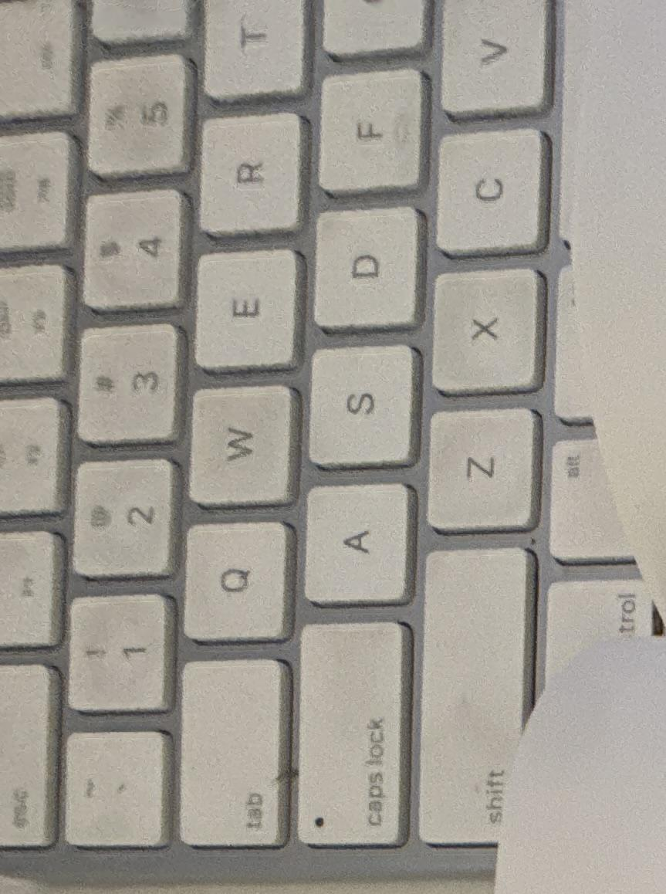

de predominio ocular, pero presentarán todas las especificidades de orientación.

Podemos ahora precisar la noción de retinotopía, diciendo que los puntos de la retina están colocados los unos respecto a los otros de la misma manera que los módulos corticales a los cuales están unidos.

*Identificacion, IVF, 1987.*

#### OTRAS INFORMACIONES NERVIOSAS

La experiencia de aquello que vemos habitualmente, nos muestra perfectamente que las informaciones puramente visuales son insuficientes para explicar completamente la visión.

Nuestro sistema visual debe de integrar otro tipo de informaciones antes de poder crear una representación consciente y comprensible de nuestro entorno.

Estas informaciones tienen orígenes múltiples, y podemos seleccionar algunas:

- Informaciones mnemónicas: es evidente que la memoria interviene aunque sea para reconocer objetos, o también reconocer la textura o la resistencia de los objetos, viéndolos únicamente.
- Informaciones motrices, proporcionadas por la motricidad ocular o por la motricidad corporal al sistema visual, serán fundamentales para la apreciación y la localización de los objetos en el entorno; y por consecuencia, para situarnos en función de nuestro entorno.
- Informaciones multisensoriales. El ejemplo de las informaciones vestibulares es el más evidente, los órganos vestibulares situados en el oído interno son sensibles a las aceleraciones, en particular a las de la gravedad. Estas informaciones coordinadas por el cerebelo, van a permitir todos los reflejos de postura y de equilibrio estático o dinámico. A nivel del sistema visual, ayudarán a discriminar arriba-abajo. Junto con otras informaciones sensoriales, también serán muy útiles en la motricidad ocular.

*Identificacion, IVF, 1987.*

#### SÍNTESIS DE LAS INFORMACIONES

La existencia de los potenciales darios, que aparecen dentro de las áreas visuales secundarias, y el global de la estimulación, son los precisos (como en el área visual) y las áreas secundarias se elaborecen.

Ello está confirmado por el plan de la área 17, estriada, hacia el centro y 19, periestriada, las cuales están en el parameórico efectuado por los procesos visuales.

La primera diferencia entre el área primaria, es que se ha de topográfica (retinotópica) y el área primaria.

La segunda diferencia entre la efectúan operaciones de que el área primaria elige la estimulación.

Para decirlo de otra parte de las células corticales, ¿por qué se vez más precisos y estáticos? (lineal móvil, etc.) más, se efectúan operaciones de

Así, en el área 17, se le ha negable en la motricidad, y por tanto se le le le le le le le le le le le le le le le le le le le le le le le le

En este estadio, la misma visual dispone de un ejemplo, en la naturaleza, las líneas de contrastes, los colores, el relato y la

Pero estamos en la parte 19, lo percibido y de la
 

---

## OCR IMG_3281.JPG

**Fuente:** `ocr-playground-download-20260621T164629Z/IMG_3281.JPG/markdown.md`

69
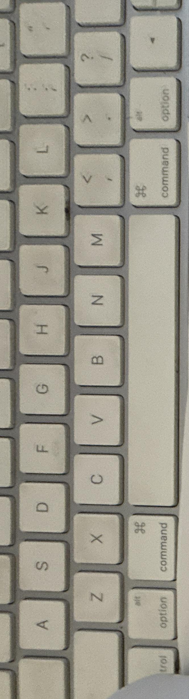

### SINTESIS DE LAS INFORMACIONES

La existencia de los potenciales visuales evocados (PVE) secundarios, que aparecen dentro del electroencefalograma, a nivel de las áreas visuales secundarias. Estas, correlacionadas con la complejidad global de la estimulación, más que con los parámetros estimuladores precisos (como en el área 17, estriada), indica que a nivel de estas áreas secundarias se elaboran representaciones de lo percibido.

Ello está confirmado por la existencia de proyecciones corticales del área 17, estriada, hacia estas áreas secundarias: 18, paraestriada y 19, periestriada, las cuales muestran perfectamente que el análisis paramétrico efectuado por el área 17 solo es una etapa de los procesos visuales.

La primera diferencia importante entre las áreas secundarias y el área primaria, es que en las áreas secundarias, la representación topográfica (retinotópica) es mucho menos estricta que en el área primaria.

La segunda diferencia parece ser, el que las áreas secundarias efectúan operaciones de síntesis sobre funciones visuales, mientras que el área primaria efectúa operaciones de análisis sobre parámetros de la estimulación.

Para decirlo de otra manera, a nivel del área primaria, la jerarquía de las células corticales extrae información, atributos o caracteres cada vez más precisos y específicos (contraste, contraste lineal, contraste lineal móvil, etc.) mientras que a nivel de las áreas secundarias se efectúan operaciones de síntesis por funciones.

Así, en el área 19, periestriada, que además juega un papel innegable en la motricidad ocular, encontramos un número muy importante de neuronas de tipo complejo, hecho que daría a esta área un papel importante en la percepción de los movimientos.

En este estadio del tratamiento de la información, nuestro sistema visual dispone de informaciones muy precisas y puntuales. Por ejemplo, en la naturaleza de los contrastes, en la orientación de las líneas de contraste, y en informaciones más globales tales como en los colores, el relieve o los movimientos.

Pero estamos aún muy lejos de la identificación estructurada de lo percibido y de su comprensión.
 

---

## OCR IMG_3282.JPG

**Fuente:** `ocr-playground-download-20260621T164629Z/IMG_3282.JPG/markdown.md`

Un repaso sobre la motricidad ocular nos permitiría añadir algunos elementos muy importantes para comprender el funcionamiento del sistema visual.

*Identification, IVF, 1987.*

#### La evolución

La evolución del ser vivo o visual, más complejas y mejor que usualmente son el fruto de esta evolución.

El estudio del fílum humano,以及,以及, y cuatrimestres, es un documento útil en la comprensión de los problemas y visuales.

En efecto, la ley de Haeckel, 1866, comparaciones demasiado proactivas para los comportamientos humanos, y que, durante el curso de la evolución, han sido consideradas.

Paralelamente, podremos tener en cuenta los testigos, y que, en un testigo, tendremos que ver si el fílum es un ser vivo o visual.

Paralelamente, los organismos, y que, en un testigo, tendremos que ver si el fílum es un fílmodo, y que, en un testigo, tendremos que ver si el fílmodo es un fílmodo.

El partido nacional, de 1919, el año de la muerte de
 

---

## OCR IMG_3283.JPG

**Fuente:** `ocr-playground-download-20260621T164629Z/IMG_3283.JPG/markdown.md`

control
option
command
command
option

### CAPÍTULO 4

### EVOLUCIÓN Y DESARROLLO
### FILOGÉNESIS Y ONTOGÉNESIS

#### La evolución

La evolución del ser vivo conduce a la aparición de formas de vida, más complejas y mejor adaptadas. Las especies existentes actualmente son el fruto de esta larga elaboración.

El estudio del filum humano aparece como un elemento particularmente útil en la comprensión de los comportamientos generales y visuales.

En efecto, la ley de Haeckel, 1866, a condición de no intentar comparaciones demasiado precisas, autoriza a enfocar el estudio de los comportamientos humanos según la historia de su aparición, durante el curso de la evolución de las especies que nos han precedido.

Paralelamente, podremos aplicar todas las enseñanzas que obtengamos de la evolución a la observación del desarrollo humano.

#### Ernest Haeckel, 1834-1919

En el año 1866 redactó la *Morfología general de los organismos*.

Los germánicos consideraron la obra de Haeckel como una demostración del predominio ario, utilizándola en provecho propio como también hicieron con la música de Wagner.

El partido nacionalsocialista se constituyó en 1919, el año de la muerte de Haeckel.

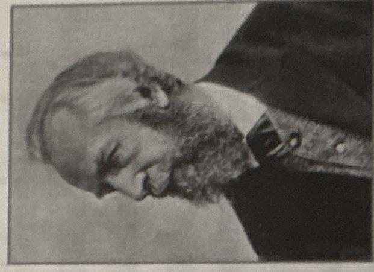
 

---

## OCR IMG_3284.JPG

**Fuente:** `ocr-playground-download-20260621T164629Z/IMG_3284.JPG/markdown.md`

72
73

Charles Darwin, 1809-1882

En el año 1858 vio la luz su publicación *El origen de las especies*.

Los británicos vieron en la obra de Darwin importantes discordancias con el Génesis. Actualmente, aún existe un alto porcentaje de adeptos que no aceptan el evolucionismo y se aferran al creacionismo, descartando el hecho de que la una no excluye a la otra.

Esta evolución ha comportado una sucesión de especies, las descendientes de las cuales están actualmente presentes entre los animales que nos rodean. De una manera muy esquemática, el ser vivo se ha desarrollado a partir de los invertebrados. La aparición de los peces ha abierto la era de los vertebrados, los estadios evolutivos esenciales de los cuales han sido marcados por los peces junto a los anfibios, los reptiles y los mamíferos. Entre los mamíferos, los primates y entre estos últimos los homínidos y, lógicamente los hombres, constituyen los seres más avanzados.

Podremos aplicar todas estas ideas a la observación del desarrollo humano. Las primeras fases del desarrollo consisten especialmente en el establecimiento de las estructuras (huesos, músculos, tendones, articulaciones, órganos, estructuras nerviosas...).

El crecimiento de las estructuras (C en la figura), muy rápido y prolífico durante la embriogénesis, disminuye progresivamente durante toda la vida del individuo. Podemos representarlo en forma de cuña, ancha en el nacimiento, con el vértice al final de la vida.

Paralelamente, la entrada en funcionamiento de las relaciones creadas por el crecimiento estructural inicial comporta la maduración de las diferentes funciones. La importancia relativa de esta maduración llega a su punto máximo durante los primeros años de la vida del niño. Después decrece en provecho de una organización superior de la que ha favorecido su aparición.

Por ejemplo, la maduración de la motricidad ocular permite la adquisición de los mecanismos visuales esenciales para el aprendizaje de la lectura (A en la figura); seguimientos oculares cómodos, centrado flexible, preciso y persistente de ambos ojos.

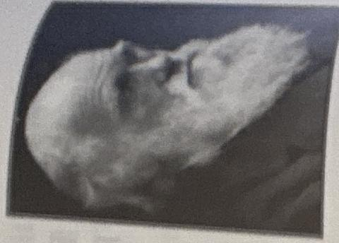

Esta maduración (M en la figura) es el cruce de dos cuñas, la cual es el más importante. El crecimiento y la maduración de la capacidad de aprendizaje de la obra completos, ya que abre la vida de la obra a la plena utilización de la obra.

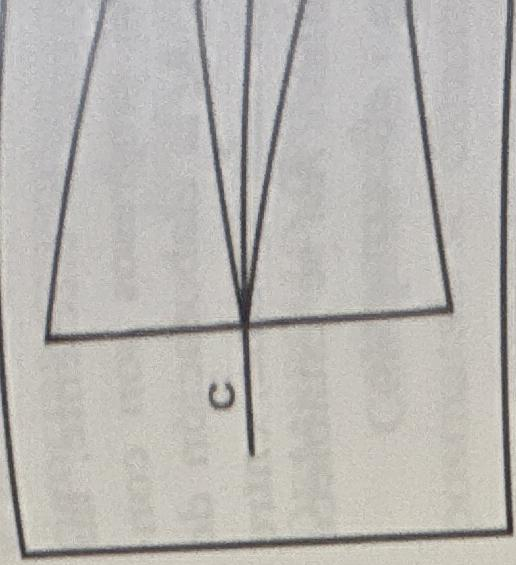

Una frase favorita: “En la figura, la Choreau, nos dice: “En la figura, nos nos constituyen una medida de la vida. O también, se dice: “En la figura, nos nos se han capacitado de a la obra. De una importancia que nos ha sido en la que se desea, esencialmente, la vida de la obra, y por lo tanto, la vida de la obra, y el vértice en la obra”.

El término “M en la figura” se utiliza para la realización de las realizadas por el creacionismo, la calculo...), pero también se utiliza para la obtención de los animales.

Para que el creacionismo sea expresado, se aplica la forma en que se encuentra el mismo es suficiente.
 

---

## OCR IMG_3285.JPG

**Fuente:** `ocr-playground-download-20260621T164629Z/IMG_3285.JPG/markdown.md`

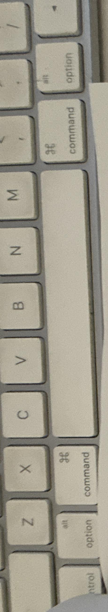

Esta maduración (M en la figura) podemos representarla como el cruce de dos cuñas, la del crecimiento y la del aprendizaje.

El crecimiento y la maduración permiten progresivamente la organización de la capacidad de adaptación al medio. Es el periodo de la operatividad, del aprendizaje. Este es esencial para un desarrollo completo, ya que abre la puerta a nuevos comportamientos; da paso a la plena utilización del potencial inicial.

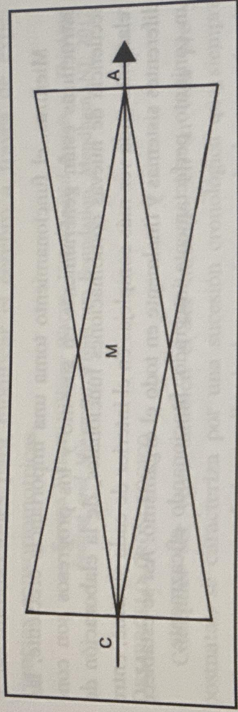
Esquema de: Crecimiento, Maduración y Aprendizaje.
Introducción a la Virología, IVF/SEO, 1983.

Una frase favorita de Donald J. Getz, atribuida a Henry David Thoreau, nos dice: "La flexibilidad de su capacidad de adaptación constituye una medida de su inteligencia".

O también, según Pablo Fernández-Berrocal: "Ser inteligente es la capacidad de adaptarse al entorno de la forma más eficaz".

De una importancia relativamente débil durante las primeras fases, esencialmente estructurales, el aprendizaje se torna predominante poco a poco, y podemos representarlo en forma de cuña, ahora con el vértice en la concepción, y la parte ancha al final de la vida.

El término aprendizaje describe a menudo las adquisiciones realizadas por el niño durante su escolaridad (escritura, lectura, cálculo...), pero caracteriza también los comportamientos inteligentes de los animales, incluso de los más primitivos.

Para que el aprendizaje y la integración se realicen, se necesita una cierta experiencia. ¡La exposición no es suficiente! La imitación y la repetición no es suficiente sin razonamiento ni sentimiento.

Serena WIEDER, Harry WACHS, Visual/Spatial Portals to Thinking, Feeling and Movement, Profectum Foundation, Mendham, NJ, 2012.
 

---

## OCR IMG_3286.JPG

**Fuente:** `ocr-playground-download-20260621T164629Z/IMG_3286.JPG/markdown.md`

74
DESARROLLO CRONOLÓGICO

Crecimiento, maduración y aprendizaje, permiten el estudio de, tallado de cualquier desarrollo, sin perder de vista, no obstante, el espacio global y dinámico que lo caracteriza. Cada uno, a la vez, será el aspecto principal del proceso. Pero, incluso en estos ámbitos, los otros aspectos estarán siempre presentes aunque su influencia sea menos importante.

Introducción a la Visiología, IVF/SEO, 1983.

Mientras, el funcionamiento toma una importancia creciente, las estructuras están generalmente en su sitio y los progresos son consecuencia de nuevas combinaciones funcionales, de la elaboración de relaciones cada vez más complejas en el interior de cada sistema, entre diferentes sistemas y finalmente en todo el organismo. Así se establece un conjunto perfectamente integrado, funcionando eficazmente.

#### Leyes del desarrollo

De una manera global, se define el desarrollo como un conjunto de procesos, fenómenos o mecanismos por los que un sistema modifica sus características cuantitativas o cualitativas, espaciales o temporales.

Michel FRÉREBEAU, *El Desarrollo del Sistema Visual y de la Visión*, SEO, 1990.

El desarrollo del individuo no se verifica de una manera constante y continua, sino que se efectúa por etapas sucesivas, las cuales van a reforzar las adquisiciones anteriores. Estas leyes son muy importantes, es preciso conocerlas, tanto para identificar todos y cada uno de los pasos del funcionamiento correcto de los niños, como para acertar el mejor tratamiento terapéutico a la hora de mejorar un funcionamiento deteriorado, bien sea mediante entrenamiento visomotor o con otras ayudas o consejos.

El desarrollo se basa en la visión y el movimiento, y hacen aquello que quieres hacer implica muchos pasos en el espacio. Las capacidades de acción sensoriomotriz nos permiten interactuar con el medio ambiente, dirigir la mirada hacia la persona que nos habla, buscar y encontrar un juguete bien especial debajo de la silla, señalar alguna cosa del estante a fin de conseguir que alguien nos la consiga.

Los sistemas visuales combinan para dar su la la palabras, las ubic así estos se integran y los símbolos se le

Cuando todo este preciso encontrar la y las interacciones, riencias sensoriomotriz

Seres
Feeling

#### DESARROLLO CRONOLÓGICO

Cualquier ser postnatal, se careté de la misura, está presente en el desarrollo y operativo, en la mental, y en general de forma inequívoca.

El desarrollo y uniforme, se irán reforzando las adquisiciones

Algunos líneas directas y de la movilidad alteración de alguna relación que el ser irrumpido

DESARROLLO
 

---

## OCR IMG_3287.JPG

**Fuente:** `ocr-playground-download-20260621T164629Z/IMG_3287.JPG/markdown.md`

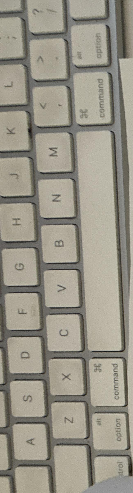

Los sistemas visual, auditivo y somatosensorial continuamente se combinan para dar soporte a las percepciones: como los rostros, las palabras, las ubicaciones espaciales y los sonidos secuenciales, así estos se integran, los significados comienzan a tomar forma y los símbolos se forman.

Cuando todo este proceso no se produce automáticamente, es preciso encontrar las oportunidades emocionalmente significativas y las interacciones para modificar el cerebro a través de experiencias sensoriomotrices.

Serena WIEDER / Harry WACHS, Visual/Spatial Portals to Thinking, Feeling and Movement, Profectum Foundation, Mendham, NJ, 2012.

#### DESARROLLO CRONOLÓGICO

Cualquier ser vivo, también el ser humano, en su vida pre y postnatal, se caracteriza por una sucesión cronológica que siempre está presente en el desarrollo de los parámetros de la ontogénesis, en el desarrollo de sus niveles de organización: estructural, funcional y operativo, en el desarrollo de sus esquemas: corporal, espacial y mental, y en general en todo su desarrollo. Orden que se verá repetido de forma inequívoca en los demás individuos de la misma especie.

El desarrollo del ser humano no se verifica de manera constante y uniforme, sino que se efectúa por etapas sucesivas, las cuales se irán reforzando entre ellas, de manera que las últimas consolidarán las adquisiciones de las anteriores.

Algunos parámetros de la ontogénesis hacen aparecer las grandes líneas directrices del desarrollo. La elaboración de las sensibilidades y de la motricidad sigue sus principios generales. Si debido a la alteración de este desarrollo se producen anomalías y se emprende alguna rehabilitación, esta deberá seguir el mismo orden cronológico que el ser habría seguido de forma natural, de no haber sido interrumpido este proceso.

*Introducción a la Visiología*, IVF/SEO, 1983.

#### DESARROLLO PROXIMODISTAL

Vemos como en la locomoción, el bebé, inicialmente incapaz de moverse, comienza a explorar el mundo reptando, después gateando,
 

---

## OCR IMG_3288.JPG

**Fuente:** `ocr-playground-download-20260621T164629Z/IMG_3288.JPG/markdown.md`

76
finalmente erecto, ampliando sin pausa su campo de actividad, muy erguido un entorno, primero próximo, después cada vez más alejado, trayendo un entorno, primero próximo, después cada vez más alejado. Esta ley nos indica que el ser humano controla primeramente el espacio próximo que lo rodea y más adelante las áreas más distantes. En la visión vemos como el bebé desarrolla primero las diferentes habilidades en visión próxima y después en visión lejana. Es capaz de ver una miga de pan que ha caído del plato, pero no puede reconocer un familiar que se encuentra a unos metros con la única ayuda visual. La agudeza visual y la motricidad ocular se desarrollan antes en visión de cerca que en visión lejana. Los desplazamientos del niño son más frecuentes y más largos, su desarrollo visual permitirá un mayor control en visión de lejos.

La evolución de los predominios sensoriales sigue la misma tendencia con el tacto que implica un contacto directo y consecuentemente la aproximación máxima, después con el gusto y el olfato, que permiten captar informaciones que proceden de fuentes más lejanas. El oído favorece una aprehensión sensorial aún más distante. En cuanto a la vista, la extensión visible de los espacios siderales da una idea de sus posibilidades.

Los tres procesos visuales, *Emetropización*, *Binocularización* e *Identificación*, siguen la misma progresión. La *Emetropización*, equilibrio de la focalización en visión de lejos, se establece después de estar afinada de cerca. La *Binocularización*, coordinación de ambos ojos, desemboca sobre una apreciación de las distancias mediante la estereocularidad, primero próxima para después llegar a una estimación aceptable de lejos; en los grandes espacios, el niño no tiene una idea precisa de las distancias.

Introducción a la Visiología, IVF/SEO, 1983.

#### DESARROLLO TRONCOAPENDICULAR

El bebé, cronológicamente, desarrolla su autonomía motriz partiendo de ser una unidad o masa para lograr la progresiva autonomía funcional, base del ejercicio de la motricidad, comienza por el tronco antes de interesar a los miembros y más adelante los segmentos, para acabar con las extremidades, tales como los dedos y los ojos.

Con ello se queja de la forma más efectiva y control del organismo, y se le imita la correcta y efectiva peeling. El niño aprecia el control importante de su estado visual, sus brazos y pies, y su segunda, hasta la base de su estado, son los dedos o la masa.

El exame se realiza de forma más efectiva, con los retos de la consecución, el control efectivo. El exame se progresa, con el niño como un control, el camino a su suficiente medida de tareas.

Los dedos se en partieron de la forma y el pecho junto con el tronco, y el lado de la mesa.
 

---

## OCR IMG_3289.JPG

**Fuente:** `ocr-playground-download-20260621T164629Z/IMG_3289.JPG/markdown.md`

Con ello se quiere indicar que el proceso evolutivo de aprendizaje y control del organismo comienza con el motor grueso hasta llegar a un control y dominio del motor fino.

El niño aprende a mover en primer lugar la musculatura más importante de su cuerpo, posteriormente irá aprendiendo a mover sus brazos y piernas desde la primera articulación, después por la segunda, hasta llegar a controlar el movimiento de los apéndices que son los dedos de las manos y de los pies.

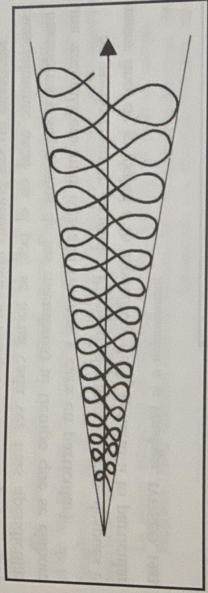

Vórtex evolutivo.
Introducción a la Virología, IVF/SEO, 1983.

El examen de la figura nos indica como la evolución nunca se realiza de manera lineal, sino que necesita pausas y también pequeños retrocesos para fijar las adquisiciones alcanzadas y posibilitar la consecución de nuevos hitos enmarcados en un progreso más efectivo. En el desarrollo de la motricidad es preciso notar que todo progreso, a menudo, comporta una regresión, por ejemplo, cuando el niño comienza a gatear, para recoger una bolita que se encuentra por el camino, es fácil que recupere la posición de reptar, que ya tenía suficientemente entrenada anteriormente y le facilitará la realización de tareas accesorias.

Los ojos, algunas veces, no consiguen una auténtica autonomía, en particular con relación al cuello, originando problemas en la lectura y escritura. Cuando el bebé desea dirigir su mirada hacia algún punto determinado, al principio lo hará realizando movimientos del tronco, después de la cabeza y solamente cuando el desarrollo de la motricidad sea más fino, estos movimientos serán oculomotores.
 

---

## OCR IMG_3290.JPG

**Fuente:** `ocr-playground-download-20260621T164629Z/IMG_3290.JPG/markdown.md`

78
A veces, los problemas de autonomía ocular son más profundos, como consecuencia de que la motricidad del cuello no tiene la adesión, cuando la cuada autonomía con relación a la de la cintura escapular, pudiendo estar en la sociedad actual, cuando además existir una carencia de autonomía entre las cinturas escapular y pelviana, ello nos conduce a considerar de gran importancia el desarrollo troncoapendicular, especialmente en la sociedad actual, en la que tanta importancia tienen actividades tales como la lectura y la escritura.

Recuerda en sus grandes líneas la complejidad del esqueleto que, esencialmente axial en el pez, se torna cada vez más apendicular (miembros y segmentos de los miembros) al tiempo que se elabora una musculatura más refinada (manos y cara en particular).

Se puede resumir diciendo: Primero el motor grueso, después el motor fino; de lo global a lo específico; de lo general a lo particular.

Introducción a la Visiología, IVF/SEO, 1983.

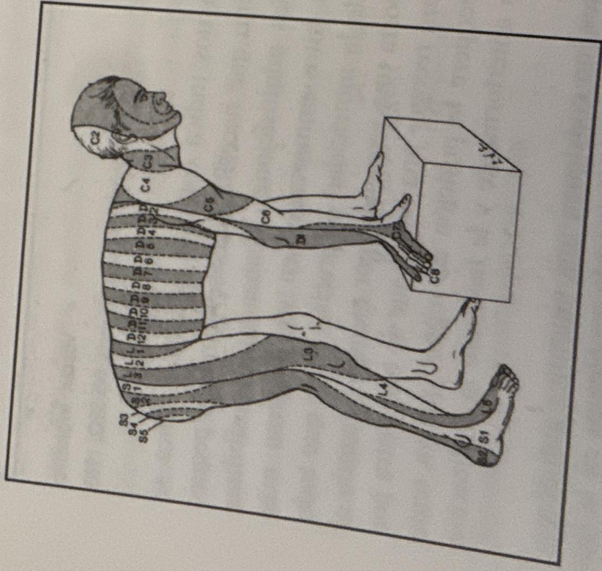

Distribución segmentaria en posición cuadrúpeda (en esta posición se ve mejor el orden de los niveles de inervación).

Carl H. DELACATO, Tratamiento y Prevención de las Problemas de Lectura, APALCE/SEO, 1985.

### DESARROLLO CEFALOCAUDAL, METAMÉRICO

Lo primero de que es consciente el neonato es de la presencia de una fuerza invisible que lo empuja contra el suelo y le impide levantarse y poder moverse libremente. En realidad en este esfuerzo por levantarse, que a veces lleva al bebé a situaciones de desesperación, el ser humano tardará entre doce y catorce meses hasta poner su cuerpo en equilibrio, en lucha contra la fuerza de la gravedad terrestre.

En el niño, los primeros días. Poco a poco sigue la dirección hasta llegar a inferiores, incluso durante. El esbozo de lo que son inferiores. Las piernas.

Resumiéndolo, pero del núcleo medular bien y se vuelven funcionales una de las metamorfos.

En consecuencia el de las piernas: la igualmente, en el que aparecen antes que

La visión progresiva, Francisco López

### DESARROLLO PERIODO

En el caso de desarrolla primero el posteriormente, se retina central.

La maduración del desarrollo. En el caso no está completamente inervada.

Los receptores de la identificación. Los receptores de la función de del detalle y de la central.

De la misma nivel de tolerancia.
 

---

## OCR IMG_3291.JPG

**Fuente:** `ocr-playground-download-20260621T164737Z/IMG_3291.JPG/markdown.md`

En el niño, los primeros enderezamientos se realizan con la cabeza. Poco a poco siguen los brazos y el tronco, así continuará en esta dirección hasta llegar a mantener un buen control de los miembros inferiores, incluso durante el periodo embriogénico o de gestación. El esbozo de lo que serán los brazos aparece antes de los miembros inferiores. Las piernas no son funcionales hasta bastante más tarde.

Resumiéndolo, podemos diferenciar el núcleo medular alto (NMA), del núcleo medular bajo (NMB), que siguiendo esta ley se desarrollan y se vuelven funcionales siguiendo este orden, siguiendo todas y cada una de las metámeras, o segmentos de la médula espinal.

En consecuencia, el control motor de los brazos llega antes que el de las piernas: la manipulación se ejerce antes que la locomoción. Igualmente, en el curso de la embriogénesis, los miembros anteriores aparecen antes que los posteriores.

La visión progresa al mejorar el conocimiento de todo el cuerpo.
Francisco LÓPEZ TABOADA, Curso de Introducción a la Optometría Funcional, 1982
Introducción a la Visiología, IVF/SEO, 1983.

#### DESARROLLO PERIFEROCENTRAL

En el caso de la visión sabemos, sin ninguna duda, que esta se desarrolla primeramente a nivel de la retina periférica y solo muy posteriormente concluye el desarrollo y activación funcionales de la retina central.

La maduración retiniana ilustra particularmente bien este tipo de desarrollo. En el nacimiento, la parte más central de la retina (fóvea) no está completamente desarrollada, y no termina de organizarse anatómicamente hasta que el bebé ha completado las dieciséis semanas.

Los receptores periféricos o bastones son los más funcionales, la identificación se limita a la luz y a los movimientos. Más adelante los receptores centrales o conos entran en acción, complementando el funcionamiento periférico posibilitando la discriminación del color, del detalle y del relieve. El desarrollo va desde la visión periférica a la central.

De la misma manera, la sensibilidad táctil es primero global, a nivel de todo el cuerpo, antes de especializarse en dirección a las
 

---

## OCR IMG_3292.JPG

**Fuente:** `ocr-playground-download-20260621T164737Z/IMG_3292.JPG/markdown.md`

manos y los dedos. Esta ley del desarrollo resulta de la maduración del sistema nervioso de abajo a arriba, desde la médula hasta los centros superiores del córtex.

Introducción a la Visiología, IVF/SEO, 1983

#### FLUCTUACIONES AUTORREGULADORAS DE LAS VARIACIONES MÁXIMAS

Las posibilidades de variación que posee el ser humano al nacer en las diferentes funciones orgánicas son enormes, y a la vez poco o nada controladas. Estas variaciones van decreciendo durante los primeros años hasta llegar a un margen óptimo de variaciones máximas, que permita un sistema de acción eficaz. En cualquier sistema para ser eficaz debe de haber una reducción o bajo consumo de energía. De la misma forma el sistema visual para ser eficaz sería preciso que redujera las posibilidades de grandes variaciones acomodativas y de convergencia manteniendo un pequeño margen al entorno del equilibrio encontrado por este sistema.

El tono, antes de llegar al equilibrio, pasa por extremos de contracción y relajación. Dentro de estas grandes variaciones, se regulariza poco a poco tendiendo hacia un nivel óptimo de contracción.

De la misma manera, el sistema óptico del ojo pasa por extremos en los que presenta estados de miopía o de hipermetropía antes de

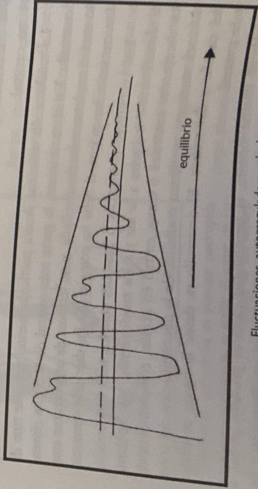
Fluctuaciones autorreguladoras de las variaciones máximas

relación analítica de los centros olvídanos
Estas relaciones con los oedis, organizan los compuestos

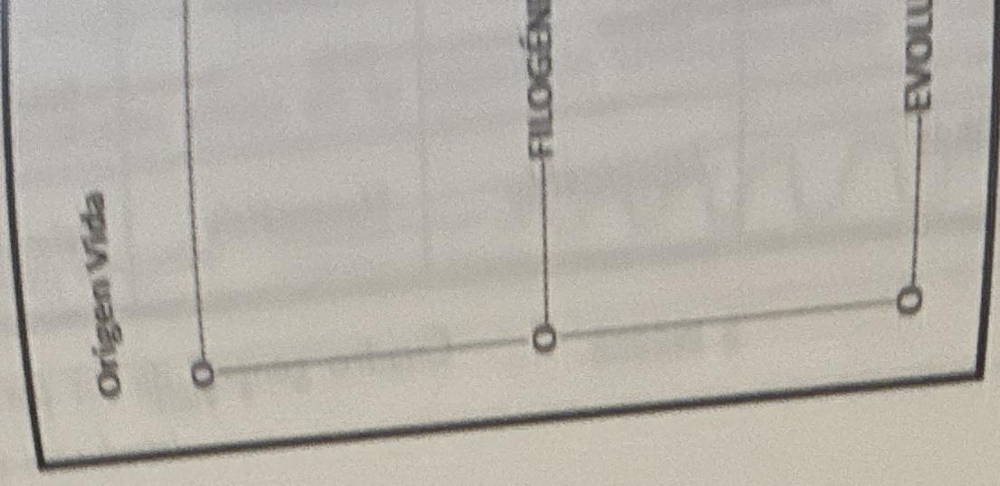
Manoel
 

---

## OCR IMG_3293.JPG

**Fuente:** `ocr-playground-download-20260621T164737Z/IMG_3293.JPG/markdown.md`

81

reducir estas variaciones y de estabilizarlas alrededor de un valor medio que constituye el equilibrio emetrópico.

El estudio analítico de los diferentes parámetros no ha de hacernos olvidar que, siendo concomitantes, se influyen continuamente. Estas relaciones constituyen sistemas en el cuadro de los cuales se organizan los comportamientos del niño.

Introducción a la Visiología, IVF/SEO, 1983.

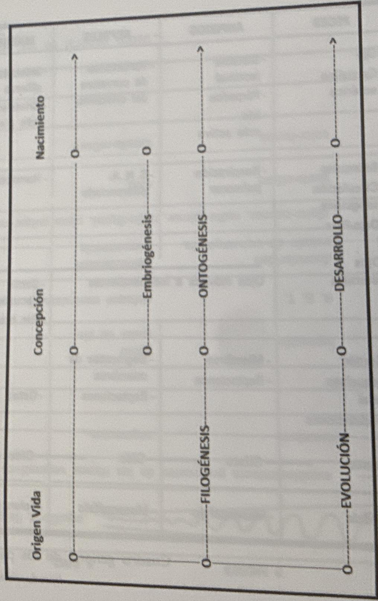

Filogénesis y ontogénesis.

Manuel ROURE ARNALDO, Paneles explicativos de las clases de Optometría, EUOOT, 1984-1987.
 

---

## OCR IMG_3294.JPG

**Fuente:** `ocr-playground-download-20260621T164737Z/IMG_3294.JPG/markdown.md`

082

|   | INVERTEBRADOS | PECES | ANFIBIOS | REPTILES | MAMÍFEROS | PRIMATES  |
| --- | --- | --- | --- | --- | --- | --- |
|   |  - Estigma - Placoda - Cópula - Vesícula | - Ojo - Cristalino esférico | - Sistema lacrimal - Párpados - Iris más activo | - Variaciones de curvatura del cristalino | - Músculos ciliares - Cristalino más plano | - Acomodación más importante  |
|  - Estruma vegetativo | - Intercambios gaseosos | - Branquias - Circulación sanguínea - Orto-Para | - Respiración pulmonar | - S. N. A. diferenciado | - Homeotermia | - Homeostasia  |
|  - Coordinación binocular |  | - Ojos laterales | Ojos móviles e independientes |   | - Semi-decusación - Par ocular | - Ojos frontales - Convergencia  |
|  - Esqueleto - Motricidad - Locomotricidad | - Endoesqueleto - Reacción de masa | - Cordón - Esqueleto axial - Ondulaciones | - Miembros - Reptaciones | - Segmentos de miembros - Reptaciones | - Gateo | - Dedos - Andar  |
|  - Sistemas sensoriales | - Tacto | - Gusto | - Olfato | - Oído | - Oído Vista | - Vista  |
|  - Sistema nervioso | - Difuso | - Médula | - Mesencéfalo | - Mesencéfalo | - Telencéfalo | - Córtese  |

Cuadro general de los parámetros de la Filogénesis.
Introducción a la Virología, IVR/REGS / 1983

|  EDAD | NACIMIENTO | 3 MESES | 1 AÑO | 3 AÑOS  |
| --- | --- | --- | --- | --- |
|  funcionamiento visual | variaciones de la focalización | establecimiento progresivo de los ritmos vegetativos  |   |   |
|  homeostasia |  | miembros | segmentos | extramidades  |
 

---

## OCR IMG_3295.jpg

**Fuente:** `ocr-playground-download-20260621T164737Z/IMG_3295.jpg/markdown.md`

83

|  EDAD | NACIMIENTO | 3 MESES | 1 AÑO | 3 AÑOS  |
| --- | --- | --- | --- | --- |
|  funcionamiento visual | variaciones de la focalización | equilibrio fisiológico  |   |   |
|  homeostasia | establecimiento progresivo de los ritmos vegetativos  |   |   |   |
|  progresiva autonomía | masa | miembros | segmentos | extremidades  |
|  tono | hipotonía axial hipertonía apendicular |  |  | equilibrio tónico  |
|  locomoción | rodillos giros | reptación | gaseo endar de pie | andar saltar, correr  |
|  actitud predominante | R. T. C. | R. S. T. | enfoque contralateral | enfoque unilateral  |
|  coordinación binocular | monocularidad estado de divergencia | duocularidad estado de convergencia | binocularidad permanencia | estereocularidad flexible  |
|  prensión | refleja | dígito-palmar, radio-palmar, radio-digital, pinza pulgar-indice, utilice herramientas |  |   |
|  dominio sensorial | tacto | gusto-olfato | oído | vista  |
|  identificación visual | luz-movimiento | color-forma | detalle-relieve | orientación del espacio  |
|  leyes del desarrollo | perífero próximo céfalo |  |  | control distal caudal  |

Cuadro general de los parámetros de la Ontogénesis. Introducción a la Virología, IVF/SEO, 1983.
 

---

## OCR IMG_3296.JPG

**Fuente:** `ocr-playground-download-20260621T164737Z/IMG_3296.JPG/markdown.md`

84

|  UNICELULARES | ANÉLIDOS  |   |   |   |   |   |
| --- | --- | --- | --- | --- | --- | --- |
|   |  GUSANO DE TIERRA | GUSANO MARINO | LAPA | NAUTILUS | CARACOL | CEFALÓPODO  |
|  Punto fotosensible | Células fotosensibles | Placa óptica | Ojo excavado | Ojo camenular con agujero estenopésico | Ojo vesiculado (refringente) | Ojo acomodaticio  |
|  |   |   |   |   |   |   |
|  Protoplasma | Fibra nerviosa | Nervio óptico | Nervio óptico Retinula | Nervio óptico Retina superficial | Nervio óptico Retina superficial Córnea, Vitreo | Cristalino Cuerpo ciliar, Iris  |

(Institut de Visiologie du Québec)

Filogénesis de la Emetropización en los invertebrados.
*Emetropipussis, IVE/SEC. 1989*

|   | CICLÓSTOMOS | PECES | ANFIBIOS | REPTILES | MAMÍFEROS | PRIMATES  |
| --- | --- | --- | --- | --- | --- | --- |
|  CÓRNEA | Elástica | Abollada Aplanada | Lisa + Arqueada | + + Arqueada | + + + Arqueada  |   |
|  CRISTALINO | Grueso Redondo Duro Cerca de la córnea |  | Ligeramente aplanado Duro Cerca de la córnea | + Aplanado + Blando Posicionado + posterior | + + Aplanado Cápsula Posicionado + posterior | + + Aplanado Cápsula elastica Posicionado + + posterior  |
|   |   |   |   | Inicio de funcionamiento de músculos delar y | Cada vez más funcional con contracciones, dilataciones, oscilaciones  |   |
 

---

## OCR IMG_3297.JPG

**Fuente:** `ocr-playground-download-20260621T164737Z/IMG_3297.JPG/markdown.md`

85

|   | CICLOSTOMOS | PECES | ANFIBIOS | REPTILES | MAMÍFEROS | PRIMATES  |
| --- | --- | --- | --- | --- | --- | --- |
|  CÓRNEA | Elástica | Abollada Aplanada | Lisa + Arqueada | + + Arqueada | + + + Arqueada  |   |
|  CRISTALINO | Grueso Redondo Duro Cerca de la córnea |   | Ligeramente aplanado Duro Cerca de la córnea | + Aplanado + Blando Posicionado + posterior | + + Aplanado Cápsula Posicionado + posterior | + + Aplanado Cápsula elástica Posicionado + + posterior  |
|  IRIS | No funcional | Músculo esfínter poco o nada funcional | Inicio de funcionamiento de músculos esfínter y dilatador | Cada vez más funcional con contracciones, dilataciones, oscilaciones  |   |   |
|  CUERPO CILIAR | Ausente | Ausente o no funcional | Colocado en su sitio | Funcional Músculos de acción directa sobre el cristalino | Músculos que actúan sobre la zónula de ZINN | Músculo ciliar Fibras: circulares mendianas radiales  |
|  ACOMODACIÓN | Músculo corneal | Protractor o Retractor | Protractor Proceso ciliar |  |  |   |

Filogénesis de la Emetropización en los vertebrados.
*Emetropización, IVF/SEO, 1989.*
 

---

## OCR IMG_3298.JPG

**Fuente:** `ocr-playground-download-20260621T164737Z/IMG_3298.JPG/markdown.md`

( 98 )

|  ESTRUCTURAS | 3 a 6 semanas | 7 semanas | 8 a 12 semanas | 13 a 21 semanas | de 22 semanas al nacimiento |   |
| --- | --- | --- | --- | --- | --- | --- |
|  TÚNICA | Vesícula óptica |  | Diámetro del globo ocular 1 mm. | Diámetro del globo ocular 3-7 mm. Formación escleral gana el polo posterior. Todas las capas de la coriodea están establecidas. | Diámetro del globo ocular 10-17 mm. Fóvea | Longitud axial ocular 18-24 mm.  |
|   |  Cúpula óptica |  |  |  |  |   |
|  Retina | Retina: periférica y central después | Formación escleral en el ecuador |  |  |  |   |
|  Esclerótica |  |  |  |  |  |   |
|  Coroides |  |  |  |  |  |   |
|  CÓRNEA | Preparación del endotelio corneal | Emplazamiento del endotelio y epitelio corneales | 3 capas epiteliales. Aparición de la membrana de BOWMAN | Fibras elásticas. Membrana de Descemet. Transparencia. | 4 capas epiteliales | 6 capas epiteliales diámetro 10-12 mm. Aumento de los elementos fibrosos Astigmatismo regular.  |
|   |  |   |   |   |   |   |
|  CRISTALINO | Placa cristaliniana Excavación | Cristalino lleno y redondo | Fibras secundarias Zónula Aplanamiento | Zónula emplazada. Aplanamiento. | Fibras del nódulo primario. | Crecimiento a lo largo de la vida.  |
|  CUERPO CILIAR | - | Fibras circulares | Aparece el cuerpo ciliar. Diferenciación del músculo ciliar (fibras meridianas) | Diferenciación del músculo ciliar (fibras oblicuas). | Ubicadas las fibras oblicuas del músculo ciliar. | Fibras oblicuas haces radiales crecen hasta los 5 años.  |
|  IRIS | - | Preparación del estroma | Iris en formación Esfínter de la pupila (esbózo) | Iris bien desarrollado. Esfínter bien desarrollado. | Músculo dilatador en formación. | Consolidación del músculo dilatador. Pigmento y perfeccionamiento.  |
|  período embrionario |   |   | período fetal |   |   | período postnatal  |

Ontogénesis de la Emetropización.
*Emetropización. IVESEO 1989*

|  Evolución de los vertebrados | Peces | Anfibios | Reptiles | Mamíferos | Primates  |
| --- | --- | --- | --- | --- | --- |
|  Evolución de las estructuras nerviosas | 3 vesículas | Techo óptico | Techo óptico | C.G.E. | Córtex visual  |
|   |  TECHO ÓPTICO | Diencéfalo | Diencéfalo |  |   |
 

---

## OCR IMG_3299.JPG

**Fuente:** `ocr-playground-download-20260621T164737Z/IMG_3299.JPG/markdown.md`

36

37

38

39

40

41

42

43

44

45

46

47

48

49

50

51

52

53

54

55

56

57

58

59

60

61

62

63

64

65

66

67

68

69

70

71

72

73

74

75

76

77

78

79

80

81

82

83

84

85

86

87

88

89

90

91

92

93

94

95

96

97

98

99

100

101

102

103

104

105

106

107

108

109

110

111

112

113

114

115

116

117

118

119

120

121

122

123

124

125

126

127

128

129

130

131

132

133

134

135

136

137

138

139

140

141

142

143

144

145

146

147

148

149

150

151

152

153

154

155

156

157

158

159

160

161

162

163

164

165

166

167

168

^{}[]
 

---

## OCR IMG_3300.JPG

**Fuente:** `ocr-playground-download-20260621T164737Z/IMG_3300.JPG/markdown.md`

|  Desarrollo de la postura ocular | Estado de divergencia | Estado de convergencia | Centrado exacto | Divergencia fisiológica  |
| --- | --- | --- | --- | --- |
|  Desarrollo de la motricidad ocular | Reflejos de compensación y de versión | Seguimientos incompletos Convergencia | Seguimientos completos Convergencia Divergencia | Seguimientos circulares controlados por el ojo director  |
|  Desarrollo de la postura general | R.T.C. asimétrico | R.S.T. simétrico | Actitud contralateral | Actitud unilateral  |
|  Desarrollo de la motricidad general | Involuntaria | Reptación | Gateo Marcha erecta Manipulación | Salto Carrera Escritura  |
|  Desarrollo de la coordinación general | Monolateralidad | Duolateralidad | Contralateralidad | Unilateralidad  |

Ontogénesis de la Binocularización.
Binocularización, IVF, 1978

|  Invertebrados | Peces | Anfibios | Reptiles | Mamíferos | Primales | Hombres  |
| --- | --- | --- | --- | --- | --- | --- |
|  Estigma Células no escribidos | Retina penférica (bastones) | Retina intermedia (bastones) | Retina central Inicio de fóvea (conos + bastones) | Mácula (conos + bastones) | Fóvea (conos) | Fóvea central  |
 

---

## OCR IMG_3301.JPG

**Fuente:** `ocr-playground-download-20260621T165017Z/IMG_3301.JPG/markdown.md`

68

2

2

2

2

2

2

2

2

2

2

2

2

2

2

2

2

2

2

2

2

2

2

^{}[]
 

---

## OCR IMG_3302.JPG

**Fuente:** `ocr-playground-download-20260621T165017Z/IMG_3302.JPG/markdown.md`

90

|   | Nacimiento a 6 meses | 6 a 12 meses | 12 a 18 meses | 18 a 42 meses  |
| --- | --- | --- | --- | --- |
|  TONICIDAD | Hipotonia axial Hipertonia de los miembros | Aumento del tono axial Reducción tono apendicular | Regulación del tono | Tonicidad controlada  |
|  PREHENSIÓN | Prehensión reflexa Prehensión dígito-palmar | Prehensión radio-palmar | Prehensión pulgar-índice | Manipulación de útiles lápices - tijeras  |
|  LOCOMOCIÓN | Rodillos Esbozo de reptación | Reptación Marcha tetrapódica | Marcha erecta sostenida Marcha rápida | Agacharse Marcha de puntillas  |
|  REACCIÓN A LA GRAVEDAD | Sumisión total Enderezamientos | Posición sedente estable De sentado a la verticalidad | Mantenimiento Derecho inestable Derecho estable | Salto con los pies juntos  |
|  ACTITUD PREDOMINANTE | RTAC RTSC | Aproximación bilateral Aproximación versátil | Aprendizaje del gesto intencional | Aprendizaje del dominio del gesto  |

Ontogénesis de la Identificación.
Instituto de Virología de Québec
Introduction à la Virologie, Tome III, Processus Odontofécaen, NQ 1970

|  Neonato | Método de 4 meses  |
| --- | --- |
|  Pez | Anfibio  |
|  Niño de 10 meses | Reptil  |
|  Niño de 8 años (habla, lees, escriba) | Niño de 1 año  |
 

---

## OCR IMG_3303.JPG

**Fuente:** `ocr-playground-download-20260621T165017Z/IMG_3303.JPG/markdown.md`

Contogénesis de la Identificación, Instituto de Virología de Quebec, Instituto de Virología de Quebec, Instituto de Virología de Quebec, Instituto de Virología de Quebec, Instituto de Virología de

|   | Nivel neurológico alcanzado | Movilidad | Visión | Audición  |
| --- | --- | --- | --- | --- |
|  Neonato | Médula tronco | Movimiento | Refleja | Refleja  |
|  Pez | Médula | Movimiento tronco | Refleja | Refleja  |
|  Níño de 4 meses | Puente | Reptación homolateral | Monocular alternante a duocular | Monocular alternante a duoaural  |
|  Anfibio | Puente | Reptación homolateral | Monocular alternante a duocular | Monocular alternante a duoaural  |
|  Níño de 10 meses | Mesencéfalo | Gateo contralateral en patrón cruzado | Duocular a binocular | Duoaural a binaural  |
|  Reptil | Mesencéfalo | Gateo contralateral en patrón cruzado | Duocular a binocular | Duoaural a binaural  |
|  Níño de 1 año | Córtex primario | Marcha rudimentaria homolateral | Fusión primaria | Estereofonía primaria  |
|  Primate | Córtex primario | Marcha rudimentaria homolateral | Fusión primaria | Estereofonía primaria  |
|  Níño de 8 años (habla, lee y escribe) | Predominio hemisférico cortical | Marcha contralateral en patrón cruzado | Estereopsis con ojo dominante | Estereofonía con oído dominante  |

(91)
 

---

## OCR IMG_3304.JPG

**Fuente:** `ocr-playground-download-20260621T165017Z/IMG_3304.JPG/markdown.md`

Cibernética y optometría

La cibernética, o arte de conseguir la eficacia de una acción, nos ayuda a comprender el efecto de control sobre la caja negra, logrando que esta a partir del inicial y simple efecto estímulo/reacción, pase a tener un componente de control, de retroalimentación, de feedback. La cibernética también nos ha de servir para plantear un procedimiento que ante cualquier actividad, nos permita prever aquellos comportamientos no manifiestos consecuentes a otros conocidos.

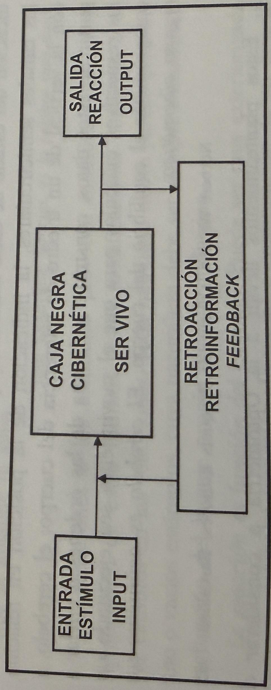

Cibernética.
Introducción a la Visiología, IVF/SEO, 1983.

Un claro ejemplo, ya clásico, de este elemento de control lo tenemos en los reguladores de bolas de Watt de las máquinas de vapor: cualquier aumento de la velocidad de rotación del volante, y en consecuencia del regulador, conlleva un aumento del diámetro de giro de las bolas y una variación en la altura del eje de giro que actúa
 

---

## OCR IMG_3305.JPG

**Fuente:** `ocr-playground-download-20260621T165017Z/IMG_3305.JPG/markdown.md`

control

sobre la llave de paso del vapor y, también, sobre el rendimiento de los pistones. El regulador de bolas de Watt es un órgano cibernético.

O también en los termostatos, otros elementos de control, también mecánicos, que regulan la temperatura, calor o frío. Se marca una temperatura y si la temperatura de la vivienda o del local baja o sube con respecto al nivel establecido, abre o cierra el regulador que hace aumentar la combustión o la producción de frío según el caso. Los termostatos son también órganos cibernéticos.

La repetición de situaciones nos lleva a pronosticar resultados a partir de unos indicios: el artillero antiaéreo no apuntará —jamás— un cañón al blanco móvil sino a aquel punto de la trayectoria del avión enemigo que el cálculo prevea como coincidente de la nave y del proyectil disparado, bien sea de modo somero, o con ayuda de sofisticados sistemas informáticos que en tiempos mínimos proporcionan datos suficientemente fiables.

Otro ejemplo, lo encontraremos en el cuerpo humano, el cerebelo recibe del cerebro la indicación del movimiento a realizar; mediante los nervios propioceptores. El cerebelo recibe a cada instante la indicación del estado de cada músculo, y por medio de los nervios de los canales semicirculares, la indicación de la posición en relación con la vertical de un triedro de referencia del cuerpo; el cerebelo, a partir de estos datos, construye cada una de las órdenes a enviar a los respectivos músculos para que el movimiento sea ejecutado sin comprometer el equilibrio del cuerpo. El cerebelo es asimismo un órgano cibernético.

Norbert WIENER, Cibernética, Tusquets Editores, Barcelona, 1985.

Estos planteamientos llevan a la Optometría a considerar el análisis de los comportamientos, o de cualquier acción, a partir de un cuadro que permita completar —de acuerdo con una cadencia y conforme a unas previsiones— todas las variaciones inherentes a la acción estudiada.

La Optometría es la Ciencia de la Visión, y la Visión es un fenómeno global por el cual el hombre integra los mensajes de origen fotónico, captados por el ojo, para obtener un significado.
 

---

## OCR IMG_3306.JPG

**Fuente:** `ocr-playground-download-20260621T165017Z/IMG_3306.JPG/markdown.md`

Hemos concretado que la visión es un fenómeno global, y diremos que no hay visión si no damos un significado a los estímulos captados. Sin la segunda característica no habría realmente visión, estaríamos en el nivel de las sensaciones, pero no en el de las percepciones y mucho menos en el de las representaciones, o percepciones sin sensación.

Las personas necesitamos también del feedback retroalimentador que influya en nuestros comportamientos. Bastantes profesores, durante las clases, interrogan constantemente los semblantes de los alumnos buscando indicios de satisfacción o de rechazo para intensificar o rectificar el sentido de las exposiciones.

Un artículo publicado, hace algunos años, en la prensa británica decía:

Trabajé durante dos años para un directivo, y en estos dos años jamás hizo el menor comentario sobre mi actuación. Cuando dejé el trabajo, le recriminé la falta absoluta de expresiones de felicitación o de crítica y me contestó: "Estaba convencido de que usted sabía que realizaba muy bien su tarea". ¿Cómo podía yo saberlo? Sí, durante dos años me había sentido como un actor ante un público impasible que ni aplaude ni silba.

Tom Crabtree, Gracias, es la palabra más dulce.

Las reacciones a los estímulos provocan modificaciones en la significación de estos últimos. Estas modificaciones conllevan a su vez cambios en las reacciones. Toda habilidad nueva parece necesitar uno o varios estímulos, cuya naturaleza debe ser siempre considerada en función del bagaje propio de cada individuo.

La reacción es función del estímulo. Puede ser muy exteriorizada, como la del bebé (reacción de masa) a continuación de un destello luminoso, o manifestarse por una grabación en el sistema nervioso. Para que un estímulo comporte una reacción necesita tener ciertas cualidades. El estímulo solo es eficaz dentro de un campo de intensidad, entre un umbral de sensibilidad, aquel en el que la mínima estimulación provoca ya sensación, por debajo del cual, por debajo de una intensidad determinada, el individuo no es sensible a ese estímulo, y un umbral máximo por encima del que el elemento sensitivo es dañado: el sol nos ciega al rebasar ampliamente el umbral máximo.

119
 

---

## OCR IMG_3307.JPG

**Fuente:** `ocr-playground-download-20260621T165017Z/IMG_3307.JPG/markdown.md`

20
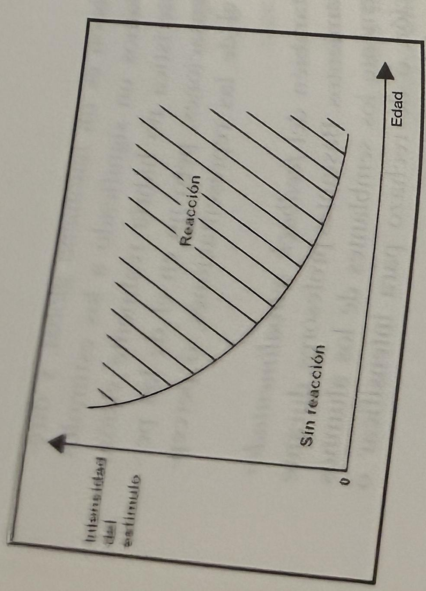

El umbral de sensibilidad es diferente según el nivel de desarrollo, será tanto más bajo y la reacción más fácil de provocar, si el desarrollo está avanzado, en esta situación la sensibilidad será mayor. Al contrario, al principio del desarrollo, el umbral de sensibilidad es elevado y hará falta un estímulo más intenso para provocar la reacción. Como un sistema binario, el organismo responde a un nivel elemental según la ley del todo o nada, on-off.

Controlado del estímulo
Introducción a la Visiología, IVF/SEO, 1983.

Esto es particularmente cierto en su sensibilidad visual, debido a que las células ganglionares de la retina y las células corticales responden según esta ley, y ello nos permite estimularlas convenientemente aplicando técnicas adecuadas a su condición.

A lo largo del desarrollo, diversos estímulos deben producirse para permitir a las últimas estructuras (retinofoveales, por ejemplo), a las maduraciones y a los nuevos aprendizajes entrar, poco a poco, en juego. Al margen de todo medio apremiante, es su naturaleza, su orden de aparición y su intensidad lo que más importa.

Introducción a la Visiología, IVF/SEO, 1983.

La reacción obtenida —sensación—, hemos dicho esa función del estímulo, aunque sea preciso matizar que esta función no es directamente proporcional sino que obedece a la ley de Weber-Fechner que se puede definir diciendo que la sensación obtenida es proporcional al logaritmo del estímulo:

$$
\text{Sensación} = \text{constante} \times \log . \text{estímulo}
$$

Los sentidos se protegen así contra los estímulos muy fuertes que podrían dañarlos disminuyendo su sensibilidad relativa, que, por el contrario, se agudiza para los estímulos débiles.
 

---

## OCR IMG_3308.JPG

**Fuente:** `ocr-playground-download-20260621T165017Z/IMG_3308.JPG/markdown.md`

Un claro ejemplo de esa protección lo tenemos en el sentido del oído: el aumento real máximo de sensación acústica, diferencia entre el umbral del dolor y el umbral mínimo de percepción, es de 134 dB (134 veces), mientras que el aumento real de intensidad sonora correspondiente es de $25 \times 10^{12}$ (25 billones de veces). ¿Qué sería de los pobres discotequeros si el aumento de sensación fuera directamente proporcional al aumento de la intensidad física del estímulo sonoro?

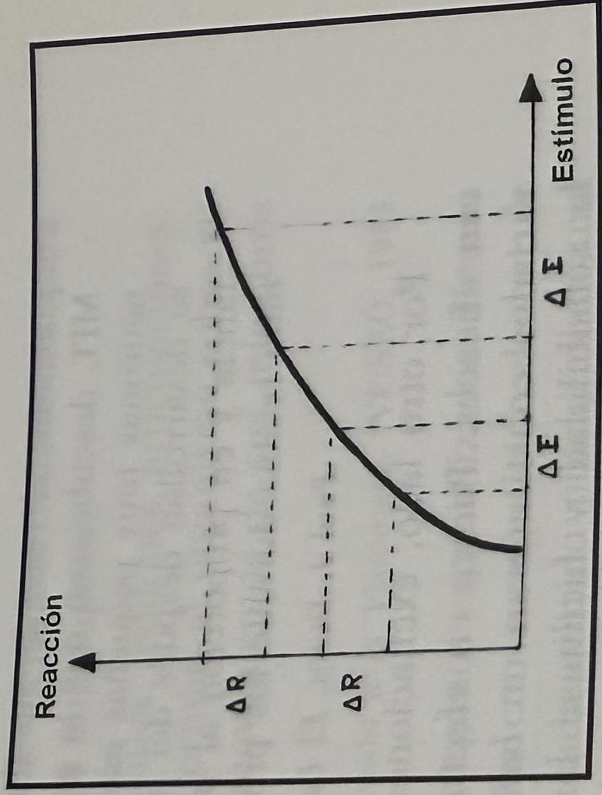
Relaciones estímulo, reacción – Ley de Weber-Fechner.
Introducción a la Visiología, IVF/SEO, 1983.

Los tres tipos de receptores definen pues tres categorías de estímulos, aunque haga falta desconfiar de divisiones tan sistemáticas. Podemos hablar así de:

- Estímulos viscerales.
- Estímulos motores.
- Estímulos sensoriales.

La acción de los estímulos motores y sensoriales en particular, empieza a ser bien conocida. La vaina de mielina, aislante que envuelve ciertas fibras nerviosas, se desarrolla en muchos casos en función de los estímulos recibidos, con ello, facilita el peso de los influjos nerviosos permitiendo nuevas habilidades de los receptores y de las reacciones mejor adaptadas. *El sistema nervioso central no está totalmente desarrollado al nacer*. Numerosas experiencias han mostrado que se enriquece estructuralmente (micro-neuronas) gracias a los estímulos a los que ha sido sometido el individuo. Este enriquecimiento permite un funcionamiento más rico y eficaz (experiencias de Hebb, Kresch y Altman sobre ratones, de Hubel y Wiesel sobre gatitos, observaciones de Schaeffer y Levy sobre bebés humanos).

Abundando en lo anteriormente citado, es interesante la siguiente cita:

Siempre habíamos creído que las crías, humanas o no, nacían con el número total de sus células nerviosas, y que este número permanecía
 

---

## OCR IMG_3309.JPG

**Fuente:** `ocr-playground-download-20260621T165017Z/IMG_3309.JPG/markdown.md`

122

constante el resto de sus días. Joseph Altman y Gopal D. Das, en el MIT, descubrieron que la gran mayoría de las microneuronas, o sea, neuronas muy pequeñas esenciales para el proceso del pensamiento, se desarrollan después del nacimiento, principalmente durante la infancia y en proporción al número de estímulos, sensaciones, que el niño recibía durante los primeros meses de su vida.

Paul J. DUNN, *El Desarrollo del Niño y la Lectura*, IVF/SEO, 1984.

Por otro lado, excitaciones aisladas y muy específicas no parecen eficaces. Parece en efecto como si los estímulos numerosos y variados constituyeran un baño sensorial que bajase el umbral de latitud y facilitase las integraciones. Este baño sensorial, la sensibilidad y facilitase las integraciones externas con actuales condiciones del hábitat y por las precauciones externas con las que se rodea muy a menudo al bebé y al niño.

Los estímulos generales favorables a un buen desarrollo visual pueden ser examinados según las componentes dominantes para cada proceso del desarrollo visual:

- Condiciones favorables viscerales en &gt;&gt;&gt;&gt;&gt; Emetropización.
- Condiciones favorables motrices en &gt;&gt;&gt;&gt;&gt; Binocularización.
- Condiciones favorables sensoriales en &gt;&gt;&gt;&gt;&gt; Identificación.

Evidentemente, esto no quiere decir que ellas sean las únicas a nivel de cada proceso: con la componente dominante van siempre unidas las otras dos, que la refuerzan y la confirman. Así los estímulos motores y viscerales contribuyen igualmente a las integraciones de la Identificación.

Los diversos estímulos se reagrupan en tres categorías en función de los receptores implicados. Los receptores, aparatos especializados en la reacción a ciertos estímulos, se distribuyen en tres clases:

- Interoceptores.
- Propioceptores.
- Exteroceptores.

Los interoceptores están constituidos por células nerviosas repartidas en el organismo, las cuales reaccionan a modificaciones químicas (contenido en oxígeno, por ejemplo), térmicas (temperatura interna, fiebre) y físicas (presión en el sistema circulatorio, presión arterial).
 

---

## OCR IMG_3310.JPG

**Fuente:** `ocr-playground-download-20260621T165017Z/IMG_3310.JPG/markdown.md`

Informan sobre su estado visceral y le permiten reaccionar para restablecer un equilibrio fluctuante, sin interrupción.

Los propioceptores situados en músculos, tendones, articulaciones, oído interno (órganos vestibulares), informan al organismo sobre su postura, su tono muscular, sobre los movimientos de sus miembros y sobre sus desplazamientos.

Introducción a la Visiología, IVF/SEO, 1983.

Los exteroceptores, situados en los órganos especializados. Hemos situado estos exteroceptores en relación con su aparición dentro de la evolución ontogenética, en la que cada sentido proporciona una apreciación más lejana de la situación objeto de examen.

- Lengua: papilas gustativas
gusto contacto
- Piel: dermis, epidermis, terminales nerviosas
tacto contacto
- Nariz: pituitaria amarilla, epitelio olfativo
olfato corta
distancia
- Membrana timpánica, huesecillos, nervio auditivo oído
larga
distancia
- Ojos: retina
vista infinito

Informan a la persona sobre las cualidades del medio ambiente y sobre sus modificaciones. Hemos concretado que la visión es un fenómeno global, y diremos que no hay visión si no damos un significado a los estímulos captados.

Fieles a la primera aseveración, al hecho de que la visión no es un fenómeno aislado en los ojos, ni en las vías, ni en el córtex, sino que implica globalmente el organismo, no es de extrañar que, aunque solamente sirva como recordatorio, iniciamos el estudio de los comportamientos visuales relacionándolos con los comportamientos generales del individuo y aún con los sistemas.

Introducción a la Visiología, IVF/SEO, 1983.
 

---

## OCR IMG_3311.JPG

**Fuente:** `ocr-playground-download-20260621T165122Z/IMG_3311.JPG/markdown.md`

Relaciones organismo-visión

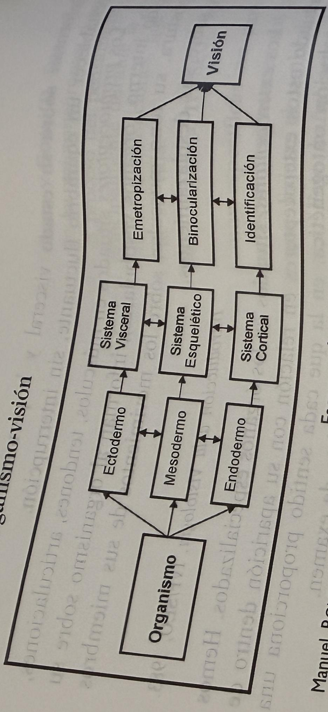

Esquema funcional de las relaciones organismo-visión.

Manuel ROURE ARNALDO, Paneles explicativos de las clases de Optometría, EUOOT, 1984-1987.

Este esquema es el gráfico más conocido que relaciona el Organismo con la Visión, ilustra adecuadamente las relaciones apuntadas pero padece de una deficiencia que lo invalida.

No podemos aceptar que la línea media relacione los dos extremos sin que entre ellos veamos representadas líneas de relación. El gráfico en cuestión prima algunas relaciones y no tiene en cuenta otras igual de importantes.

Resumiendo, y como ejemplo, conecta la Emetropización con la Binocularización y esta última la relaciona con la Identificación. Faltan, no obstante, unas relaciones directas suficientemente importantes como las que existen entre la Emetropización y la Identificación, y esta omisión no puede aceptarse.

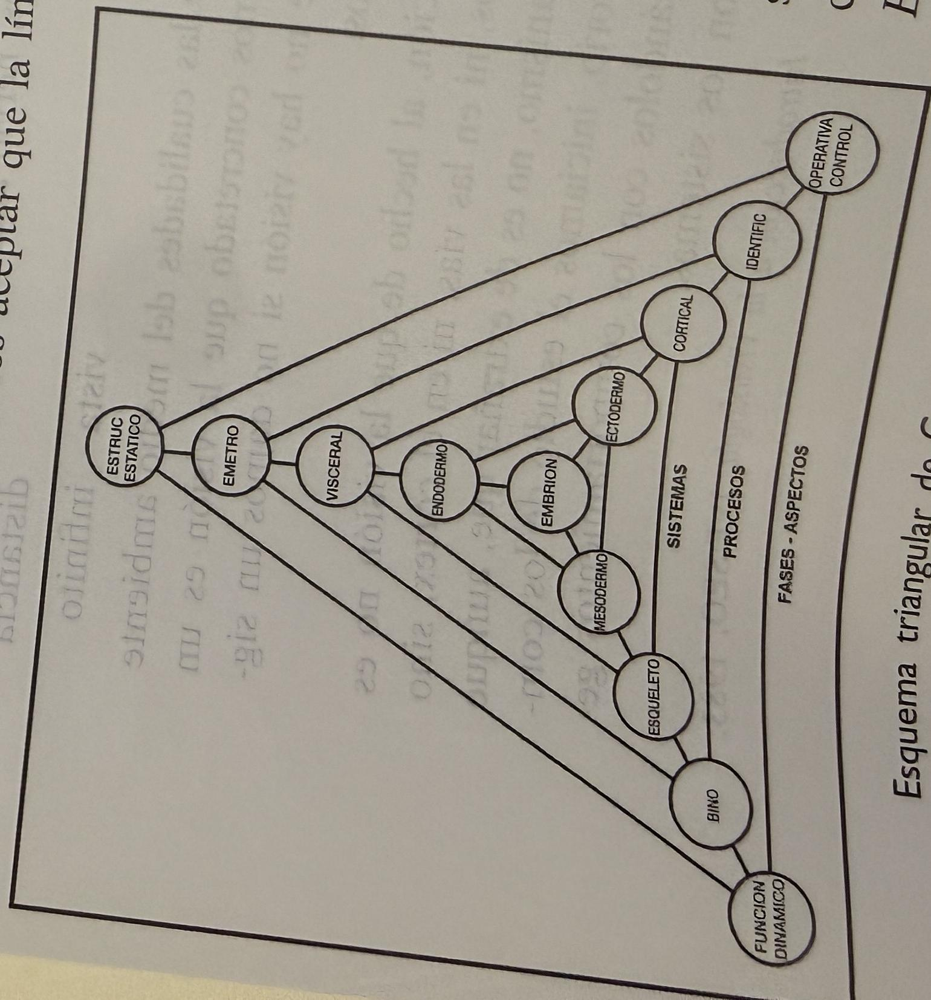

Esquema triangular de Gesell de las relaciones organismo-visión.

Manuel ROURE ARNALDO, Paneles explicativos de las clases de Optometría, EUOOT, 1984-1987.
 

---

## OCR IMG_3312.JPG

**Fuente:** `ocr-playground-download-20260621T165122Z/IMG_3312.JPG/markdown.md`

Debemos acostumbrarnos a pensar en la disposición triangular de Gesell que da cumplimiento a las exigencias planteadas ya que nos indica la interdependencia de las relaciones de las tres láminas embrionarias, de los tres sistemas, de los tres procesos visuales, de los tres fases, de los tres aspectos.

#### El sistema funcional

El sistema funcional, cuyo esquema encontraremos a lo largo de este trabajo, es el instrumento que permite la estructuración del análisis de los comportamientos, de las metodologías de examen, de las normas de cada una de las pruebas realizadas, de los problemas visuales, de los medios de mejora.

El cuadro de esta jerarquía es el sistema funcional, aplicable a todo el conjunto dinámico. Estas tres fases de organización permiten clasificar los comportamientos.

#### FASE DE ORGANIZACIÓN ESTRUCTURAL

Comprende las estructuras propias del sistema estudiado. Por ejemplo, para el estudio de la marcha tendremos en la fase estructural: los huesos, los músculos, los tendones, las articulaciones, los centros de mando, etc.: esqueleto, musculatura, centros nerviosos.

#### FASE DE ORGANIZACIÓN FUNCIONAL

Comprende los comportamientos permitidos por las estructuras citadas, que se convierten en dinámicas.

Siguiendo con nuestro ejemplo de la marcha, incluimos en esta fase la posibilidad que tienen las piernas de sostener el cuerpo, de moverlo, de mantenerlo en equilibrio, etc.: postura erecta, movimientos de los miembros, equilibrio de flexores-extensores.

#### FASE DE ORGANIZACIÓN OPERATIVA

En esta última fase situaremos los comportamientos a los que debe conducir el sistema estudiado cuando está perfectamente equili-
 

---

## OCR IMG_3313.JPG

**Fuente:** `ocr-playground-download-20260621T165122Z/IMG_3313.JPG/markdown.md`

brado. Es en este nivel en el que el sistema llega a ser eficaz. En lo que respecta a la marcha, se alcanza el desplazamiento automatizado; andar adelante y atrás, correr, dar saltos... marcha, con variaciones de ritmo, marcha automatizada, útil.

Si hacemos la comparación con la ontogénesis, corresponde:

- Al periodo fetal, la distribución de las estructuras.
- Después del nacimiento, la puesta en funcionamiento de estas estructuras (activación de los reflejos).
- Más adelante, la adquisición de los diferentes controles que permiten su utilización.

Esta división en tres fases de organización va a facilitar la comprensión de las relaciones entre los diferentes comportamientos, pero resulta insuficiente para un estudio detallado. Ciertamente, nos permite establecer relaciones directas, pero, si queremos estudiar las relaciones indirectas, habrá que subdividir cada una de las tres particles.

Emetropización, IVF/SEO, 1989.

#### ASPECTO ESTÁTICO

Entre las estructuras que componen el sistema en cuestión, algunas son únicamente estáticas. Volviendo a la analogía de la marcha, el esqueleto constituye un principio fundamental sin el cual ni los músculos, ni sus centros de mando, ni sus funciones tendrían existencia.

Con respecto a las estructuras, el aspecto estático concierne a las más primitivas y a aquellas a partir de las cuales se elaboran las estructuras motrices.

Igualmente, en las fases funcionales y operativas, el aspecto estático participa en los comportamientos de base, que tendrían necesidad de elementos motores para llegar a ser eficaces. Repitiendo la analogía de la marcha, podríamos ilustrar la fase funcional por la postura erecta, y la fase operativa, por la marcha como tal.

Emetropización, IVF/SEO, 1989.
 

---

## OCR IMG_3314.JPG

**Fuente:** `ocr-playground-download-20260621T165122Z/IMG_3314.JPG/markdown.md`

&lt; 127

### ASPECTO DINÁMICO

Las estructuras, a priori, no pueden ser dinámicas. Algunas están, sin embargo, más relacionadas con la motricidad que con los fundamentos mismos del sistema. Así, para las estructuras de la marcha, la musculatura tiene un aspecto más dinámico, más motor.

|   | Aspecto estático | Aspecto dinámico | Aspecto de control  |
| --- | --- | --- | --- |
|  Astrutura | Esqueleto | Musculatura | Centros nerviosos sensorio-motores  |
|  Función | Postura erecta | Movimientos de los miembros | Equilibrio de flexores y extensores  |
|  Operatividad | Marcha | Variaciones del ritmo en la marcha, reserva de energía | Marcha automatizada, integrada, útil  |

Desarrollo de la marcha.
Emetropización, IVF/SEO, 1989.

La fase funcional podría ilustrarse, en su aspecto dinámico, por los movimientos reflejos del bebé que preceden a la marcha. Y en cuanto a la fase operativa, las variaciones de velocidad y la flexibilidad constituyen lo esencial.

### ASPECTO DE CONTROL

Toda capacidad debe poder ser superior a la de su nivel habitual de utilización. Un vehículo no se mueve normalmente a su velocidad máxima. Para tener ademanes eficaces, hemos debido analizar el resultado. Todo sistema vivo está informado de las consecuencias de sus actos a más o menos largo plazo. El aspecto de control está constituido por retracciones y reajustes, vías que conducen a nuevos rendimientos o habilidades.
 

---

## OCR IMG_3315.JPG

**Fuente:** `ocr-playground-download-20260621T165122Z/IMG_3315.JPG/markdown.md`

El sistema funcional objeto de nuestro estudio queda resumido en un cuadro de nueve casillas, dispuestas de tres en tres. Este cuadro servirá de base en el estudio de los procesos y de sus comportamientos, normas, problemas y medios de mejora. Esta sistematización facilitará notablemente nuestro estudio cuando se trate de abordar las relaciones entre los diferentes procesos y las incidencias de un problema específico sobre el conjunto del funcionamiento visual.

Tiene igualmente la ventaja de orientar las investigaciones cuando ciertos comportamientos son incompletos o poco conocidos, un poco al modo como el cuadro de los elementos químicos ideado por Mendeleiev, permitía suponer la existencia de metales aún ignorados, por el análisis de las repeticiones y de las coincidencias que en los elementos conocidos se daba.

*Emetropización, IVF/SEO, 1989.*

Para tener una apreciación global de la visión, es necesario contemplar el conjunto de los tres procesos visuales: *Emetropización*, *Binocularización* e *Identificación*, y analizar los respectivos comportamientos de una manera conjunta.

Situándolos conjuntamente en el cuadro cibernético, consideraremos el proceso de *Emetropización* como el aspecto estático, relacionado con la concentración visual; estudiaremos el proceso de *Binocularización* como el aspecto dinámico, relacionado con la atención visual, y consideraremos el proceso de *Identificación*, como el aspecto de control, relacionado con el reconocimiento visual.

#### Comportamientos y procesos visuales

Entre los comportamientos individuales, los visuales ocupan un lugar privilegiado. Siguen el mismo tipo de organización según los tres sistemas ya considerados, y los estudiaremos según los tres procesos, como los sistemas, provenientes de las tres hojas embrionarias.

El desarrollo de la focalización, proceso de *Emetropización*, resulta de la armonización de las estructuras oculares y anexas y de armonización de las funciones viscerales.
 

---

## OCR IMG_3316.JPG

**Fuente:** `ocr-playground-download-20260621T165122Z/IMG_3316.JPG/markdown.md`

El desarrollo del centrado o funcionamiento simultáneo de ambos ojos, proceso de Binocularización, resulta de su coordinación tal y como la organización esquelética resulta de la coordinación motora.

El desarrollo del reconocimiento visual, proceso de Identificación, resulta de la integración de las informaciones luminosas tal como la organización cortical resulta de la puesta en relación y de la integración de todas las experiencias sensoriales y motrices vividas por el individuo.

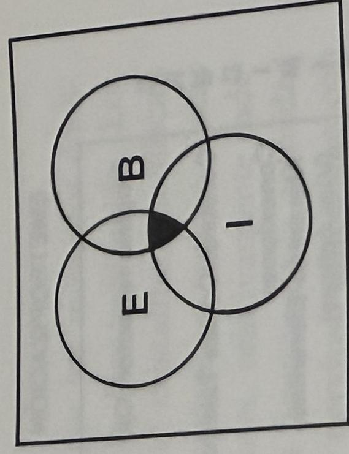
Procesos visuales. Introducción a la Visiología, IVF/SEO, 1983.

#### Emetropización

En el curso de la Emetropización, el individuo va a adaptar su sistema de enfoque a las exigencias visuales del medio: focalización de cerca, de lejos, paso de cerca a lejos y viceversa, además de la automatización y mantenimiento del enfoque.

#### FASE ESTRUCTURAL

Desde el punto de vista estructural, los elementos en cuestión se han emplazado en el curso de la embriogénesis. Se trata esencialmente de las envolturas del ojo, de la córnea y del cristalino. Las características de estos constituyentes son variables: lo esencial es su equilibrio. Las estructuras oculares son extremadamente maleables en el curso de la embriogénesis y conservan una plasticidad notable algún tiempo después del nacimiento. Por esto, las características ópticas varían y dependen de los estados viscerales del individuo, más que de las medidas físicas de sus componentes. En los niños y jóvenes es preciso tener muy en cuenta el desarrollo.

El establecimiento armónico y coordinado de las estructuras oculares para formar un conjunto óptico satisfactorio a nuestras necesidades, precisará un medio visceral exento de variaciones anormales.
 

---

## OCR IMG_3317.JPG

**Fuente:** `ocr-playground-download-20260621T165122Z/IMG_3317.JPG/markdown.md`

130

|  CRECIMIENTO | EMPRENTO | DIETATIVO | MADURACIÓN  |
| --- | --- | --- | --- |
|  C R E C I M I E N T O | Diioptrio refractor: Ojo Cerebro: Córtex-Tálamo Conexiones Aferentes-Eferentes (Vías ópticas) Captación y concentración de Luz | Dos monocularidades Reflejos motores de base: * Orientación * Compensación * Versión Captación y orientación s/la Luz | SENSACIÓN Sensibilidad a: * Luz * Movimiento * Campo visual * Color Transformación de la Luz  |
|   | Focalización a todos los planos del espacio Variaciones Acomodación | Centrado binocular (Ajustes) Amplitud de Vergencias Fusión | PERCEPCIÓN Discriminación de: * Forma * Detalle * Relieve * Volumen  |
|   | Equilibrio de la Focalización: * Lejos * Cerca Hipermetropía fisiológica (Reserva) | Equilibrio del Centrado Estereocularidad Exoforía fisiológica (Reserva) | REPRESENTACIÓN Integración Espacio Descodificación en: * Lectura * Escritura Memoria visual  |

CONCENTRACIÓN + ATENCIÓN + RECONOCIMIENTO = LECTURA

Procesos visuales – Análisis de los comportamientos.

Manuel ROURE ARNALDO, Paneles explicativos de las clases de Optometría, EUOOT, 1984-1987.
 

---

## OCR IMG_3318.JPG

**Fuente:** `ocr-playground-download-20260621T165122Z/IMG_3318.JPG/markdown.md`

CIRCULARIOS Y CONDICIONES DE LA REPÚBLICA DE COLOMBIA

### FASE FUNCIONAL

La activación de las estructuras oculares por los músculos constituye la fase de organización funcional de la *Emetropización*. Los músculos ciliares antagonistas actúan sobre el cristalino, modifican sus curvaturas y por consiguiente sus características ópticas. Estas modificaciones son en principio muy importantes, relativamente independientes de los estímulos luminosos. Son la función de la actividad más global en un primer tiempo, del sistema nervioso autónomo con sus componentes orto y parasimpático.

(El tono) sube, baja y vuelve a subir buscando un equilibrio. Si el lactante está satisfecho, su emetropía se situará más bien en una zona tónica mínima, mientras que, al contrario, si está mojado, tiene hambre y está incómodo la curva indicadora de las variaciones dioptricas tenderá a dirigirse hacia la zona tónica máxima.

Institut de Visiologie du Québec, *Introduction à la Visiologie*. Tomo II: *Le Processus d’Emmetropisation*, IVQ, 1970.

Estas variaciones dioptricas han sido medidas objetivamente, mediante retinoscopía:

- Getman, 1958, encontró que estos cambios podían ser del orden de 12 dioptrías, pasando de +4,00 / +5,00 a -7,00 / -8,00 en poco tiempo.
- Gerald N. GETMAN. Citado por Roger DE SAINT ANDRÉ, *Apuntes seminario: La Visión y el Niño*, IVF/SEO, 1985.

- Bastien, 1984, expuso que, en bebés de catorce días, el intervalo podía oscilar entre +9,00 y -11,00.
- Armand R. BASTIEN, *Apuntes seminario: El Examen Visual Behavioral*, SOE/CNOO, 1983.

### FASE OPERATIVA

Establecida globalmente durante la fase de organización funcional, la focalización debe afinarse, adaptarse a necesidades visuales diferentes a las de la propia *Emetropización*. El papel del iris y de las fibras oblicuas del músculo ciliar, es aquí importante. Son estos los que van a asegurar los reajustes delicados y delimitar la peque-
 

---

## OCR IMG_3319.JPG

**Fuente:** `ocr-playground-download-20260621T165122Z/IMG_3319.JPG/markdown.md`

control

ña zona en el interior de la cual se ejercen las microfluctuaciones, indispensables en la eficacia visual. La naturaleza del estímulo entra aquí en juego y constatamos, a menudo, en particular en las personas que tienen problemas de Emetropización que las dificultades de descodificación entrañan modificaciones, a veces muy importantes, en el equilibrio de la focalización. Investigaciones realizadas en la Yale Clinic of Child Development Institute del pediatra Arnold Gesell han demostrado este hecho en los niños:

Estos cambios dióptricos estaban fuera de proporción con los que se podían esperar para focalizar a la distancia en la que se encontraban los contrastes luminosos que los niños tenían que identificar correctamente.

Gerald N. GETMAN y Newal C. KEPHART, Developmental Vision, OEP, Duncan, 1958-1959.

Se encuentran resultados idénticos en los adultos dependiendo de la descodificación del optotipo utilizado en la retinoscopia, así pueden ser diferentes los resultados según el tipo de retinoscopia practicada: estática, dinámica, cognitiva.

Volviendo a los niños, igualmente se observan diferencias apreciables ante determinadas sensaciones táctiles experimentadas durante la práctica de la retinoscopia. Es normal encontrar valores más convexos si se acaricia suavemente al niño observado, o se le da conversación que le distraiga, desviando su atención a intereses distintos de la propia prueba, liberando así la consciencia del niño de la tensión que podría generarse.

En resumen, la Emetropización que comienza con el emplazamiento de las estructuras dióptricas oculares, comprende el equilibrio de la focalización después de variaciones importantes poco a poco amortiguadas, y de su utilización exacta y fácil en los diferentes planos del espacio y en las necesidades de cada uno. En el transcurso de constantemente en relación con el resto del organismo, esencialmente por intermedio del sistema visceral.
 

---

## OCR IMG_3320.JPG

**Fuente:** `ocr-playground-download-20260621T165122Z/IMG_3320.JPG/markdown.md`

133

### Binocularización

Durante el proceso de Binocularización, ambos ojos como los dos lados del cuerpo afinan su coordinación hasta formar un conjunto funcional, siguiendo los progresos de la motricidad general.

#### FASE ESTRUCTURAL

La coordinación binocular, esencialmente motriz, utiliza estructuras musculares y nerviosas, asentadas en la fase de organización estructural. De hecho, las estructuras de este proceso de coordinación son estructuras de la conducta es decir manifestaciones motrices reflejas que soportan el desarrollo futuro de la motricidad ocular.

Se trata de la activación refleja de los globos oculares cuyas oscilaciones no coordinadas (nistagmus) se ejercen en el feto entre los siete y ocho meses y algunas veces en el recién nacido de manera pasajera.

Estos son también los reflejos que permiten al bebé orientarse hacia una fuente luminosa (reflejo de orientación), incluso si la posición de su cuerpo varía (reflejo de compensación) o por el contrario, un poco más tarde, seguir, relativamente, un objeto en movimiento (reflejo de versión). El reflejo de alineamiento, refinamiento de los anteriores, alineará la imagen del estímulo observado sobre la fóvea del ojo.

Estos reflejos de seguimiento corresponden a una estimulación de la retina periférica más que de la retina central, paralelamente al nivel del desarrollo funcional del SNC (bulbo, puente, cerebelo). Tenemos aquí un ejemplo de la ley del desarrollo periferocentral.

Los movimientos de ambos ojos son normalmente conjugados, pero, a este nivel, se observa que el alineamiento solo se efectúa en un ojo. Por esta razón, esta fase de organización estructural puede llamarse etapa de monocularidad.

Aunque los dos ojos efectúen aproximadamente los mismos movimientos, uno solo es activado verdaderamente. El otro sigue, pero sin fijar la mirada de una manera real. La organización neuromotriz correspondiente es típicamente monolateral, regida por el reflejo tónico asimétrico del cuello (RTAC).
 

---

## OCR IMG_3321.JPG

**Fuente:** `ocr-playground-download-20260621T165327Z/IMG_3321.JPG/markdown.md`

10

### FASE FUNCIONAL

El alineamiento monocular se alterna, acto seguido, de un ojo al otro y estos dos ojos que se ignoraban empiezan a funcionar conjuntamente. En el curso de esa segunda etapa, de duocularidad, el funcionamiento es estimulado, simétricamente, pero no aun perfectamente coordinado. Los ejes visuales, según la postura general y la etapa del desarrollo, tienen tendencia a divergir o a converger; esta tendencia puede manifestarse de manera temporal.

En definitiva, se pasa de una fase monocular, duocular y binocular, de forma continuada. Es aquello que denominamos un continuum. Y ello desde el comienzo de la vida. El responsable de la velocidad de esta progresión es la cantidad de tiempo que un niño pasa en cada uno de los estadios. Siguiendo los progresos de la motricidad, el niño empieza a actuar, los dos ojos se alinean sobre el objeto de manera estable y simultánea. Las dos imágenes visuales se fusionan a nivel cortical y la coordinación así alcanzada permite calificar este rendimiento de contralateralidad.

### FASE OPERATIVA

La estereocularidad, capacidad de apreciar las distancias, nace de la integración simultánea de las adquisiciones binoculares y de las experiencias de locomoción y de manipulación. Así el desarrollo binocular, en estrecha relación con el desarrollo motor general, conduce al centrado automático sobre todo objeto de interés y a la apreciación de las distancias relativas entre este objeto y otros planos del espacio o del propio individuo.

Estas capacidades son utilizadas en la vida corriente, por ejemplo en la conducción automovilística (cálculo de posibilidades de un adelantamiento sin riesgos, apreciación de las velocidades, de las distancias...).

El centrado de ambos ojos se establece con agilidad gracias a una ligera tendencia a la divergencia. La coordinación general se lateraliza: el par ocular es dirigido por uno de los dos ojos, el ojo dominante motor u ojo director, el cual en esta fase se automatiza.

Introducción a la Visiología, IVF/SEO, 1983.
 

---

## OCR IMG_3322.JPG

**Fuente:** `ocr-playground-download-20260621T165327Z/IMG_3322.JPG/markdown.md`

13

### Identificación

El proceso de Identificación visual está en estrecha relación con el sistema cortical, captador e integrador de los estímulos internos y externos. El individuo aprende a descodificar los mensajes de origen luminoso, del más primitivo (la propia luz) al más elaborado (el símbolo). El desarrollo de la Identificación visual se hace en paralelo con el de las sensibilidades táctiles, gustativas, olfativas y auditivas que concurren a reforzar reconocimientos cada vez más visuales.

La visión de los objetos implica numerosas fuentes de información además de la que el ojo encuentra cuando miramos un objeto. Ello implica generalmente un conocimiento del objeto que deriva de una experiencia anterior; esta experiencia puede concernir a los otros sentidos: tocar, gustar, oler y quizás también a la temperatura o al dolor.

R. L. GREGORY, Ojo y Cerebro, Ed. Guadarrama, Madrid, 1965.

### FASE ESTRUCTURAL

Los primeros análisis visuales van dirigidos hacia el conjunto del entorno luminoso, se conducen especialmente hacia la luz y el movimiento. Estos analizadores constituyen, por otra parte, estructuras de la conducta que serán la base de las descodificaciones ulteriores. Corresponden a la primera maduración de las estructuras nerviosas de transmisión y de integración: en particular la retina periférica y los centros primitivos del cerebro. De una manera general, el aspecto "sensación" domina, pues el estímulo luminoso provoca una reacción interna que marca el organismo a un nivel inconsciente.

Es así como el niño reacciona primero a la luz, hacia la cual dirige con frecuencia su mirada. Para Piaget la luz constituye un verdadero alimento del sistema visual. Se vuelve sensible a las variaciones de luminancia y se interesa por los movimientos.

Comienza a seguir con los ojos los objetos que se mueven, repara en las caras familiares. Este periodo de organización de las estructuras de la conducta de la Identificación visual, se perfecciona por la sensibilización a las diferentes longitudes de onda: el color. El color no existe como tal, por sí mismo. Las longitudes de onda serán seguidamente identificadas como colores después de complejas asociaciones.
 

---

## OCR IMG_3323.JPG

**Fuente:** `ocr-playground-download-20260621T165327Z/IMG_3323.JPG/markdown.md`

Gracias a estos estímulos y a las grabaciones efectuadas, el sistema visual sufre una maduración que le va a posibilitar rendimiento de descodificación más elaborados.

#### FASE FUNCIONAL

Anteriormente hemos indicado la importancia del tacto en el desarrollo de la identificación visual. Ahora es cuando va a jugar un papel importante de confirmación y de soporte para la descodificación visual.

Las sensaciones, primer nivel de integración, pierden progresivamente su preponderancia en provecho de un análisis sensorial superior: la percepción.

Held ha demostrado en sus experiencias con gatos:

Que los estímulos táctiles y motores influyen esencialmente en el desarrollo de la percepción visual. Lo mismo sucede en el niño. Las manipulaciones de un objeto facilitan estímulos táctiles y visuales. Las sensaciones táctiles y visuales dan una “imagen” de este objeto. La percepción visual permite reconocerlo sin tener que tocarlo o mirarlo mucho. Del mismo modo la exploración táctil de los huecos, volúmenes, ángulos... conduce a la percepción visual del relieve.

R. HELD, Citado por R. L. Gregory, Ojo y Cerebro, Ed. Guadarrama, Madrid, 1965

Las constataciones hechas particularmente en los ciegos de nacimiento que recuperan la vista confirman esta importancia del tacto y de la motricidad en la adquisición de la percepción visual: estos nuevos videntes se muestran incapaces de reconocer los objetos o las distancias simplemente por la observación visual; están obligados a desplazarse, a manipular estos objetos para una identificación de la forma, de las propiedades. Uno de ellos, en base a su experiencia, declaró:

Ahora que yo lo he sentido, puedo verlo.

Citado por R. L. GREGORY, Ojo y Cerebro, Ed. Guadarrama, Madrid, 1965.

El niño desarrolla así sus percepciones que ejerce esencialmente sobre tres características del mundo visual: las formas, conjuntos percibidos globalmente cuyos rasgos específicos son a veces difíciles
 

---

## OCR IMG_3324.JPG

**Fuente:** `ocr-playground-download-20260621T165327Z/IMG_3324.JPG/markdown.md`

de captar; los detalles, dando cuenta de una actividad analítica y desarrollando en su aprendizaje la agudeza visual, y el relieve, nacido de los contrastes de sombras y de luz, de las ocultaciones de unos objetos por otros cuyo origen manipulatorio y por lo tanto táctil es particularmente evidente.

#### FASE OPERATIVA

El análisis del funcionamiento cortical nos ha hecho constatar que las sensaciones y las percepciones son las que han permitido y permiten en el hombre el tercer nivel de integración: la representación. Esta evoca a nivel consciente experiencias sensoriales próximas o ligadas al estímulo y a lo que representa. Mucho antes de llegar a la representación simbólica, el individuo integra las coordenadas espaciales: no tiene necesidad de ver el espacio para imaginar los efectos de un desplazamiento, sitúa las direcciones principales (vertical, horizontal), orienta estas direcciones arriba-abajo, adelante-atrás, derecha-izquierda. Sobre estas bases, podrá localizar sin dificultad y mentalmente, si esto es necesario, todo objeto en el mundo que lo rodea, y situarse él mismo en él.

Las impresiones táctilo-cinestésicas dominan en el curso de toda la primera infancia, es decir, durante las primeras semanas de la vida y constituyen, verdaderamente, una unión entre el organismo y el medio exterior (Wallon 1949, Piaget 1947). Pero desde el cuarto o quinto mes, la coordinación de la visión y de la prensión progresiva del espacio táctil y propioceptivo y del espacio visual. La visión toma la delantera al conocimiento, pero es evidente que ella queda siempre controlada por los datos táctilo-cinestésicos correspondientes, que contribuyen a estructurar las informaciones que transmite. El espacio perceptivo y el espacio representativo se constituyen así a partir de todos los datos sensoriales.

Yvette HATWELL, *Privation Sensorielle et Intelligence*, PUF, París, 1966.

La representación visual se convierte en más rica, cuantas más experiencias sensoriales se tienen; el simbolismo puede, entonces, tener sitio, permitiendo la extensión del pensamiento consciente.

La Identificación visual cuyo desarrollo se apoya sobre toda la sensorialidad, parece la clave de la elaboración de la inteligencia,
 

---

## OCR IMG_3325.JPG

**Fuente:** `ocr-playground-download-20260621T165327Z/IMG_3325.JPG/markdown.md`

138

sea bajo la forma de investigaciones intelectuales fructuosas o bajo la forma de soluciones que se podrán adaptar eficazmente.

La filogénesis confirma esta importancia de la visión. Hemos visto su elaboración progresiva cada vez más fina, basada sobre los otros sentidos, su ascensión como receptor e integrador del mundo que nos rodea, como guía privilegiada de la adaptación a lo largo de la evolución.

El neurofisiólogo y cibernético Grey Walter escribe:

En el hombre, la preeminencia de la visión se apoya sobre órganos de una elaboración y de una sensibilidad extremas y sobre la proporción impresionante de la actividad cerebral reservada a este sentido.

William GREY WALTER, *Le Cerveaux Vivant*, Delachaux et Niestlé, Neuchâtel, 1954.
 

---

## OCR IMG_3326.JPG

**Fuente:** `ocr-playground-download-20260621T165327Z/IMG_3326.JPG/markdown.md`

CAPÍTULO 7
COMPORTAMIENTOS DE LA EMETROPIZACIÓN

#### Nociones de emetropía

La Emetropización permite al sistema visual el establecimiento de una focalización eficaz de su dióptrica ocular sobre un estímulo determinado. Estamos habituados a considerar la emetropía como un valor numérico correspondiente a la focalización exacta sobre la retina de un objeto situado en el infinito.

A un pez que vive en aguas bastante turbias, ¿le sería útil tener su remoto en el infinito? Otro pez que busca su alimento entre los arrecifes de coral, no tiene necesidad de ver más allá, cuando su descodificación visual solamente puede ejercerla a algunos decímetros. Este es un claro ejemplo de adaptación miópica deseable y favorable.

De hecho, muchos animales están equilibrados ópticamente a planos próximos, en todo caso distintos del infinito, y podríamos considerarlos miopes si a este término le diéramos un matiz distinto del de su connotación de problema visual.

Debe acercarse la noción de emetropía a la de adaptación del sistema dióptrico a las necesidades del animal, como también debe acercarse a la noción de adaptación del hombre a las necesidades del medio. Esta adaptación, favorable o desfavorable, deseable o indeseable, puede revestir la forma de una miopía en el caso de todas las especies cuyo medio habitual sea relativamente próximo.

Es perfectamente lógico considerar la noción de emetropía de cerca, o la noción de emetropía a cada una de las distancias requeridas o precisas, distancias que cada vez toman mayor importancia como consecuencia de las ocupaciones y aficiones predominantes a distancias próximas. Ello en contraposición y complementando la habitual y única consideración de la noción de emetropía limitada a focalizar el infinito.

139
 

---

## OCR IMG_3327.JPG

**Fuente:** `ocr-playground-download-20260621T165327Z/IMG_3327.JPG/markdown.md`

Un contable, cuyo trabajo transcurre íntegramente a una distancia reducida, tampoco tendría necesidad de una visión lejana nítida si despreciáramos el resto de su existencia, sus aficiones, su vida social y de relación... la adaptación miópica, en este caso, sería favorable para el trabajo, aunque rechazable desde el punto de vista global.

Para el contable, la adaptación miópica no sería favorable de lejos, para sus desplazamientos, sus diversiones, y por tanto sería no deseable al no cumplir todos los requisitos necesarios. Igualmente, es necesario considerar que quizás tampoco sea favorable una condición hipermetrópica o emetrópica para su trabajo especializado a planos próximos.

Nuestro egocentrismo nos impide, frecuentemente, comprender los equilibrios a los que han llegado las especies animales. Ello nos dificulta también la comprensión de las adaptaciones que ciertos individuos son capaces de realizar ante condiciones específicas, distintas de las consideradas habituales o normales.

En la prehistoria, no cabían los miopes medios, incapacitados para cazar y procurar su sustento y el de su familia; en cambio, si tenían un lugar destacado en la sociedad los miopes elevados dedicados, gracias a su condición, a la elaboración de flechas, puntas de lanza y otros instrumentos de precisión necesarios para su comunidad.

Albert A. Sutton, en 1968, nos dice:

La miopía no es solamente un problema de la visión. Es un problema de todo el cuerpo y de la mente... Para el optometrista, algunas veces, es el punto en el cual una conclusión se consigue, donde paramos de razonar o pensar.

Deborah ZELINSKY, Neuro-optometric diagnosis, treatment and rehabilitation following traumatic brain injuries, Elsevier Saunders, 2007.

La miopía se define y describe de muchas formas, estructural, funcional y operativamente. La definición puede variar según el concepto definidor de "visión". La definición es de color frecuentemente por los supósitos que se indican como hechos. Cuando este es el caso, por ejemplo, una definición puede ser peligrosa ya que puede delimitar al usuario en su pensamiento y aplicación clínica.
 

---

## OCR IMG_3328.JPG

**Fuente:** `ocr-playground-download-20260621T165327Z/IMG_3328.JPG/markdown.md`

141

A. M. Skeffington proporciona una excelente definición operativa de la miopía, cuando afirma que la miopía es la condición en la cual la agudeza visual es inferior a la normal, pero queda restaurada a la norma con lentes cóncavas. La mayoría de las miopías se producen en respuesta al estrés inducido por la biológicamente inaceptable tarea de cerca realizada por el individuo. En realidad, el problema visual inducido por el estrés es la condición, y la miopía es la manera de adaptación.

Clínicamente, la miopía es vista tanto como una adaptación primaria y como una respuesta secundaria. Por definición, la miopía primaria es la que surge en el proceso visual como una primera respuesta a la presión impuesta. Esta es la miopía que se produce en los primeros años escolares. Sin embargo, los clínicos son conscientes de que la miopía aparece y se incrementa también en los años de escuela secundaria, los años universitarios, e incluso después. Esta es la miopía secundaria. Con la evidencia disponible y el diagnóstico diferencial, es evidente que la miopía secundaria se produce como una respuesta al estrés adicional, en la actualidad, el paciente se ve afectado antes por un síndrome de eficiencia visual reducida'.

Robert A. Kraskin, *Lents Power in Action*, OEP, 2003.

El hecho de que cada vez se trabaje más de cerca, motiva situaciones curiosas que son consecuencia de la progresiva miopización de la población en los países más culturizados:

- Entre las sociedades primitivas, casi no hay miopes.
- Entre los antiguos payeses, casi no hay miopes.
- Entre las sociedades no sedentarias, casi no hay miopes.
- En Norteamérica, casi no hay miopes altos. ¿De dónde habían de salir? No lo eran los pieles rojas autóctonos, ni tampoco los negros trasladados desde África como esclavos, ni lo eran los emigrantes europeos o asiáticos, ya que los miopes se quedaron en casa, y no pudieron emigrar debido a su minusvalía visual.
- En los EE.UU. en el año 1939, aún en la cola de la crisis del 1929, el 33% de las lentes fabricadas eran cóncavas, en el año 1968, finales del boom industrial, las lentes cóncavas representaban ya el 66%. Y ello solo en veintinueve años.
 

---

## OCR IMG_3329.JPG

**Fuente:** `ocr-playground-download-20260621T165327Z/IMG_3329.JPG/markdown.md`

- Más cerca, cuando monté la óptica, en el año 1971, pedí un estoc de lentes al proveedor. Me enviaron muchas lentes cómo cavas y pocas convexas, sin duda escogieron las lentes que más consumo tenían globalmente en Catalunya, pero en mi comarca, por aquel entonces básicamente agraria, había más hipermetropes que miopes. Tuvimos que cambiar el estoc de lentes por otro más apto a las necesidades de mis clientes.
- Alaska, en el año 1959, se convirtió en el 49º estado de la Unión. Es preciso aclarar que a partir de esta conversión, las Unión. Es preciso aclarar que a partir de esta conversión, las leyes de los EE.UU. rigieron también en el nuevo estado y las leyes de los EE.UU. rigieron también en el nuevo estado y las leyes de los EE.UU. rigieron también en el nuevo estado y las leyes de los EE.UU.

Resultados de ambas visitas:

- Generación A: abuelos (sin contacto con la civilización) 1% de miopías (1965) &gt;55 años, analfabetos
- Generación B: padres (algún contacto con la civilización) 5-7% de miopías (1965) 25-55 años, lectores a nivel de 8 años
- Generación C: hijos (1ª generación escolarizada) 24% de miopías (1965) 11 años, lectura como en los otros estados de los EE.UU.
- Generación C: hijos (1ª generación escolarizada) 33% de miopías (1977) 18 años preuniversitarios
- Generación C: hijos (1ª generación escolarizada) 50% de miopías (1977) &lt;25 años universitarios
- Generación C: hijos (1ª generación escolarizada) 60% de miopías (1977) &gt;25 años universitarios trabajando

Armand R. BASTIEN, Seminario: Entrenamiento Visomotor y Psicomotor, SOE CNOO, 1983.
Greg GILMAN, Audiovisual Seminario: Conducta Humana y Función Visual. SOE, 1983.
 

---

## OCR IMG_3330.JPG

**Fuente:** `ocr-playground-download-20260621T165327Z/IMG_3330.JPG/markdown.md`

143

- Esta situación está corroborada por otros estudios sobre los inuit de Alaska, como el realizado por un grupo de científicos que fueron al Círculo Polar Ártico para estudiar toda una comunidad antes de iniciar la escolarización obligatoria. Se encontraron con que entre los individuos pre-présbitas casi no había miopes, su incidencia era de un 1,5-2,0%. Transcurrido cierto tiempo después de que los niños iniciasen su escolarización ya encontraron un 44,7% de miopes. Otros estudios realizados en Groenlandia mostraron que los inuit que vivían con un estilo de vida tradicional, tampoco presentaban miopía. No obstante, los inuit que iban a la escuela mostraron prevalencias similares de miopía a las que se encontraron en los niños inuit de Alaska.

Es evidente que el aumento en la miopía está correlacionado con la experiencia académica: el fenómeno del aumento de la incidencia de la miopía que ocurrió en una generación, justamente coincidiendo con la escolarización.

Este aumento de generación en generación en la prevalencia de la miopía no se podría explicar por la teoría de Darwin, ya que la selección natural requiere tiempo para que las características cambien. El concepto de Darwin era simple pero poderoso: los individuos mejor adaptados a su entorno tienen más probabilidades de sobrevivir y reproducirse. Mientras haya una cierta variación entre ellos, habrá una inevitable selección de individuos con las variaciones más ventajosas.

W. C. MAPLES, *Darwin vs Skeffington*, *Journal of Behavioral Optometry*, vol. 21, n° 5, 2010.

- El aumento de las tasas de miopía entre la población inuit también se ha citado como evidencia para dar apoyo a la mediación ambiental de la miopía. Goldschmidt citó una frecuencia de la miopía en el Distrito Angmassalik de Groenlandia de 1,2% en 1952, observando un incremento considerable después de 32 años, que fueron testigos de un aumento de diez veces, culminando en una frecuencia del 12%. Es importante destacar que los principales cambios en el entorno y la educación también se experimentaron durante estos años, lo que sugiere
 

---

## OCR IMG_3331.JPG

**Fuente:** `ocr-playground-download-20260621T165504Z/IMG_3331.JPG/markdown.md`

144

un papel importante del medio ambiente en la mediación de las tasas de miopía.

Rebekah WHITE, *A Precarious Balance: Genetic vs Environmental Risk in the Mediation of Myopia*, Cross Sections, vol. 1, 2005.

Al hablar de la emetropía de cerca es preciso referirnos también al *Estrés Visual de Cerca (EVC)*, descrito ya por Demóstenes (384-322 a. C.), fenómeno que denominó *atonicidad ocular* y que mejoraba recomendando caminar, correr y practicar la gimnasia.

En la edad media Johan Zahn (1685) previno sobre la realización de trabajos con la luz crepuscular y la excesiva inclinación sobre el libro durante la lectura.

El término astenopía fue creado el 1843 por William MacKenzie. El tratamiento recomendado era la abstención del trabajo de cerca, la ingestión de purgantes, tónicos, bebidas frías y calientes, tratamientos de los músculos rectos medios para ayudar a la acomodación y muy raramente lentes convexas.

En 1862, von Graffe mencionó un defecto de convergencia que causaba síntomas parecidos a la atonicidad de Demóstenes.

Finalmente, F. C. Donders (1864) trató la astenopía y describió, por primera vez, los mecanismos acomodaticios que estaban implicados en el EPC. Se refirió a una extraña condición melancólica de los ojos. Los ojos no presentaban sintomatología, eran aparentemente normales, la agudeza visual de lejos era alta, pero en lectura, escritura y trabajo refinado de cerca, especialmente con luz artificial, después de un corto espacio de tiempo, los objetos se volvían confusos y se producía un sentimiento de fatiga y tensión. Observó que los periodos de reposo aliviaban esta condición de manera directamente proporcional a la duración de estos periodos de descanso. Ya intuyó que el verdadero motivo subyacente era la hipermetropía.

W. LANCASTER, *The Story of Asthenopia*, Arch. Ophth 30(2):167-78, Reprinted by OEPF. Citado por Greg GILMAN, *Optometría de la Conducta*, CNOO, 1991.

En la edad media, personajes como Johannes Kepler pudieron mantener una dedicación tan fructífera como dilatada en la distancia de cerca, posiblemente gracias a la fuerte miopía que los limitaba para otros menesteres a distancias más alejadas.
 

---

## OCR IMG_3332.JPG

**Fuente:** `ocr-playground-download-20260621T165504Z/IMG_3332.JPG/markdown.md`

La emetropía, la hipermetropía y también la miopía, constituyen una adaptación de la focalización a las necesidades específicas de un medio particular. Es importante la consideración de las condiciones en las cuales el aparato visual deberá ejercer su actividad, en especial a distancia. Si la actividad se realiza a corta distancia, es fácil que genere miopía. Esta definición evolutiva contrasta con las clásicas, las cuales consideran el ojo de una manera estática.

*Emetropización*, IVF-SEO, 1989.

Kedzia definió la emetropía con estos términos:

El órgano visual es emetrópico si la cantidad de información que recibe es máxima, no mejorable con ayudas ópticas.

Boleslaw KEDZIA, *Ponencia, Information Criterion of the Visual Emmetropy, 17th World Congress de la SOE*, Viena, 1983.

Manas también dice:

... los datos que poseemos indican que la emetropía y la ortoforia en lugar de ser condiciones favorables al mecanismo visual, son en realidad condiciones anormales dominantes entre los lectores medios.

Leo MANAS, *Visual Analysis*, OEPF, 2009.

En términos de rendimiento, los emétropes no son precisamente los más eficaces en las tareas grafoléxicas, en contra de lo que podría esperarse.

Borish desmitifica totalmente los conceptos estructuralistas clásicos cuando dice:

La emetropía está producida por el control cortical y subcortical del tono del músculo ciliar, y la ametropía por factores que interfieren este mecanismo.

Irvin M. BORISH, *Clinical Refraction*, 1975.

Le Grand, en una conferencia pronunciada en la UNESCO, en 1961, dijo:

La emetropía es un equilibrio que se adquiere con el crecimiento, es un equilibrio deseado, es decir, un equilibrio biológico, no es un equilibrio mecánico.

Yves LE GRAND, Citado por el Institut de Visiologie du Québec.

*Introduction à la Visiologie*, Tome I, *Le Processus de Binocularisation*, IVQ, 1970.

*Introducción a la Visiología*, IVF/SEO, 1983.
 

---

## OCR IMG_3333.JPG

**Fuente:** `ocr-playground-download-20260621T165504Z/IMG_3333.JPG/markdown.md`

Los problemas visuales no son la causa del estrés en visión próxima, sino la respuesta del sujeto a este estrés.

Citado por Pilar VERGARA, La Era de la Neurociencia, IV Congreso Federópticos, 2011.

El estrés o tensión es la sal de la vida.

Hans SELYE, Tensión sin Angustia, Guadarrama, Madrid, 1975.

El punto de tensión es organicista. O sea que se trata de una respuesta bilateral de la persona total observada convenientemente con la ayuda de un retinoscopio. La posición del punto de estrés será generalmente el mismo para cualquier ojo, con excepción de comportamiento asimétrico incrustado acompañado por anisometropía medible.

Robert A. KRASKIN, Lents Power in Action, OEP, 2003.

Resumiendo, se puede afirmar que la miopía consiste en la adaptación del sistema visual a la distancia a la que mayoritariamente se utiliza.

#### Fase estructural

##### ASPECTO ESTÁTICO

La estructura de la *Emetropización* puede ser comparada a una esfera o a un conjunto de dioptrios acompañados de una pantalla.

La esfericidad resume este ensamblaje de estructuras, su detalle comprende:

- La esclerótica, recubierta interiormente por la coroides y la retina
- La córnea
- El humor acuoso
- El iris
- El cristalino
- El humor vítreo.

##### ASPECTO DINÁMICO

Para poder adaptarse y modificarse, las estructuras estáticas han de estar acompañadas de estructuras metálicas.
 

---

## OCR IMG_3334.JPG

**Fuente:** `ocr-playground-download-20260621T165504Z/IMG_3334.JPG/markdown.md`

control

desplazamientos o cambios de formas. Estas estructuras dinámicas no intervienen en la focalización propiamente dicha, pero van a modificarla incidiendo sobre las estructuras dióptricas apropiadas. El aspecto dinámico no concierne a las estructuras fundamentales, sino a los elementos indispensables a su adaptación.

Los músculos ciliares y del iris forman los elementos dinámicos de la fase estructural. Gracias a ellos, la focalización podrá variar y adaptarse a las exigencias del medio y del organismo.

#### ASPECTO DE CONTROL

Para que los elementos musculares intervengan conforme a sus necesidades, es necesaria la presencia de un sistema de reajuste permanente: el sistema nervioso, ortosimpático y parasimpático.

Las fibras pupilares, que parten de la retina para llegar a los centros de mando de las contracciones del iris, permiten reajustar el diámetro de la pupila en función de la intensidad luminosa.

Los músculos ciliares son activados por el mismo centro de mando, situado en el tronco cerebral. La retina, mediante el nervio óptico, y el córtex visual hacen realidad una vía sensorial que utiliza el reflejo de acomodación en su componente cortical.

Los centros reflejos primitivos (tronco cerebral) y los centros superiores (córtex) están, pues, implicados en la regulación de los mecanismos dióptricos.

*Emetropización, IVF-SEO, 1989.*

#### Fase funcional

#### ASPECTO ESTÁTICO

Cuando las estructuras oculares están en su sitio, y en presencia de estímulos apropiados, comienza la fase funcional. La focalización es su razón de ser fundamental. Esta focalización es relativamente imprecisa. Le faltan las posibilidades de ajustes que la convertirán en una habilidad eficaz.

147
 

---

## OCR IMG_3335.JPG

**Fuente:** `ocr-playground-download-20260621T165504Z/IMG_3335.JPG/markdown.md`

La focalización tomará distintos valores si su control es inconsciente o voluntario, o sea si se ejerce desde los centros reflejos primitivos (tálamo, mesencéfalo...) o a partir de los centros superiores corticales.

La focalización global constituye una primera activación, que no tiene otro fin que el de permitir al proceso alcanzar mucho más tarde el rendimiento óptimo.

Consideremos también la posibilidad de que esta focalización se efectúe a distintos planos del espacio, desde el próximo al remoto, gracias a la acomodación.

#### ASPECTO DINÁMICO

Las estructuras motrices, más específicamente dinámicas, permiten las variaciones de ciertos componentes dioptricos. De este modo, la focalización puede adaptarse a los diferentes planos del espacio. La noción clásica de acomodación explica, en parte, un fenómeno que reposa esencialmente en las modificaciones de curvatura del cristalino.

Este fenómeno, más complejo, corresponde a una motricidad involuntaria (análoga a los juegos musculares viscerales). Las variaciones de la curvatura del cristalino permiten mantener la focalización precisa sobre la retina a pesar de los alejamientos y acercamientos del objeto mirado. Denominamos variaciones dioptricas máximas al intervalo de valores numéricos entre los que puede oscilar el equilibrio óptico que, a su vez, permita una descodificación adecuada.

C: Córnea
I: Iris
L: Cristalino
M: Músculo ciliar
Z: Zónula de Zinn
H: Humor acuoso
V: Humor vilreo

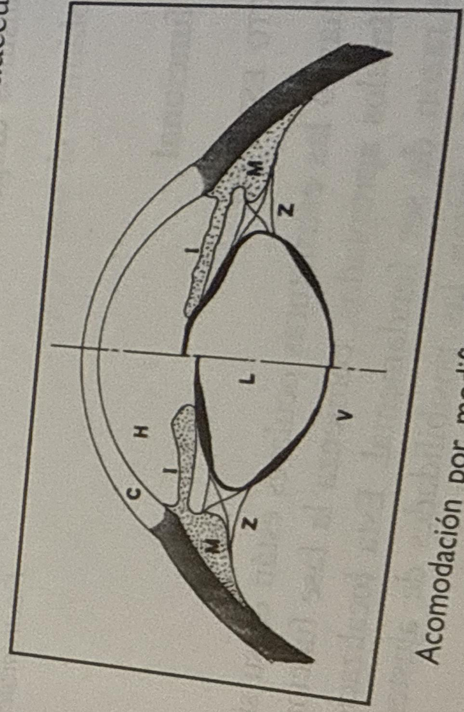
Acomodación por modificaciones externas del cristalino.

Jörg TROTTER, El Ojo, SOE, 1972.
Michel MILLODOT, Óptica Fisiológica, Universidad de Montreal, CNOO, 1978.
Manuel ROURE ARNALDO, La Acomodación y la Convergencia, EUOT, Mollerussa, 1992.
 

---

## OCR IMG_3336.JPG

**Fuente:** `ocr-playground-download-20260621T165504Z/IMG_3336.JPG/markdown.md`

ASPECTO DE CONTROL

Mientras el aspecto dinámico de la fase funcional concernía a las variaciones dióptricas máximas, su aspecto de control corresponde a las variaciones dióptricas óptimas o más corrientemente utilizables para un funcionamiento eficaz.

Un sistema de amortiguadores, por lo común, está concebido para funcionar adecuadamente dentro de sus límites; cuando estos se sobrepasan, tal sistema ya no realiza adecuadamente su función.

El sistema dióptrico funciona de la misma forma. Posee variaciones extremas o máximas (puntos #20 y #21 de la OEP), las cuales nos proporcionan el valor de las acomodaciones relativa positiva y relativa negativa respectivamente, pero su funcionamiento normal debe hacerse dentro de un intervalo más restringido que corresponde a las variaciones óptimas.

Las variaciones dióptricas óptimas son de amplitud más reducida que las máximas y tienen un valor funcional diferente. Mientras las máximas corresponden al mayor valor posible, utilizable instantáneamente, las óptimas definen el espacio utilizable para una tarea prolongada y eficaz, sin riesgo de generar problemas.

Leo Manas, Visual Analysis, OEPF, 2009.
*Emetropización*, IVF-SEO, 1989.

#### Fase operativa

##### ASPECTO ESTÁTICO

Mientras que la focalización realizada en el estadio funcional era variable, a nivel operativo el conjunto de las estructuras oculares se armoniza para alcanzar un equilibrio preciso. Clásicamente, la noción de emetropía se refiere a la visión de lejos, cuyo equilibrio corresponde a la hipermetropía fisiológica. Esta reserva es indispensable en todo sistema funcional, porque le permite estar constantemente en oscilación y preparado para todos los reajustes.

Hemos de considerar, también, la noción de emetropía de cerca. Esta noción toma cada vez más importancia en nuestra sociedad, en la que la visión de cerca es cada vez más necesaria.

149
 

---

## OCR IMG_3337.JPG

**Fuente:** `ocr-playground-download-20260621T165504Z/IMG_3337.JPG/markdown.md`

CAPO 1
shift
m
control
optica

### ASPECTO DINÁMICO

El equilibrio alcanzado por el sistema emetrópico responde a los estímulos tanto internos como externos. Para la consecución de la estabilidad y duración de estos equilibrios es preciso que posean una flexibilidad que sea, a la vez, suficiente para evitar una sobrecarga, y limitada para mantener su precisión.

Las microfluctuaciones de la acomodación corresponden a este juego funcional mínimo, que debe respetar el equilibrio obtenido al tiempo que le suministra la flexibilidad requerida, a fin de que la actividad emetrópica pueda ser mantenida de forma prolongada o modificada inmediatamente.

### ASPECTO DE CONTROL

La razón de ser del sistema visual es recoger las informaciones que nos permitan la mejor actuación según nuestras necesidades. La focalización se inscribe en un contexto global en el que participa la Identificación. Finalmente, el equilibrio obtenido por el sistema dióptrico debe subender una descodificación óptima y, recíprocamente, esta descodificación no debe perturbar el equilibrio dióptrico normal.

La interacción entre la Identificación, la Binocularización y la Emetropización se ejerce verdaderamente en el aspecto de control de la fase operativa. Por otra parte, es en este nivel, en el que notaremos las más fuertes incidencias de los problemas de Identificación. Una descodificación difícil modificará, a menudo, el delicado equilibrio que no puede obtenerse sin una apreciación perceptiva suficientemente precisa, para conseguir una visión nítida a cualquier distancia.

A pesar de este estudio sistemático de los componentes emetrópicos, podremos organizar las pruebas necesarias para un buen análisis del estado y del funcionamiento de la focalización.

Emetropización, IVF-SEO, 1989.
 

---

## OCR IMG_3338.JPG

**Fuente:** `ocr-playground-download-20260621T165504Z/IMG_3338.JPG/markdown.md`

control
option
ESTRUCTURA
FUNCION
OPERATIVIDAD

|  Aspecto estático | Aspecto dinámico | Aspecto de control  |
| --- | --- | --- |
|  Globo ocular Córnea Diafragma - Iris - Esfínter/dilatador Humores: • acuoso • vítreo Dioptrio - Cristalino - Flexibilidad Retina - pantalla OFTALMOSCOPIA QUERATOMETRÍA | Músculos ciliares Esfínter/dilatador REFLEJOS FOTOMOTORES • directo • consensual | Sistema Nervioso • ortosimpático • parasimpático Sistema Intramural • Tálamo centro primitivo Vías visuales • Retina - sensorial • Nervio óptico • CGE • Córtex-áreas visuales  |
|  Focalización • Lejos • Cerca Acomodación RETINOSCOPIA | Mantenimiento de la focalización Amplitud de Acomodación Variaciones dióptricas Máximas • Lejos • Cerca | Óptimas • Lejos • Cerca  |
|  Reservas Fisiológicas Equilibrios • Lejos • Cerca | Microfluctuaciones de la focalización Ajuste eficaz de la focalización a todos los planos del espacio | Adaptación de la focalización para posibilitar la descodificación visual Nitidez  |

CILINDROS CRUZADOS – DUOCROMO

CONCENTRACIÓN VISUAL

Análisis de los comportamientos emetrópicos.

Emetropización, IVF-SEO, 1989.

&lt; 151
 

---

## OCR IMG_3339.JPG

**Fuente:** `ocr-playground-download-20260621T165504Z/IMG_3339.JPG/markdown.md`

SOCIEDAD ESPAÑOLA DE OPTUUMETRIA

### EMETROPIZACIÓN

#### METODOLOGÍA DE EXAMEN - FICHA IVF/SEO - s/Olivier Gauthier

|  Pruebas | Etapa | Fase | Base | Optotipo | Evaluación investigada | Instrumentos y auxiliares | Normativa  |
| --- | --- | --- | --- | --- | --- | --- | --- |
|  1 | Oftalmoscopía | mono | E |  | observación/medida estructuradas | oftalmoscopio de proyección | de 0,00 a 2,00 Dp.  |
|  2 | Queratometría | mono | E |  | medida curvatura de la córnea | queratómetro | astigmatismo fisiológico -0,50 a 0°  |
|  3 | Reflejos pupilares | mono | E |  | fotomotor directo | luz puntual | contracción/dilatación/oscilación  |
|  4 | Retinoscopía de lejos | mono | E |  | fotomotor consensual | luz puntual/obturador | reacción ambas pupilas  |
|  5a | Retinoscopía de cerca | bino | F | 4 | dibujo | retinoscopio | respuesta mesencefálica  |
|  5b |  | bino | F | 5a | texto | retinoscopio | respuesta deficita  |
|  5'a | Control subjetivo | mono |  | 4 | 0,5 | retinoscopio | cálculo CX / CC  |
|  5'b |  | mono |  | 5'a | 0,5 | cálculo | cilindros cruzados  |
|  5" | Equilibrio | duo |  | 5'b | 0,7 | reducir diferencias | buscar mejor AV  |
|  6 | Duocromo de lejos | bino | O | 5" | duocromo | comprobación esférica | miopización/reducir CX  |
|  7 | Cilindros cruzados lejos | bino | O | 5" | reja |  | 1 igualdad  |
|  8 | Apreciación perceptiva lejos | bino | O | 6 | 1,0 | afinamiento esférico | esféricos CX / CC  |
|  9 | Variaciones máximas lejos | bino | F | 7 | 0,9 | intérvalo esférico posible | adición CX / CC  |
|  10 | Variaciones óptimas lejos | bino | F | 8 | 0,9 | intérvalo utilizable | adición CX / CC  |
|  11 | Cilindros cruzados cerca | bino | O | 5" | reja | comprobación esférica | miopización/reducir CX  |
|  12 | Apreciación perceptiva cerca | bino |  | 10 | 1,0 | afinamiento esférico | esféricos CX / CC  |
|  13 | Variaciones máximas cerca | bino |  | 11 | 0,9 | intérvalo esférico posible | adición CX / CC  |
|  14 | Variaciones óptimas cerca | bino | O | 12 | 0,9 | intérvalo utilizable | adición CX / CC  |

Iluminación ambiental atenuada en 1, 4, 5, 6, 7, 10 y 11

Emetropización – Metodología de examen.

Manuel ROURE ARNALDO, Apuntes I.° Cicle de l'Institut de Vuiologie de France, 1983.
 

---

## OCR IMG_3340.JPG

**Fuente:** `ocr-playground-download-20260621T165504Z/IMG_3340.JPG/markdown.md`

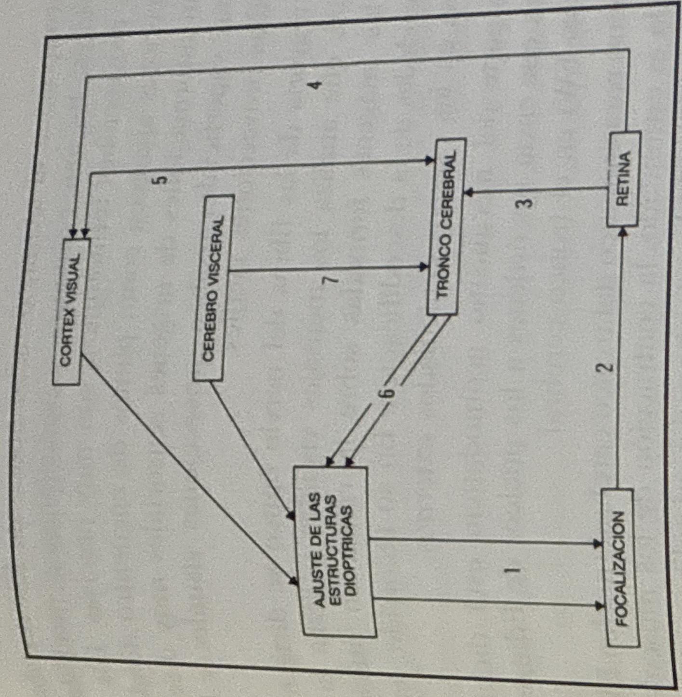
Esquema del proceso emetrópico.
Manuel ROURE ARNALDO, Paneles explicativos de las clases de Optometría, EUOOT, 1984-1987.
Emetropización, IVF/SEO, 1989.

1. Los elementos dióptricos y sus mecanismos de ajuste permiten la focalización.
2. La focalización se realiza sobre una estructura ocular privilegiada: la retina. Este tejido nervioso, que representa mucho más que una simple pantalla, desempeña un importante papel en el análisis de los estímulos visuales.
3. Entre las fibras nerviosas que parten de la retina para constituir el nervio óptico, un determinado porcentaje (15 al 25%) según Duke-Elder, se dirige hacia el antiguo centro visual, los colículos superiores (nueva denominación oficial de los tubérculos cuadrigéminos anteriores) y hacia los núcleos de los nervios motores oculares.

Estas fibras son canales de informaciones luminosas utilizadas por el reflejo pupilar y por una parte de los mecanismos responsables de los ajustes dióptricos. Los colículos superiores
 

---

## OCR IMG_3341.JPG

**Fuente:** `ocr-playground-download-20260621T165942Z/IMG_3341.JPG/markdown.md`

corresponden al *tectum* o techo óptico de los vertebrados inferiores. Es una estructura mesencefálica a nivel de la cual las proyecciones retinotópicas son muy precisas. Los colículos superiores aparecen como puntos de encuentro donde se asocian informaciones de orígenes sensoriales muy diversos. Las capas superficiales reciben proyecciones visuales y las capas medias proyecciones táctiles.

4. La mayoría de las fibras del nervio óptico se dirigen al córtex visual, que analiza los mensajes visuales y juzga la precisión de las imágenes formadas sobre la retina en función de las necesidades de la descodificación. En su recorrido, realizan una pausa en los cuerpos geniculados externos.

5. Una parte del mecanismo acomodaticio está dirigida por el córtex que envía sus órdenes a los núcleos de Edinger Westphal (núcleo EW) en el tronco cerebral.

6. El centro parasimpático del tronco cerebral (núcleo EW) provoca, cuando es estimulado, la contracción de los músculos ciliares y la modificación de la curvatura del cristalino.

7. Los centros neurovegetativos son capaces de activar los mecanismos dióptricos actuando sobre el tronco cerebral.

Estas diversas relaciones ilustran las posibilidades de controles y de interacciones que existen entre estructuras oculares y nerviosas en el marco del funcionamiento emetrópico.

*Emetropización, IVF-SEO, 1989.*
 

---

## OCR IMG_3342.JPG

**Fuente:** `ocr-playground-download-20260621T165942Z/IMG_3342.JPG/markdown.md`

CAPÍTULO 8
COMPORTAMIENTOS DE LA BINOCULARIZACIÓN

La lateralidad

Para entrar en cualquier estudio del proceso de Binocularización, y precisamente porque es el que mantiene las relaciones de ambos ojos entre sí, es conveniente hacerlo considerando previamente los parámetros que relacionan ambos lados del cuerpo, teniendo en cuenta los elementos constituyentes de la progresiva lateralización del sistema visual coordinados con él los de los restantes componentes del organismo.

Newal Carlyle Kephart, en 1960, define la lateralidad como una sensibilidad interna, o consciencia, de ambos lados del cuerpo y de su diferencia.

Delacato, en una conferencia pronunciada en la Escola Universitària d'Òptica de Terrassa, detallando las etapas de la lateralización, concretó como:

(...) la etapa coincidente con los 6 años de edad es la que verdaderamente distingue al hombre. (...) A este nivel, un hemisferio del cerebro se convierte en el hemisferio dominante o del lenguaje. (...) El otro lado del cerebro, es decir el subdominante, se convierte en el hemisferio tonal.

Carl H. DELACATO, Relaciones entre el Desarrollo Humano y la Visión, APALCE/SEO, 1986.

Desarrollo de la lateralidad

La lateralidad existe en el ser vivo a nivel de la materia: diversos estudios han demostrado una diferenciación funcional entre uno y otro lado. Aunque la lateralidad tenga componentes innatos, no está totalmente desarrollada en el nacimiento y este desarrollo deberá realizarse hacia uno de los dos lados.

155
 

---

## OCR IMG_3343.JPG

**Fuente:** `ocr-playground-download-20260621T165942Z/IMG_3343.JPG/markdown.md`

56

En una conferencia pronunciada por Carl H. Delacato y Glenn Doman, en 1953, siguiendo el maestrasgo del neurólogo Temple Fay, en el Instituto de Medicina Física y Rehabilitación de Nueva York, precisaron que sobre cualquier tratamiento terapéutico, debe tenerse muy en cuenta la siguiente directriz:

... cuando existe una lesión dentro de los confines del cerebro, el tratamiento, para que sea exitoso, debe ser dirigido al cerebro, lugar de la causa, nunca se debe dirigir a la parte de la periferia en la que se reflejan los síntomas.

Carl H. DELACATO, *Un Nuevo Comienzo para el Niño con Problemas de Aprendizaje*, APALCE, 1983.

Estos autores también afirmaron que la lateralidad está determinada básicamente por la Organización Neurológica.

- Todos los circuitos conectados al cerebro son sensoriales (aferrentes) y motores (eferentes), son por tanto circuitos cerrados.
- La solución a los problemas de las lesiones cerebrales solo puede encontrarse cerrando circuitos que no lo están.
- El desarrollo de la lateralidad depende, en parte, del crecimiento, de la maduración y del aprendizaje pero, especialmente, del condicionamiento a que se somete al individuo durante su desarrollo.

#### Evolución de la coordinación general

Las diferentes estructuras motrices de cada animal se convierten en funcionales dependiendo de las coordinaciones que se producen en el organismo. Estas coordinaciones evolucionan en el curso de la filogénesis y permiten definir el nivel evolutivo alcanzado por tal o cual especie.

#### PECES

Los peces poseen una coordinación monolateral, en la que las contracciones de las bandas musculares laterales están coordinadas por trenes de ondas que provocan las ondulaciones responsables de su motricidad. Estos trenes de ondas alternan un lado, luego el otro,
 

---

## OCR IMG_3344.JPG

**Fuente:** `ocr-playground-download-20260621T165942Z/IMG_3344.JPG/markdown.md`

pero no conocen otros modelos de coordinación diferentes de aquellos que, simultáneamente, implican un solo lado.

#### ANTIBIOS

En los anfibios, se arrastran repitiendo las ondulaciones de los peces pero reptan apoyándose sobre las extremidades mientras el cuerpo se desliza por el suelo. A esta relación fundamental se le asocia una coordinación duolateral, o coordinación entre elementos homólogos (homología), los miembros anteriores se mueven juntos, por ejemplo. La combinación de la monolateralidad y la duolateralidad permite el control simultáneo de miembros anteriores y posteriores.

#### REPTILES

Los reptiles utilizan igualmente la reptación, pero se desplazan en homolateralidad, combinando los dos estadios iniciales. (Se mueven de manera alternante todos los miembros del mismo lado.)

#### MAMÍFEROS

Los mamíferos pueden presentar tal coordinación, de manera accidental (caballo marchando en ambladura), pero su coordinación principal es contralateral, lo que conlleva una motricidad cruzada. Esta nueva coordinación implica una relación más estrecha entre los dos lados del cuerpo y se acompaña, en el dominio visual, de una asociación de ambos ojos sobre los planos perceptivos y motores.

#### PRIMATES

En los primates, se considera que la coordinación contralateral constituye el más alto nivel de control motor, a pesar de que a la luz de nuevos descubrimientos, se pone en duda la exclusividad humana de la unilateralidad enunciada por Delacato, ya que según una investigación que se está actualmente desarrollando por Miquel Llorente y colaboradores, en la Fundación Mona de Riudellots de la Selva, se ha observado qué mano prefieren los chimpancés en la

157
 

---

## OCR IMG_3345.JPG

**Fuente:** `ocr-playground-download-20260621T165942Z/IMG_3345.JPG/markdown.md`

control

motricidad precisa utilizando herramientas rudimentarias y han visto que, de manera parecida a los humanos, existe un 10% de zurdos y un 90% de diestros.

Miquel LLORENTE ESPINO, Lateralidad Manual y Especialización Hemisférica en Chimpancés, tesis doctoral, Universitat Ramon Llull, Barcelona, 2006.

Estas nuevas informaciones no rechazan sino que, tal y como yo lo veo, reafirman y complementan la teoría de la Organización Neurológica expuesta más adelante. Varía solamente, dentro de la evolución de las especies, el momento preciso de la aparición de la unilateralidad: en los humanos según Delacato, en los chimpancés según el estudio mencionado.

#### HOMÍNIDOS

Los homínidos, sin embargo, presentan una emergencia de esta perfección de las relaciones motrices bajo forma unilateral. Se trata del predominio funcional de un lado sobre el otro. La ontogénesis permitirá explicar las aportaciones de esta nueva coordinación. En el curso de la filogénesis, la evolución binocular se apoya sobre estructuras (frontalización, sistema nervioso, decusación); se acompaña de los progresos de la motricidad general caminando al mismo tiempo que se desarrolla la coordinación del conjunto de movimientos del animal, y llega a ser el sostén esencial de las actividades motrices (desplazamientos y manipulaciones).

Binocularisation, IVF, 1979.

Con el fin de aclarar nuestras definiciones de mono-dúo-contra y unilateralidad, debemos partir de una analogía tomada del fenómeno sociológico que representa la asociación de dos personas que ejercen la misma profesión, por ejemplo, dos médicos asociados o dos abogados X e Y.
 

---

## OCR IMG_3346.JPG

**Fuente:** `ocr-playground-download-20260621T165942Z/IMG_3346.JPG/markdown.md`

1.° ETAPA "MONO"

X e Y tienen una organización independiente, pero poseen el mismo sistema de contabilidad, secretaría, clientela, servicios administrativos. Deciden asociarse: pasan a la segunda etapa.

2.° ETAPA "DGO"

X e Y se asocian, se instalan en un mismo local, pero conservan sus servicios independientes, a pesar de que los utilizan a la vez.

3.° ETAPA "CONTRA"

Poco a poco, reagrupan ciertos servicios, se sustituyen en las ausencias, intercambian su clientela.

4.° ETAPA "UNI"

X e Y se especializan cada uno en un campo particular; uno asume el cometido de dirigente y ambos constatan la eficacia de su asociación.

Monolateralidad

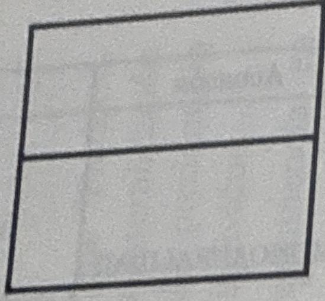
Duolateralidad

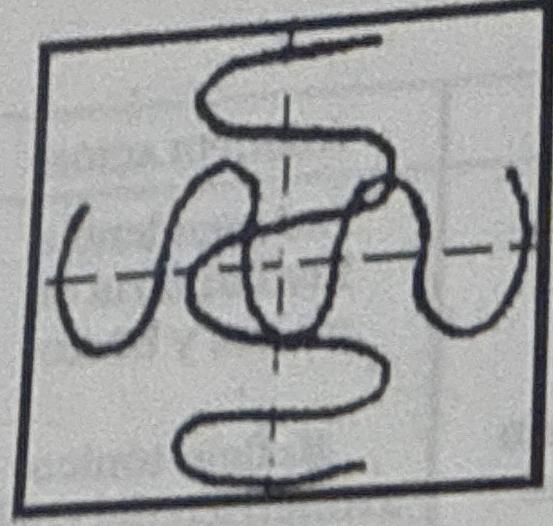
Contralateralidad

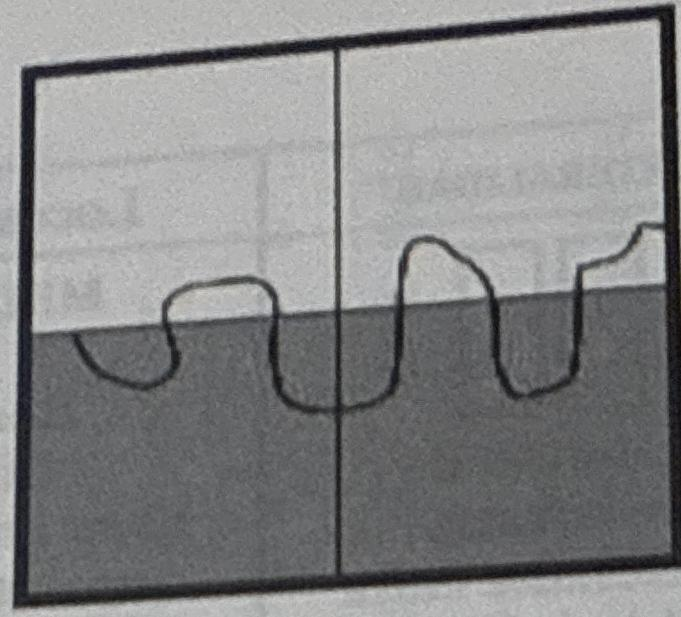
Unilateralidad

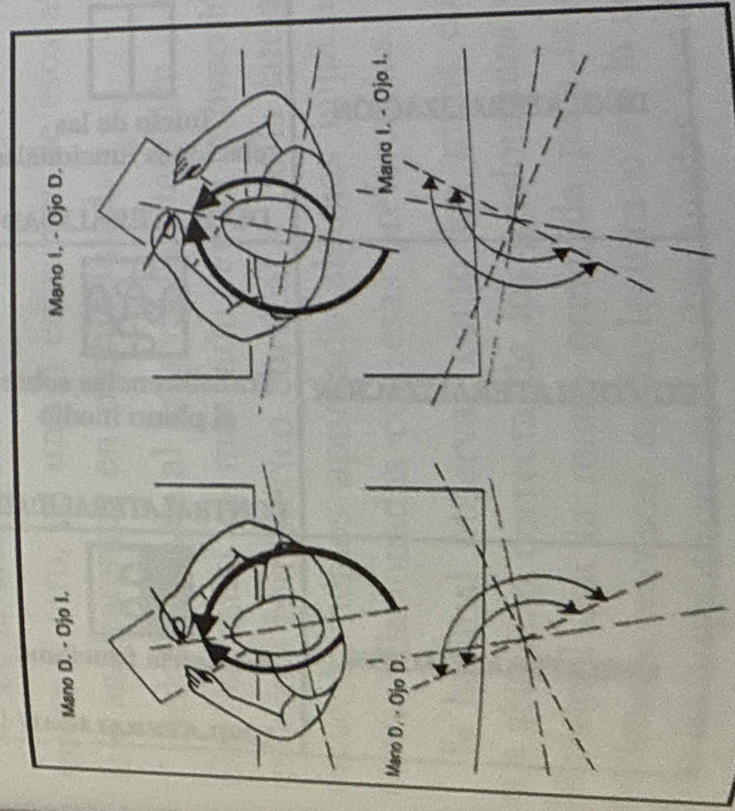

Postura y lateralidad.

Binocularisation, IVF, 1979.

IVF/SEO, La Lateralidad, 1982.
 

---

## OCR IMG_3347.JPG

**Fuente:** `ocr-playground-download-20260621T165942Z/IMG_3347.JPG/markdown.md`

|  ETAPAS | LATERALIDAD | LOCOMOCIÓN | MANIPULACIÓN | AUDICIÓN | VISIÓN  |
| --- | --- | --- | --- | --- | --- |
|  MONOLATERALIZACIÓN | Ausencia de relaciones funcionales entre ambos lados del cuerpo MONOLATERALIDAD | MEDULA Rodillo Giros Experimentación espalda-vientre delante-detrás | Independencia involuntaria de manos y brazos Reflejo tónico asimétrico del cuello RTAC | MONOAURALIDAD | Divergencia MONOCULARIDAD  |
|  DUOLATERALIZACIÓN | Inicio de las relaciones funcionales DUOLATERALIDAD | PUENTE DE VAROLIO Reptación ventral homóloga homolateral | Movimiento simultáneo de los dos brazos Reflejo tónico simétrico del cuello RTSC | DUOAURALIDAD | Convergencia visión simultánea DUOCULARIDAD  |
|  CONTRALATERALIZACIÓN | Transferencias sobre el plano medio CONTRALATERALIDAD | MESENCEFALO CÓRTEX Marchar a 4 patas a 4 manos a dos pies, derecho saltar, correr | Coordinación ojo-mano Transferencias sobre la línea media | BINAURALIDAD | Mantenimiento de la fijación de la mirada BINOCULARIDAD  |
|  UNILATERALIZACIÓN | Asimetría funcional UNILATERALIDAD | PREDOMINIO HEMISFÉRICO CORTICAL Habilidades unilaterales, chutar, salto de altura | Preferencia manual para escritura dibujo costura etc. | ESTEREOAURALIDAD | Divergencia fisiológica operativa Predominios visuales ESTEREOCULARIDAD  |

La lateralidad – Cuadro recapitulativo Manuel ROURE ARNALDO, Predominios Visuales, Ed. Milenio, 2012
 

---

## OCR IMG_3348.JPG

**Fuente:** `ocr-playground-download-20260621T165942Z/IMG_3348.JPG/markdown.md`

Essteredoculariado

Manuel ROURE ARNALDO, Predominios Visuales. Ed. Milenio, 2012

¿Qué son los predominios visuales?

Predominio, según una definición clásica, equivale a poder, a su perioridad que se tiene sobre una persona o cosa.

Armand R. BASTIEN, Apuntes seminario: El Examen Visual Behavioral, SOE/CNOO, 1983.

Si aplicamos esta situación a la visión, tendremos que "Predominio Visual" equivaldría también a la preferencia en la lateralización visual o, más aún, en la proyección sobre la visión del predominio hemisférico cortical y de la lateralización global del individuo.

Por tanto, predominio visual consistirá en la preeminencia, en la prevalencia:

- De un ojo.
- De las estructuras de un ojo.
- De la amplitud de acomodación de un ojo.
- De la capacidad de focalización eficaz de un ojo.
- Del conjunto de las habilidades motrices de un ojo.
- De la sensibilidad de un ojo.
- De la percepción de un ojo.
- Del rendimiento léxico de un ojo.

En definitiva,

- De la eficiencia visual de un ojo,

respecto al otro, en uno o en varios de esos aspectos que, más adelante, analizaremos en profundidad.

Predominio visual equivaldría también a preferencia en la lateralización visual o, más aún, en la proyección sobre la visión del predominio hemisférico cortical y de la lateralización global del individuo. Ya hemos apuntado algunas implicaciones distintas de las motrices relacionadas con esas preferencias.

Es habitual observar como los niños con algunas alteraciones en la ubicación correcta de los predominios visuales, en su relación homolateral con la mano preferida para la escritura, presentan alteraciones y retrasos, en la lectura o en la comprensión léxica y en todas las asignaturas más relacionadas con las letras y, por contra,

( 16
 

---

## OCR IMG_3349.JPG

**Fuente:** `ocr-playground-download-20260621T165942Z/IMG_3349.JPG/markdown.md`

no presentan problemas en la comprensión abstracta, razonada, de los temas matemáticos y científicos.

Leonardo Da Vinci escribía normalmente de derecha a izquierda y se precisaba un espejo para poder leer sin dificultad los textos escritos, resolviendo de esta manera alguno de los inconvenientes que comportaba su lateralidad zurda.

En estos casos, se puede constatar como las habilidades matemáticas están en relación con los niveles de inteligencia, mientras que en el área de las humanidades no existe correlación entre la inteligencia y el rendimiento y son evidentes los retrasos en las habilidades más relacionadas con el lenguaje, con la lectura, con la lectoescritura.

Manuel ROURE ARNALDO, Predominios Visuales, Editorial Milenio, 2013.

De hecho el fenómeno visual es bastante más complejo ya que, por la semidecusación, cada retina está relacionada con ambos hemisferios, o, dicho de otra manera, el CGE y el córtex visual de cada hemisferio están conectados con las dos semirretinas homólogas, y reciben información, preferente, de uno de los dos campos visuales, justamente el contralateral, aunque con las diferencias introducidas por los croissants temporales, ya que los campos visuales están limitados por la posición de cada órbita y por la arista nasal.

Manuel ROURE ARNALDO, Predominios Visuales, Editorial Milenio, 2013.

#### Organización neurológica humana

Según Delacato: En el nacimiento, el sistema nervioso está preparado para desarrollarse. Muy pronto, la función del cerebro comienza a lateralizarse alternativamente.

Sistema visual - Campos visuales y croissants temporales.

P. H. LINDSAY &amp; D. A. NORMAN, Citados por M. P. BRYDEN, Laterality, Functional Asymmetry in the Intact Brain, Academic Press, 1982.

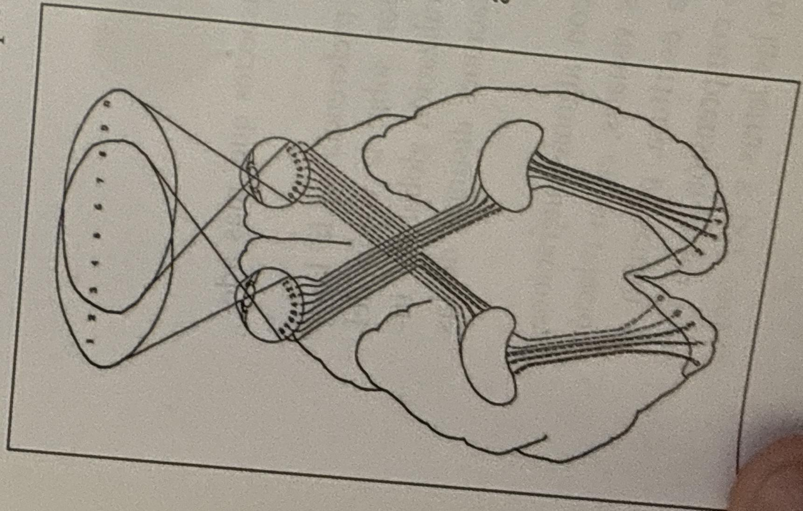
 

---

## OCR IMG_3350.JPG

**Fuente:** `ocr-playground-download-20260621T165942Z/IMG_3350.JPG/markdown.md`

|  ASPECTOS ESTÁTICOS | ASPECTOS DIDÁMICOS | ASPECTOS DE CONTROL  |
| --- | --- | --- |
|  OJO BÁSICO • Integridad de las estructuras • Calidad del reflejo retinoscópico • Nivel óptimo de aberraciones | OJO DIRECTOR REFLEJO • Versiones • Compensaciones • Seguimientos | OJO SENSITIVO Bioconsciente • Filtro rojo • Prismas rojos SEO • Semicírculos SEO  |
|  OJO ACOMODATIVO • Ruptura de la acomodación • Reflejo retinoscópico en el punto próximo | OJO DIRECTOR VOLITIVO • Ruptura del centrado duocular • Comportamiento en el punto próximo | OJO RECEPTIVO Fisioconsciente • Disociador • Siluetas • Estilizados • "E" direccional • "C" de Landoit • Telebinocular  |
|  OJO FOCALIZADOR • Focalización eficaz • Disociadores • Miras de Foucault • Cuadros SEO • Calidad de la imagen retiniana | OJO DIRECTOR AUTOMATIZADO • Tarjeta perforada • Alineamiento ojo / dedo / objeto • Mirar por un anteojo monofocal | OJO REPRESENTATIVO Neuroconsciente • Disociador de campos visuales • Letras, cifras • Decalato Stereo Reader • Eficacia léxica  |

OJO EFICIENTE

Análisis de los predominios visuales.

Manuel ROURE ARNALDO, Predominios Visuales, Editorial Milenio, 2013.
 

---

## OCR IMG_3351.JPG

**Fuente:** `ocr-playground-download-20260621T170047Z/IMG_3351.JPG/markdown.md`

Tendido el niño sobre el vientre, vuelve la cabeza hacia el lado cuyas extremidades están flexionadas, el ojo y el oído del lado al que tiene vuelta la cabeza funcionan, mientras los del lado contrario permanecen tapados. Esta posición homolateral constituye una posición muy precoz que se realiza hacia los tres meses. Alrededor de los seis meses, el niño comenzará la reptación homolateral, moviendo alternativamente las extremidades.

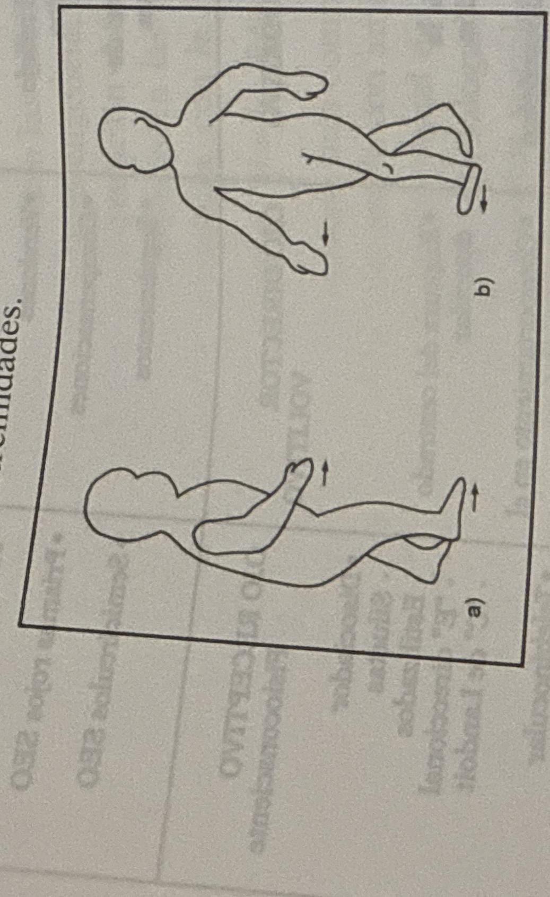

a) Marcha homolateral rudimentaria, con activación diestra.
b) Marcha contralateral eficiente, en patrón cruzado.

Carl H. DELACATO, Relaciones entre el Desarrollo Humano y la Visión, APALCE/SEO, 1986.
Manuel ROURE ARNALDO, Predominios Visuales, Editorial Milenio, 2013.

Cuando el niño alcanza los nueve meses comienza el gateo en patrón cruzado, contralateralmente, apoyándose sobre manos y rodillas, ello significa que el niño avanza, a la vez, la mano y la rodilla opuestas, utilizando ambos lados del cuerpo simultánea y coordinadamente. Alrededor de los catorce meses el niño empieza a andar. La filogénesis nos muestra dos maneras de hacerlo: el andar homolateral es la forma utilizada por los primates y en ella se moviliza alternativamente un lado después del otro, o sea, se mueven a la vez la pierna y el brazo del mismo lado (a); la otra manera, el andar contralateral, en patrón cruzado, es la propia del ser humano y en ella la movilización resulta simultánea y coordinada entre ambos lados del cuerpo, moviendo a la vez la pierna y el brazo opuestos (b).

Carl H. DELACATO, Relaciones entre el Desarrollo Humano y la Visión,
 

---

## OCR IMG_3352.JPG

**Fuente:** `ocr-playground-download-20260621T170047Z/IMG_3352.JPG/markdown.md`

La próxima etapa coincide con los seis años aproximadamente, y es la que verdaderamente distingue al hombre. Solamente los seres humanos la franquean, ya que son los únicos que consiguen la posesión del lenguaje hablado y escrito.

Ya hemos dicho que a este nivel, un hemisferio del cerebro se convierte en el hemisferio dominante o del lenguaje. La sintomatología consiste en observar como el ser humano se vuelve diestro, o curdo, de mano, ojo, oído y pie. Esta habilidad final humana es la que nos permite hablar, escribir y leer.

El concepto de Organización Neurológica Humana nos dice que el hombre para desarrollar completamente todas sus características, debe pasar secuencialmente por las etapas señaladas.

Carl H. DELACATO, *Relaciones entre el Desarrollo Humano y la Visión*, APALCE/SEO, 1986.

#### Fase estructural

##### ASPECTO ESTÁTICO

La visión binocular es esencialmente espacial, constituye el proceso visual por el que el individuo *coge* el espacio, y guía sus desplazamientos y manipulaciones.

El fundamento de toda binocularidad implica una actitud de partida, una *postura ocular* con relación a este espacio o a un punto de particular interés. La primera postura ocular es monocular, como lo ha mostrado la ontogénesis. Se define con relación al estímulo, es decir que el ojo se *sitúa* de una manera determinada hacia este estímulo.

Esta postura es de origen reflejo. Los centros posturales, tubérculos cuadrigéminos anteriores (TCA), o colículos superiores, están organizados para recibir estímulos periféricos y activar los centros nerviosos de los músculos extrínsecos que conducirán la imagen de estos estímulos a la zona macular.

El antagonismo funcional entre periferia y centro de la retina juega aquí un papel fundamental, desencadenando y guiando este reflejo.

Si el reflejo de orientación tiene una base genética cierta, como todos los reflejos motores, tiene necesidad de ser ejercitado a fin de
 

---

## OCR IMG_3353.JPG

**Fuente:** `ocr-playground-download-20260621T170047Z/IMG_3353.JPG/markdown.md`

que se confirme, precise e integre en una actividad binocular más amplia. Es, pues, importante proporcionar al organismo en desarrollo un medio visual suficientemente rico en estímulos, para que la orientación pueda afinarse.

#### ASPECTO DINÁMICO

Cuando la orientación se ha ejercido, puede ser alterada por dos perturbaciones: o el sujeto se mueve, o el punto de observación se desplaza. Tanto en uno como en otro caso la orientación se pierde. Dos reflejos van a permitir su recuperación y posterior mantenimiento: el reflejo de compensación y el reflejo de versión.

Estos reflejos poseen un asentamiento estructural hereditario dependiente, igualmente, de la organización de los TCA y de sus relaciones con los centros oculomotores. También deben ser ejercidos para elaborar una motricidad ocular bien controlada y libre de movimientos asociados.

La compensación es el reflejo que permite conservar la orientación a pesar de los movimientos de la cabeza y/o del cuerpo. Mantiene la estabilidad del espacio circundante cuando el sujeto se desplaza.

La versión concierne al desplazamiento del objeto observado. El ojo está orientado y necesita seguir el movimiento. Esta versión, inicio de los seguimientos, puede ser considerada como una sucesión de orientaciones. El objeto en desplazamiento forma, en efecto, una imagen en la retina periférica y una nueva orientación la devuelve a la retina central. Esta serie de orientaciones explica que los primeros movimientos de versión sean a sacudidas, correspondiendo cada una a una orientación.

#### ASPECTO DE CONTROL

La activación de los reflejos de compensación y de versión va a permitir una adecuada autonomía de la motricidad ocular. Esta se ejerce durante los seguimientos oculares en las diferentes direcciones del espacio. Estos seguimientos, inicialmente a sacudidas, se van a precisar para que los ojos puedan captar rápidamente un estímulo
 

---

## OCR IMG_3354.JPG

**Fuente:** `ocr-playground-download-20260621T170047Z/IMG_3354.JPG/markdown.md`

y seguirlo y para que así se elaboren las diferentes estrategias de la motricidad ocular.

Durante la lectura, por ejemplo, serán indispensables, según el texto, movimientos bien definidos en amplitud y velocidad para la descodificación ordenada del mensaje.

En los primeros estadios, los seguimientos pueden reducirse a una serie de orientaciones, que comporten el reflejo de orientación y elaboren poco a poco un alineamiento foveal estable. Este último, a su vez, va a reforzar y precisar los seguimientos oculares.

Seguimientos y alineamientos son interdependientes y se refuerzan mutuamente.

#### Fase funcional

Se trata de la fase principal de este análisis de los comportamientos. Conlleva la elaboración del centrado de los dos ojos sobre el punto de fijación de la mirada y las variaciones de este centrado para pasar de uno a otro plano de observación, o para seguir binocularmente un objeto que se desplaza.

#### ASPECTO ESTÁTICO

En el desarrollo del niño, si bien la actitud inicial es la orientación monocular, la postura ocular implica, muy rápidamente, ambos ojos. El emplazamiento de la fase funcional de la visión binocular reposa sobre el centrado simultáneo de los dos ojos. El punto de observación es el objeto de este centrado y hacia él convergen las líneas de mirada.

De hecho, cuando el alineamiento monocular está suficientemente integrado y los seguimientos se realizan con suficiente flexibilidad, la convergencia que depende de la postura simétrica general va a asociar dos monocularidades. Esta asociación, al tiempo que realiza el centrado de los dos ojos sobre el punto de fijación de la mirada, provoca la visión simultánea, siendo percibidas al mismo tiempo las imágenes formadas sobre cada una de las dos retinas.

Centrado y visión simultánea dependen muy estrechamente una de otra. Reposan sobre una adquisición de coordinación, la duocularidad,
 

---

## OCR IMG_3355.JPG

**Fuente:** `ocr-playground-download-20260621T170047Z/IMG_3355.JPG/markdown.md`

asociada a la duolateralidad (movilización simultánea de los elementos motores pares). Su asociación es tal, que es difícil encontrar un centrado duocular preciso sin visión simultánea, y que una visión simultánea completa acompañe el centrado anormal de un ojo con relación al otro.

La combinación del centrado y de la visión simultánea constituye la base de la fusión, la primera ocasión de su ejercicio, su incentivo.

#### ASPECTO DINÁMICO

La posibilidad de centrado duocular, y la visión simultánea que lo acompaña, se realizan, en primer lugar, de manera momentánea, para un punto particular del espacio.

Su extensión a los diferentes puntos de fijación de la mirada necesita las variaciones del centrado.

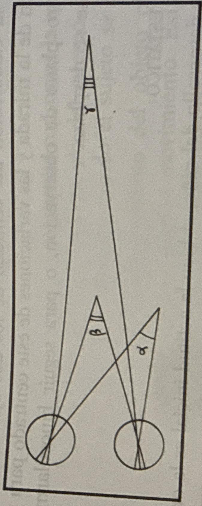

Variaciones del centrado.
Binocularisation, IVF, 1979.

Estas variaciones o vergencias reposan inicialmente sobre modificaciones del tono de postura de la musculatura extrínseca. Las vergencias permiten, por ejemplo, seguir con ambos ojos un objeto que se aproxima o aleja. Su ejercicio inicial se equilibra para mantener la fusión en los diferentes planos del espacio. Haciendo esto, se establece una amplitud limitada por las posibilidades extremas de diplomía, se rompe la fusión.
 

---

## OCR IMG_3356.JPG

**Fuente:** `ocr-playground-download-20260621T170047Z/IMG_3356.JPG/markdown.md`

10

### ASPECTO DE CONTROL

Todo sistema vivo posee límites, pero para que su funcionamiento permanezca eficaz debe situarse muy en el interior de estos límites. Así, en el sistema binocular, los límites, más allá de los cuales se produce la diplopía, no pueden ser alcanzados sin perturbar gravemente el funcionamiento visual. La fusión solo se realiza con una amplitud más reducida, que ponga en juego un menor esfuerzo muscular y asegure un rendimiento binocular satisfactorio.

Esta amplitud reducida depende esencialmente de las tendencias a la fusión, tendencias que son activadas en el curso del desarrollo, sobre las bases de una monocularidad, por los juegos repetidos de la vergencia. Está caracterizada por la capacidad del sistema binocular de reencontrar instantáneamente la fusión, cuando una perturbación cualquiera ha provocado una diplopía. Ciertos autores hablan, a este respecto, y muy justamente, de deseo de fusión.

#### Fase operativa

En todo sistema funcional la fase operativa no aporta comportamientos fundamentalmente nuevos, sino afinamientos de los comportamientos ya emplazados. Estos afinamientos pretenden suministrar al sistema reservas garantes de su eficacia y de su resistencia.

### ASPECTO ESTÁTICO

La postura duocular debe permitir el centrado simultáneo de ambos ojos sobre el punto de observación. En la fase operativa, esta postura va a dotarse de una reserva funcional que asegure su flexibilidad. Esta reserva, en visión lejana, está constituida por una ligera tendencia divergente (exoforia fisiológica de ½ dioptría prismática).

La exoforia fisiológica motiva que, incluso en el infinito, el sistema binocular deba estar ligeramente bajo tensión para realizar un centrado preciso. Esta actividad tónica constituye un desequilibrio con relación a la ortoforia que podría parecer ideal. Esta tendencia, si no es demasiado importante, asegura la rapidez de respuesta mientras que el equilibrio riguroso se acompaña de una rigidez contraria a la eficacia binocular.
 

---

## OCR IMG_3357.JPG

**Fuente:** `ocr-playground-download-20260621T170047Z/IMG_3357.JPG/markdown.md`

Esta situación es análoga al nivel tónico muscular, un músculo presto a la acción jamás está totalmente relajado.

En visión próxima, la exoforia fisiológica aumenta paralelamente a las crecientes necesidades de la convergencia. Esta exoforia (4 a 6 dioptrías) corresponde, como en visión lejana, a la misma necesidad funcional (preparación a la acción); también permite recuperar con facilidad el centrado en visión de lejos ya que actúa facilitando la divergencia necesaria con relación al plano de observación de cerca. Así queda asegurada la flexibilidad y la permanencia del centrado binocular, tanto en visión de cerca como en visión de lejos.

#### ASPECTO DINÁMICO

La dinámica de la visión binocular está caracterizada por los movimientos de versión y por los de vergencia. La motricidad así establecida se ejerce en el contexto de la coordinación general. Esta motricidad, primeramente monolateral (monocular), se convierte en duolateral (duocular).

Finalmente, la lateralidad o la unilateralidad introducen la preferencia funcional de un lado con relación al otro. Sobre el plano de la motricidad ocular, un ojo va a tomar la dirección de los movimientos y de las fijaciones de la mirada; servirá de punto de referencia. Es el que será utilizado para mirar, y el otro ojo se centrará sobre el punto de mirada con relación al primero. No aporta ninguna motricidad nueva, pero asegura una mejor eficacia motriz, tal como una mano dominante permite una escritura más equilibrada, una respuesta más rápida. Es el ojo director o dominante motor.

El control de las observaciones binoculares durante la lectura es así más preciso y los movimientos son más rápidos.

#### ASPECTO DE CONTROL

La integración de los comportamientos operativos debe desembocar sobre nuevas posibilidades visuales. A la visión simultánea, a la fusión y a su perfecta utilización en todos los planos del espacio, viene a añadirse la apreciación de las distancias, habilidad típicamente binocular. Si el relieve puede ser percibido de manera monocular por juegos de
 

---

## OCR IMG_3358.JPG

**Fuente:** `ocr-playground-download-20260621T170047Z/IMG_3358.JPG/markdown.md`

fh control
alt option
3€ command
command

luz y sombra, si la situación de unos objetos con relación a otros puede ser deducida por sus tamaños aparentes o por sus superposiciones parciales, las distancias solo pueden ser realmente apreciadas por la integración de funciones binoculares y de experiencias locomotrices o manipulatorias.

La estereocularidad, apreciación visual de las distancias, implica una binocularidad bien establecida. Cualquier intermitencia en la visión simultánea o cualquier defecto de centrado duocular la penalizan. Sin embargo, no sabría ser perfecta sin la divergencia fisiológica que, por la flexibilidad que asegura, permite las exploraciones finas de los diferentes planos del espacio.

Igualmente como la locomotoridad y la manipulación están influenciadas por la elección de un lado dominante, la estereocularidad no sería perfecta sin un ojo director bien afirmado.

El análisis de los comportamientos de la visión binocular permite el emplazamiento de sus distintos constituyentes. Sobre esta base, las pruebas, los problemas y los medios de mejora podrán articularse en un contexto funcional y con la seguridad de tener en cuenta todos los factores que puedan influenciar la eficacia binocular.

Binocularisation, IVF, 1979.
 

---

## OCR IMG_3359.JPG

**Fuente:** `ocr-playground-download-20260621T170047Z/IMG_3359.JPG/markdown.md`

|  Aspecto estático | Aspecto dinámico | Aspecto de control  |
| --- | --- | --- |
|  Reflejo de Orientación Alineamiento macular | Reflejo de: • Compensación • Versión | Seguimientos Alineamiento foveal  |
|  ETAPA MONOCULAR  |   |   |
|  LUZ PUNTUAL | LUZ PUNTUAL | LUZ PUNTUAL OFTALMOSCOPIO DE PROYECCION  |
|  Centrado duocular Visión simultánea | Amplitud máxima de: • Divergencia • Convergencia Ojo director • Dominante motor • Volitivo | Amplitud óptima o Amplitud de Fusión  |
|  ETAPA DUOCULAR --- FUSION --- ETAPA BINOCULAR  |   |   |
|  OBTURADOR MADDOX WORTH PRISMA VERTICAL | Ruptura --- PRISMAS --- Recobro AMPLITUD DE TRIANGULACION DUCCIONES |   |
|  Reservas (divergencia) fisiológicas operativas | Ojo director • Dominante motor • Automatizado | Estereocularidad • Periférica • Intermedia • Central  |
|  ETAPA ESTEREOCULAR  |   |   |
|  Equilibrios • Lejos • Cerca | TARJETA PERFORADA ALINEAMIENTOS OJO/DEDO/OBJETO | • Lejos • Cerca MOSCA WIRT TNO BROCK  |

ATENCION VISUAL

Análisis de los comportamientos binoculares.

Binoculares
 

---

## OCR IMG_3360.JPG

**Fuente:** `ocr-playground-download-20260621T170047Z/IMG_3360.JPG/markdown.md`

SOCIEDAD ESPAÑOLA DE OPTOMETRIA

### BINOCULARIZACIÓN

#### METODOLOGÍA DE EXAMEN - FICHA IVF/SEO - s/Olivier Gauthier

|  Pruebas | Etapa | Fase | Evaluación investigada | Instrumentos y auxiliares | Normativa  |
| --- | --- | --- | --- | --- | --- |
|  1 | Oftalmoscopia | mono | E alineamiento monocular | oftalmoscopio de proyección | alineamiento foveal estable/central  |
|  2 | Amplitud de triangulación | bino | F ruptura/recuperación - alineamiento binocular | luz puntual | ruptura/recuperación a 5/8 cm nariz  |
|  3 | Comportamiento punto próximo |  | O ojo director | luz puntual | según lateralidad  |
|  4 | Versión | mono | E observación de un objeto móvil | luz puntual muy próxima | mov.ampl.reg. s/mov. asociados  |
|  5 | Compensación | mono | E autonomía oculomotora | luz puntual muy próxima | mov.ampl.reg. con observ continua  |
|  6 | Obturación de cerca | duo | F tendencia postural duocular | obturador/luz puntual a Harmon/2 | movimiento témporo-nasal  |
|  7 | Filtro rojo de cerca | bino | F mantenimiento fusión - ojo sensorial | filtro rojo - luz puntual a Harmon | 1 luz rosa - según lateralidad  |
|  8 | Obturación de lejos | duo | F tendencia postural duocular | obturador/luz puntual | ningún movimiento  |
|  9 | Filtro rojo de lejos | bino | F mantenimiento fusión - ojo sensorial | filtro rojo - luz puntual | buscar mejor AV  |
|  10 | Prisma 10 dp. Base externa | bino | F capacidad de convergencia de lejos | prisma 10 dp. - luz puntual | paso rápido de 2 luces a 1  |
|  11 | Prisma 10 dp. Base interna | bino | F capacidad de divergencia de lejos | prisma 5 dp. - luz puntual | paso rápido de 2 luces a 2  |
|  12 | Visión simultánea | duo | F presencia de visión simultánea | prisma 10 dp.-rojo/verde-luz puntual | 2 luces desde nariz a lejos  |
|  13 | Estereoscopia de cerca | ester | O estereopsis periférica a distancia de Harmon | anillos de Brock - gafas anáglifas moscas polarizadas-gafas polarizadas | relieve de 3 a 5 cm. relieve de 3 a 5 cm.  |
|   |  |  | estereopsis intermedia a distancia Harmon | animales - gafas polarizadas | relieve en los 3 animales (3/3)  |
|   |  |  | estereopsis central a distancia de Harmon | puntos de Wirt - gafas polarizadas | relieve en los 9 puntos (9/9)  |
|  14 | Estereoscopia de lejos | ester | O estereopsis periférica de lejos | anillos de Brock - gafas anáglifas | relieve aprox de 2 m.  |
|  15 | Forias horizontales de lejos | duo | tendencias posturales binoculares, | Maddox horiz.-diasporám-luz puntual | 1/2 EXO (base interna)  |
|   | Forias verticales de lejos | duo | en ausencia de fusión a dist. Harmon | Maddox vert.-diasporám-luz puntual | ortoforia  |
|  16 | Forias horizontales de cerca | duo | O tendencias posturales binoculares, | Maddox horiz.-diasporám-luz puntual | 4 a 6 EXO (base interna)  |
|   | Forias verticales de cerca | duo | en ausencia de fusión a dist. Harmon | Maddox vert.-diasporám-luz puntual | ortoforia  |
|  17 | Ducciones horizontales de lejos | bino | latitudes/reservas de fusión de lejos | 2 diasporámetros - 7/10 vertical | base ext 19/10 - base int 9/5  |
|   | Ducciones verticales de lejos | bino | latitudes/reservas de fusión de lejos | 2 diasporámetros - 7/10 horizontal | base sup / base inferior 3/1  |
|  18 | Ducciones horizontales de cerca | bino | latitudes/reservas de fusión de cerca | 2 diasporámetros - 7/10 vertical | base ext 21/14 - base int 22/17  |
|   | Ducciones verticales de lejos | bino | latitudes/reservas de fusión de cerca | 2 diasporámetros - 7/10 horizontal | base sup / base inferior 3/1  |

Todas las pruebas con la compensación habitual, excepto 1, 4 y 5 - Iluminación ambiental atenuada en 1, 7, 9, 15 y 16

Binocularización – Metodología de examen.

Manuel ROURE ARNALDO, Apuntes I.° Ciclo del Institut de Visiologie de France, 1983.
 

---

## OCR IMG_3361.JPG

**Fuente:** `ocr-playground-download-20260621T170135Z/IMG_3361.JPG/markdown.md`

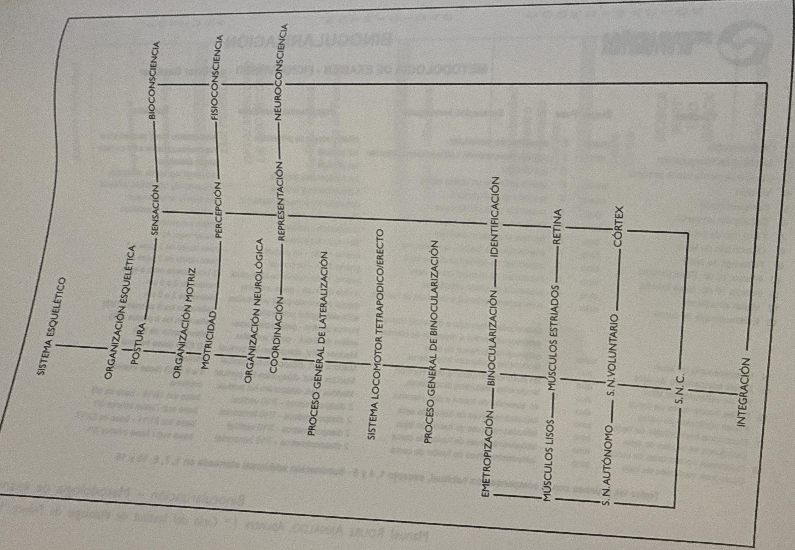

Manuel ROURE ARNALDO, Paneles explicativos de las clases de optometría, EUOOT, 1984-1987.
 

---

## OCR IMG_3362.JPG

**Fuente:** `ocr-playground-download-20260621T170135Z/IMG_3362.JPG/markdown.md`

175

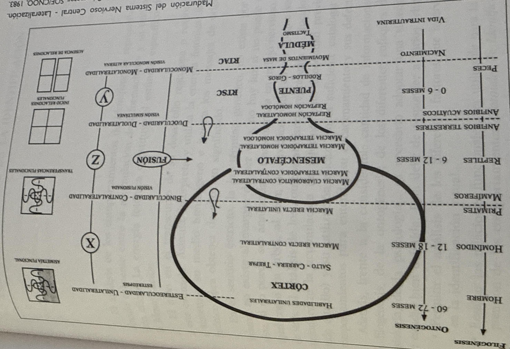

FILGOÉNESIS

ONTOGÉNESIS
HOMBRE
60 - 72 MESES
HABILIDADES UNILATERALES
CÓRTEX
SALTO - CARRERA - TREPAR
MARCHA ERECTA CONTROLATERAL
ESTEREOUS
ASIMETRÍA FUNCIONAL

HOMÍNDOS 12 - 18 MESES
MARCHA ERECTA UNILATERAL
PRIMATES
MARCHA ERECTA UNILATERAL
MARCHA CUADROMÁTICA CONTROLATERAL
MARCHA TETRAPÓDICA CONTROLATERAL
ASIMETRÍA FUNCIONAL

MARCHA
MARCHA TETRAPÓDICA HOMOLOGIA
ASIMETRÍA FUNCIONAL

REPTILES 6 - 12 MESES
MESENCEFALO
MARCHA TETRAPÓDICA HOMOLOGIA
MARCHA TETRAPÓDICA HOMOLOGIA
ASIMETRÍA FUNCIONAL

ANFIBIOS TERRESTRES
ANFIBIOS ACUÁTICOS
0 - 6 MESES
REPTACIÓN HOMOLOGIA
PUENTE
RTRSC
RODILLOS - GIROS
POCES
NACIMIENTO
MÓVIMIENTOS DE MASA
MÉDULA
TACTISMO
VIDA INTRAUTERINA

DUOCULARIDAD - DUOLATERALIDAD
VISIÓN SIMULTÁNEA
DUOCULARIDAD - DUOLATERALIDAD
VISIÓN SIMULTÁNEA
DUOCULARIDAD - VISIÓN MODULAR
VISIÓN MODULAR

INICIO RELACIONES
FUNCIONALES
INICIO RELACIONES
FUNCIONALES
INICIO RELACIONES

MONOCULARIDAD - MONOLATERALIDAD
VISIÓN MONOCULAR ALTERNA
VISIÓN MONOCULAR ALTERNA
VISIÓN MONOCULAR ALTERNA

MANUAL ROURE ARNALDO, Paneles explicativos de las clases de Optometría, EUOOT, 1984-1987.
 
